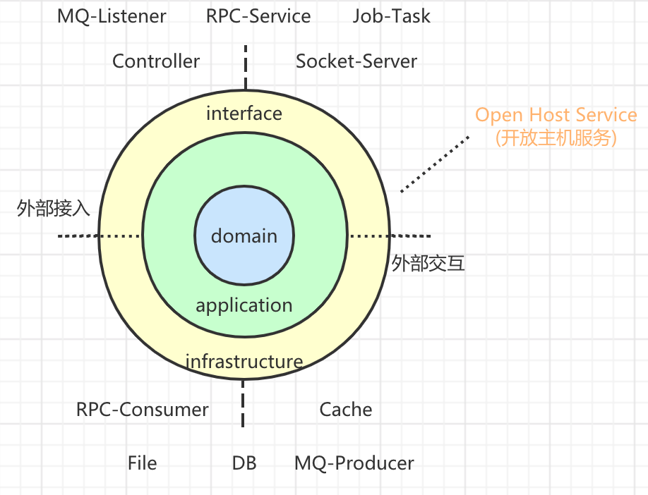
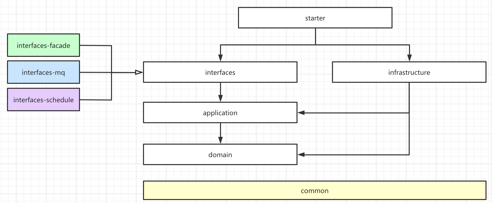

# DDD

## 个人对DDD的看法

首先，DDD是一种业务架构设计的流派，不是完美无缺的，一般来说，我们针对大型和复杂业务系统，可以践行DDD；如果是很简单的小型CRUD系统，强往DDD上靠的话，没有太大意义。

比如说，设计清结算会计系统，我个人认为没有必要完全按照DDD的范式，做战略设计和战术设计。因为对于会计领域来说，已经足够的小，可预见的只需要两个三子域（记账、基础、日终），每一个子域的业务动作也足够聚合，可以成为一个限界上下文。更多的在应用架构、工程架构上引入DDD所倡导模式（洋葱架构、胀血模型、实体与聚合）

应该站在一个更高的角度去实践DDD，比如设计支付清结算领域。此时，战略设计阶段，需要根据清结算的整体业务流程，规范通用语言，识别问题域；划分核心域（会计核心域、结算核心域、计费核心域）、支撑域与通用域。在战术设计阶段，在各领域中，识别实体、值对象，形成聚合根，并在各个领域中，将**解决一类问题的聚合根，划分到一个限界上下文中，而这一个限界上下文，就是一个微服务系统。这也是我们划分微服务的一个标准。**

限界上下文之间的关系，其实就是上下文映射。跨限界上下文的交互，我们应该在应用的应用服务中进行编排，形成防腐层（所谓的防腐，就是在于其他限界上下文的交互中，隔离变化，防止其他上下文对当前上下文的污染；防腐层内部是腐化变化的）

而在进行DDD领域模型建模的时候，我们要摒弃一个想法，就是数据表的概念（要想象成，我们的系统是一个大的内存数据库，啥都可以存）。我们要先识别出对象，识别哪些可以称之为实体对象（即有主键，有生命，有真正的业务动作），哪些是值对象（没主键，没生命，有简单动作）。最后形成一个聚合，这个聚合就是一个领域模型，它具有独立而完成的动作。

一个实体，可能会包括多个表的对象，其实我们日常基于ER的思维设计出的数据表也是这样：虽然很多是有属性有主键的，但是是附着于某一张主表的（因为数据库设计，再差也要符合一定的范式规范，不能所有字段都干在一起）。最后在资源库Repository中，对一个实体的CRUD，其实很有可能是对多个表的CRUD，这是一种思维的转换

与其说DDD是将业务与技术分离的架构设计方法论，不如说，DDD更关心的是一个领域模型的动作，如何去编排领域动作完成业务case；其实我们日常的业务架构设计中，也是可以做到业务与技术分离的，只不过我们更多的数据流（哪一步存那个表，取哪一个表），DDD是模型领域流（哪一步是哪一个领域对象或者聚合的哪一个动作完成）推动

----

## 战略设计与战术设计

### 战术设计
#### 聚合、聚合根、实体、值对象的关系

- **聚合(Aggregate)：** 逻辑概念，在代码组织层面是一个包。聚合中是包含了聚合根和所属一个范围边界的，实体、值对象的集合。通过聚合根实体，可以导航到聚合
- **实体(Entity)：** 实体是有唯一主键的，有生命周期、有状态、有动作，实体可以通过ID来区分两个不同的实体
- **聚合根(Aggregate Root)：** 聚合根是一个特殊的Entity，它是一个聚合的入口和标示；不同的aggregateId标示不同的聚合对象，聚合根要全局唯一；聚合根内的Entity的Id，在聚合根内唯一即可
- **值对象(Value Object)：** 值对象的核心是`值`，没有生命周期，附着于实体和聚合根；它只有简单的动作（创建的校验这样的）；只要两个值对象的所有字段是相等的，那么就是同一个值对象

----

## 架构风格

### 洋葱架构

- 外层只依赖内层的抽象，符合`依赖倒置(DIP)`原则
- 越到内层是越不可变的，易于测试的

#### Domain领域层：
- 领域层是基于`实体(Entity)、聚合(Aggregate)`完成核心业务逻辑的模块
- 该模块不应该与任何模块有关联，是纯粹的，`聚焦于一个聚合的业务逻辑`
- Repository资源库、DomainEvent领域事件：
  - 都应该为抽象的接口，在Infrastructure层完成实现
  - Repository的实现可能是Mybatis、Redis、JdbcTemplate等；领域事件的发布，可能是本地Message Event Bus、RocketMQ、KafKa；而这些不是领域层关心的事情
  - Repository操作的应该是聚合(Aggregate)，不应该是Entity
- DomainService领域事件：
  - 如果一个业务逻辑涉及到一个聚合的多个实体动作协调完成时，逻辑应该抽象到领域服务中(例如转账)，或者说是协调两个同聚合类型完成业务动作的
  - 类似生成序列号这样的逻辑，虽然是某一个聚合的动作，但是又与业务逻辑不是那么的强相关，抽象成独立的领域服务
  - 领域事件的命名可以是动作名称，例如：TransferDomainService；也可以是某一个聚合的领域服务，例如：AccountingVoucherDomainService

#### Application应用层：
- 协调一个或多个聚合根、防腐层、领域服务、领域事件，完成业务逻辑的**编排**；一个应用服务的方法是一个业务Case
  - 就像UML的时序图一样，只关心完成业务逻辑的流程
  - 不应该存在IF-ELSE分支，不同的条件有不同的逻辑(这样的过程应该下沉到domain中实现)
- Service名称应该按照Case的维度做一个聚合，例如：`AccountingAppService`表示记账应用服务，里面包括`交易记账、手工记账`等应用服务
- 事务在应用服务层进行控制，可以是@Transactional 或者 手工事务
  - 因为在应用层，要编排防腐层、MQ等逻辑，这些长耗时交互不应该在事务中，也有可能涉及到分布式事务的处理；所以此时可能需要手工处理事务
- 正常来说，一个领域服务方法，最后只对一个聚合根做修改操作；理论上说，多个聚合的修改应该在应用层发布领域事件，如果都是本应用库内的聚合修改，可以在一个事务中完成
- 防腐层ACL：在应用层中定义防腐层接口(Adaptor和DTO)，参与到业务逻辑的编排
- 依赖Doamin层，由于事务的需要，可依赖Spring-tx

#### Interface接入层和Infrastructure基础设施层：
- 这两层是一个维度的概念，与具体技术实现有关，完成外部与系统的接入和系统与外部的交互
- Interface接入层：可以理解为`Open Host Service（开放主机服务）`，是外部与系统交互入口
  - 包括Controller、Rpc-Provider、Listener、Job
  - 因为Listener、Job也是被外部服务触发的，所以也归集到该层
  - 该层的方法应该是非常薄的，处理必要的参数校验外，只调用应用服务
  - 配置类（自动配置不需要）
- Infrastructure基础设施层：这里的基础设施不是说通用的工具类，而是支撑起整个系统业务逻辑的基础设施，与外部交互的出入口
  - 实现Domain层和Application层的接口，使用具体的技术实现逻辑
  - 各种中间件的实际依赖和配置类
- 在洋葱架构中，`Interface接入层`可以理解成 _北桥网关_ ；`Infrastructure基础设施层`可以理解成 _南桥网关_ ；类比计算机主板的南北桥网关

**思考？**
- 工具类和一些通用的模块放在哪里？
  - 抽象common模块，各个层都可以依赖；也可以从Domain做统一的依赖
- Interface接入层和Infrastructure基础设施层的配置信息从哪里来？
  - 在实际开发中，针对Interface接入层各种接入模式，应该有一个starter对应模块，里面有配置信息的`ymal文件`
  - starter依赖Interface和Infrastructure

---

### 应用架构

---

### CQRS模式

**定义：** Command Query Responsibility Segregation（命令查询的职责分离）

- 在DDD的架构风格中，将命令动作与查询动作分离的一种模式。CQRS已经超过了DDD的范畴，它属于如何使用DDD的一种策略
- 使用CQRS的目的在于，解决纯查询类的逻辑，通过`domain model`的方式会非常复杂的问题；将指令类动作和查询类动作分离
- 作用在Application应用服务层

#### Command：指令模式

- 基于 `Interface - Application - Domain` 的模式，完成业务逻辑的流程。常见的业务动作，全部都是`Command`指令模式

#### Query：查询模式

- 纯查询类逻辑
- 直接定义DTO和Service或DAL；在Infra层实现，直接调用数据库查询出DO，转换为DTO

**注意点：**
- `CommandService`和`QueryService` 不要互相调用
- `QueryService`不要有业务逻辑，纯查询

#### 思考

- Query作用在应用层，是一个独立的Service
- 应该在应用层的Adaptor中单独为query的接口做适配，然后在infra中实现查询逻辑（这样避免破坏DIP原则，不需要application依赖infra中的dao）；同时，在infra中可以根据不同的技术实现完成查询（MyBatis查询数据库、Cache查询、ES查询等）

**参考：**
> ddd的战术篇: CQRS: https://blog.csdn.net/abchywabc/article/details/80879514
>
> 领域驱动设计实践: http://learn.lianglianglee.com/%E4%B8%93%E6%A0%8F/%E9%A2%86%E5%9F%9F%E9%A9%B1%E5%8A%A8%E8%AE%BE%E8%AE%A1%E5%AE%9E%E8%B7%B5%EF%BC%88%E5%AE%8C%EF%BC%89
>
> 阿里技术专家详解DDD系列第四讲：领域层设计规范: https://mp.weixin.qq.com/s/NoRTUSovcO2Yz237k0ceIw#at
>
> DDD实施过程中的点滴思考: https://zhuanlan.zhihu.com/p/65948474
>
> 使用DDD指导业务设计的一点思考: https://insights.thoughtworks.cn/ddd-business-design/
>
> 浅谈我对DDD领域驱动设计的理解: https://www.cnblogs.com/netfocus/p/5548025.html
>
> DDD理论学习系列——案例及目录: https://www.jianshu.com/p/6e2917551e63
>
> 领域驱动设计DDD和CQRS落地: https://www.jianshu.com/p/Tozpp3
>
> 新项目从零到一DDD实战思考与总结: https://developer.51cto.com/art/202106/668962.htm
>
> DDD实战,领域驱动设计: https://www.processon.com/view/5e55d17ee4b069f82a120d06