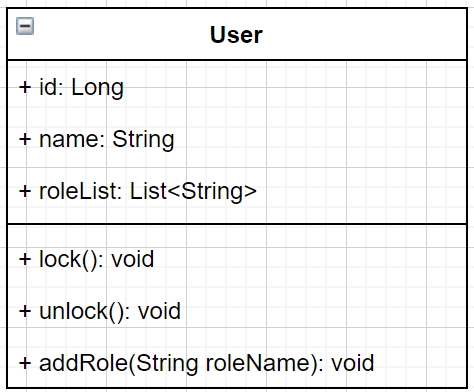
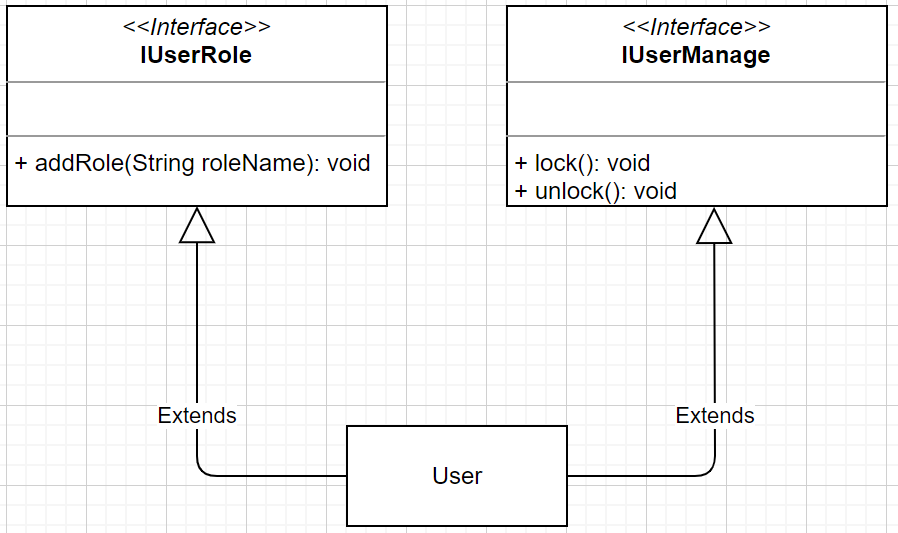

# 设计模式

- 面向接口编程，而不是面向实现编程
- 没有银弹，只有合适的抽象

## SOLID原则

SOLID是设计模式六大原则的首字母联结，分别是：
- Single Responsibility Principle：单一职责原则（SRP）
- Open Closed Principle：开闭原则（OCP）
- Liskov Substitution Principle：里氏替换原则（LSP）
- Law of Demeter：迪米特法则（LD与LSP合并为同一个L）
- Interface Segregation Principle：接口隔离原则（ISP）
- Dependence Inversion Principle：依赖倒置原则（DIP）

### Single Responsibility Principle：单一职责原则

> _There should never be more than one reason for a class to change._
>
> 一个接口或类只有一个原因引起变化，一个类或者一个接口，只负责一件事

单一职责适用于类、接口和方法中，假设User类，理论上应该包括如下动作：

如果我们将`lock()`、`changeName()`、`addRole()`的逻辑各封装到一个类中，这看起来每个类只有一个职责，但是又非常的不内聚，这会带来过度设计；当我们需要完成一个业务动作的时候，可能需要耦合多个类才能完成

我们需要分清职责，并且将职责进行聚合；同时，我们应该面向接口进行编程，我们可以让一个接口和方法的职责是分明的，例如：

我们将User的动作聚合为`IUserRole角色类动作`和`IUserManage管理类动作`两类接口，每一个接口的职责都是明确的，要么是负责用户角色类操作，要么是负责用户管理类操作；

在日常开发中，我们可能会有一个`UserService`类或接口，然后每一个方法完成一个业务逻辑（方法的单一职责原则一般来说都会遵守）；如果我们修改了某一个方法，很难确定是否影响到其他方法的实现（因为都在同一个类中，我们不确定是否有单例 + 共享变量的情况发生）；所以，我们需要将Service的动作做一个聚合分离，让不同的接口只处理一类问题

**单一职责的总结：**

- 类（接口）的复杂性降低，实现什么职责或哪一类职责有明确的定义和界限
- 代码可读性高、代码复杂度低
- 降低变更的风险：变更是没有办法避免的，如果单一职责做的好，需求变更影响的可能只是一个接口或一个实现类，变更的风险和范围可控，对系统稳定性有很大的帮助。
- 在实际应用的过程中，我们更倾向于是接口和方法的职责的单一与聚合：即接口的职责只负责一类事情，方法的逻辑只完成一件事情

### Open Closed Principle：开闭原则

### Liskov Substitution Principle：里氏替换原则

### Law of Demeter：迪米特法则

### Interface Segregation Principle：接口隔离原则

### Dependence Inversion Principle：依赖倒置原则

**参考**
> 六大设计原则(SOLID): https://www.jianshu.com/p/3268264ae581
>
