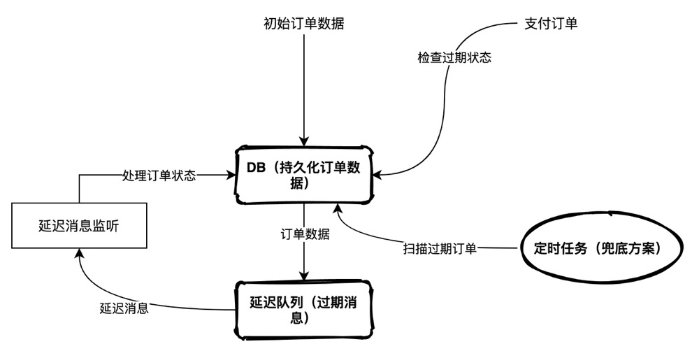
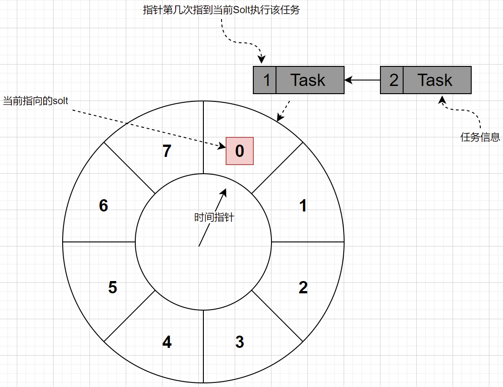
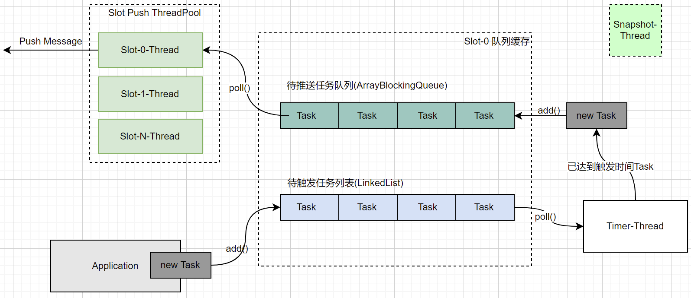

# 订单超时和防重

## 超时订单处理



### 被动超时处理

当用户发起订单状态查询或发起`确认支付`操作时，主动查询订单判断是否超时；如果超时，则将订单关闭并返回`订单已失效`，否则再继续后续流程

该方案是执行`确认订单`的入口逻辑，是所有方案的兜底方案。建议还是强依赖数据库，以保证订单的时效性

如果只依赖该方案处理超时订单，如果用户不再发起任何操作，那么订单的状态就不会再继续流转；针对小型系统：使用`被动超时处理` + `定时任务超时处理`足以应对

在大型系统中，可以基于`分库分表`提升数据库的操作性能；同时基于`缓存化`缓存订单信息，如果缓存中的订单已经是下一个状态，则不再校验超时（需要考虑缓存和数据库一致性问题：先删再改，改完再删，队列同步？）

### 定时任务超时处理

以一个较为快的频率启动一个定时任务，定时扫描订单表，条件是状态是`初始化` + `失效时间 < current_time`捞取记录；捞取记录后，基于乐观锁，更新订单到`关闭`状态。

在小型的系统中，个人认为该方案足以应对订单超时场景。只要做好并发控制，控制每次捞取的记录数避免系统出现`OOM`问题即可；

同时，我也任务该方案可以作为大型系统的兜底方案（因为我们不能保证延迟队列的高可用和投递成功率就是100%），但是需要考虑在大数据量情况下的性能问题

- 如果订单已经做了分库分表，那么定时任务也应该基于sharding的方式运行：这样可以保证每一个运行节点同时运行，同时降低系统压力；建议shard数和分库数一致，或者每个节点平分订单shard库的数据

- 控制任务频率和每批记录数，因为还有`被动超时处理`作为兜底，降低对数据库（即使是从库）的压力；可以在job捞数的过程中添加timer计时器，例如`每隔30s`运行的任务，捞数过程不超过`20s`，这样可以为更新预留出时间buffer，这样可以避免由于job时间过长，导致后续任务捞取重复记录

- 异步化：捞取超时记录后，可以压到本地线程池异步操作（要注意应用shutdown时，为pool增加hook）

### 延迟消息超时处理

#### 1.基于消息中间件特性实现延迟队列

- RabbitMQ死信队列模式：
> 发送消息时设置消息TTL，针对该topic不设置消费者，当消息超时后，会进入到死信队列
>
> 新建exchange绑定死信队列，并新增添加Consumer，消费后处理订单关闭
>
> 问题：如果只设置一个队列接受TTL消息，第一个消息10min后超时，第二个消息1min后超时，那么第二条消息也会在10min后被处理；
>
> 解决方案：根据RabbitMQ的架构特点，技术基于镜像模式做高可用，每个节点的queue数据也是一致的；我们要为不同的延时时间，建立多个Queue

- RocketMQ延迟队列模式：
> 发送消息时，设置消息的delayTimeLevel级别，消息推送到Broker之后，会暂存在`SCHEDULE_TOPIC_实际Topic名称`这个Topic中
>
> 开源版支持`1s 5s 10s 30s 1m 2m 3m 4m 5m 6m 7m 8m 9m 10m 20m 30m 1h 2h`，足够一般业务场景使用
>
> Broker创建一个Timer，来执行不同级别的延时任务，读取`SCHEDULE_TOPIC_`的消息，将到期的Message推送到实际的`Topic`中，一直读取到当前queue中某一个offset位置的消息还没超时（单个queue中的消息是有序的）
>
> 问题：一个`new java.util.Timer()`其实只起了一个线程，然后处理queue中的的定时任务，当队列中有大量延迟消息时，性能相对较差
>
> 解决方案：修改源码，使用时间轮调度，每一个延时级别单独起一个线程处理，但是要处理Broker重启时，时间轮指针位置与圈数的问题

#### 2.基于时间轮实现延迟队列

##### 时间轮算法原理



**整体流程**

- 根据指针的运行频率和预估的任务规模，初始化一个固定长度的时间轮（可以使用链表实现）
> 如果指针是`1s`前进一格，任务精度是最小`1s`延迟；如果指针是`2s`前进一格，任务精度是最小`2s`延迟
>
> 延迟时间应该是指针精度的整数倍

- 当有新任务提交时：根据`指针精度(point_step_length)`、`任务延迟时间`和`当前指针指向的slot`，计算任务应该存放的slot和指针第几次指到当前Solt执行该任务

> 以指针精度`1s`、长度(slot_lenght)为`8`的时间轮（转一圈需要8s）,提交一个延迟时间为`35s`的任务为例
>
> 当前指针指向slot-0，`36s`后指针应该指向`slot-3`，同时需要记录该任务应该在指针第5次指到`slot-3`中的自己时执行
>
> 计算规则: 
> 
> ```
> // 指针转动一圈的时间
> int one_round_time = slot_lenght * point_step_length;
> 
> // 任务指针需要转动的圈数 
> int round_times = msg_delay_senconds / (slot_lenght * point_step_length)
>
> // 计算slot位置
> int slot_index = current_slot_index + [msg_delay_senconds % (one_round_time)]/point_step_length;
> if slot_index > slot_lenght  slot_index = slot_index - slot_lenght
> 
> // 任务被指针指向N次后运行
> int cycle_num = round_times + 1;
> 
> ```
>
> 指针每指向一个slot的时候，需要遍历里边的任务，将Task被指向的次数+1，指到满足条件被移除执行

##### 时间轮实现方案



- 时间轮上的每一个Slot分配两个队列，分别为`待触发任务队列`和`待推送任务等待队列`。目的在于提高每一个Slot的处理性能，将已经达到延时时间的任务和待处理任务隔离
- 应用创建新的延时任务时，根据算法计算出对应的Slot，并添加到对应Slot的`待触发任务队列`的尾部（为了避免并发冲突，可以为链表的尾部元素加一个读写锁）
- Timer线程移动指针到下一个Slot，在该线程中遍历`待触发任务队列`的任务；如果有达到触发条件的节点，就将该节点移除，并添加到`待推送任务等待队列`的尾部
> 内存遍历速度比较快，但是也有一个问题，在遍历的过程中如果一直有任务加到队列尾中怎么办？我的思路是为整个链表加读写锁，这样虽然会降低并发性，但是会避免遍历时无法控制链表长度的问题；
>
> 即使基于时间轮，也不是完全的精确实时，而是准实时性
- 为每一个Slot创建一个独立的线程，实时消费`待推送任务等待队列`的任务：将工作线程与时间线程隔离，提升服务的处理性能
- `Snapshot`线程，定时将整个时间轮的内存生成结构化的二进制镜像文件，备份到本地或者S3服务
> 初始化时间轮时，首先从备份文件恢复数据；此时时间轮暂时不对外提供服务
>
> 遍历`待触发任务队列`和`待推送任务等待队列`的任务，检查任务是不是已经超时，如果超时则直接执行任务；
>
> 历史任务需要根据剩余时间重新分配Slot和被指向多少次运行后，方可接收新的延迟任务。
- 可以以本地服务的方式嵌入到应用中，这样可以在应用内完成自循环（即自己只处理自己节点生成的数据）

##### 总结
- 不能保证时间是完全精确的，因为时间轮算法的精度，是由`指针`粒度锁控制；例如，指针每`1s`一跳，那么小于1s的任务就没办法被时间轮调度
- 时间轮格子数量越多，每一个格子维持的任务数量越少，处理效率也会相对越高；只能是相对，如果前置处理逻辑较多，任务真真被推走执行的时间还是会有延迟
- 中小型项目使用`MQ延迟队列 + 被动超时 + 定时任务`模式即可;中大型项目可以选择扩展RocketMQ的延时队列或者自研时间轮方式实现

**参考：**
> 订单超时自动关闭的实现方案总结: https://www.extutorial.com/blog/1543096
>
> 有赞延迟队列设计: https://tech.youzan.com/queuing_delay/
>
> 揭秘：达达-京东到家订单派发的技术实战: https://www.sohu.com/a/251506542_168370
>
> RocketMQ 延迟消息的使用与分析: https://blog.csdn.net/silence1144/article/details/109902684