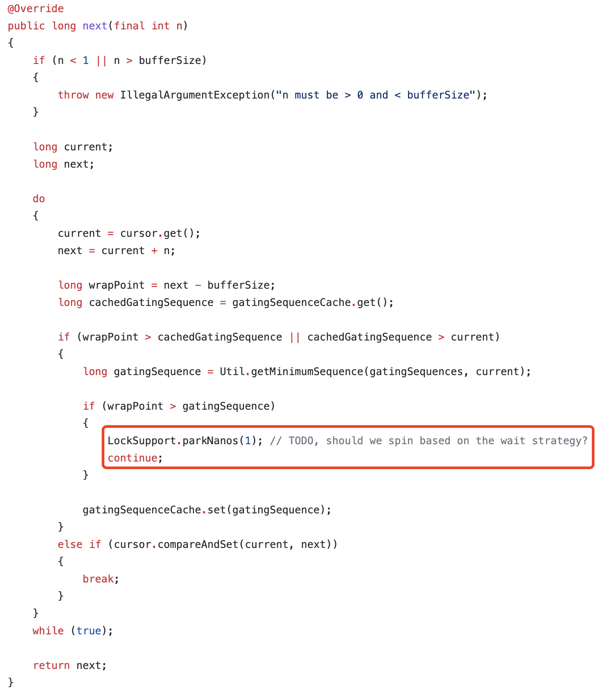

# 并发编程

## Java内存模型

---

## 线程池

### 关于用户态和内核态:
- JVM线程均为内核态线程：可以利用cpu的多核处理能力
- 没有用户态 <-> 内核态的互转过程

### 线程池线程数的合理设置:
- 原则：`尽可能的不要浪费CPU的计算能力`
- 分析任务类型：CPU计算密集、IO密集、混合型
- **CPU密集型**
    - 核心线程数：CPU核数 + 1
    - 线程数尽量少一些。因为CPU运算时间和IO的速度都非常快，较多的线程反而会增加CPU频繁切换线程导致的性能开销较大。充分利用每一个核的运算能力即可
- **IO密集型任务**
    - 核心线程数：一般资料建议为2*CPU核数。`实际场景要以性能测试的结果作为参考，监控压测期间的CPU使用率，如果太低，可以持续调大到合理范围`
    - 绝大部分与数据库、网络IO交互的任务，都属于IO密集型
    - 以常见的 controller() -> service() -> dao() 的编码模式举例
        - 由于dao()操作是IO交互，线程不占用CPU运算资源
        - 如果核心线程数较小，大部分任务都在等待队列里无法执行，造成CPU运算资源浪费
        - 此时CPU切换线程的开销，远远小于任务等待的性能消耗
- **混合型任务**
    - 分拆预估任务中的CPU运算时间和IO时间
    - 如果相差过大，拆分两个线程池，分别进行CPU密集型预算和IO密集型任务
    - 如果相差不大，没必要拆分

### 关于应用中设置多少个线程池:
- 原则：影响系统性能的因素不在于有多少个线程池，而是`应用有多少线程在工作`
- **方案1：** 为CPU密集型任务和IO密集型任务分别设置独立的线程池
- **方案2：** 对需要快速响应的任务独立设置线程池。如果只有一个线程池，大部分任务会在等待队列中等待，反而会导致需要快速响应的任务响应较慢
- **方案3：** 一类业务逻辑的任务使用独立的线程池

> 以RocketMQ的多线程模型举例：
>
> 1个Master主线程（线程数1），负责监听TCP连接，建立连接并创建SocketChannel，注册到selector上
>
> 1个Worker线程池（线程数3），主线程拿到网络数据后提交到Worker线程池
>
> 1个DefaultEventExectour线程池（线程数8），将Worker线程池的网络数据进行解编码、SSL校验等操作
>
> 1个业务线程池（线程数8），进行实际的业务操作
>
> 注意：不要让每个线程都阻塞在等待未被处理请求的结果上，会造成死锁

### ThreadPoolExecutor参数配置:

- corePoolSize: 核心线程数，线程池的实际基础工作能力
- maximumPoolSize： 最大线程数，只有当等待队列满后才会创建
- keepAliveTime： 存活时间，大于核心线程数的线程存活时间；根据实际配置，没有银弹
- unit： 存活时间的时间单位
- workQueue： 等待队列
    - 如果使用LinkedBlockingQueue，要指定长度，否则相当于是无界队列。线程池的工作线程永远都只有corePoolSize；还会造成`内存溢出`
    - ArrayBlockingQueue：基于数组实现的等待队列，不会出现LinkedBlockingQueue的问题。但是性能可能相对差一些。`主要原因如下：`
        > LinkedBlockingQueue：使用两把锁控制读写，并发性较高。链表的数据结构特性决定的，FIFO读取的是head头结点并改变指针，进入队列只是指向tail尾结点
        >
        >ArrayBlockingQueue：只有一把锁锁住整个数组，并发度较低
- threadFactory：线程创建工厂，`建议配置`，为每一个线程设置一个Name。排查问题是，可以通过dump文件较为直观的观察到创建的线程
- RejectedExecutionHandler：线程拒绝策略，当`线程池已达到最大线程数&&等待队列满`时的任务拒绝策略
    - AbortPolicy：默认策略，直接抛出异常`RejectedExecutionException`
    - DiscardPolicy：直接忽略 - 这种策略基本没法使用，无法感知到线程池运行情况
    - CallerRunsPolicy：有当前线程运行任务。问题，会阻塞当前线程的执行
    ```java
    public static class CallerRunsPolicy implements RejectedExecutionHandler {
        public CallerRunsPolicy() { }

        public void rejectedExecution(Runnable r, ThreadPoolExecutor e) {
            if (!e.isShutdown()) {
                // 直接调用了线程的run方法，而不是start
                r.run();
            }
        }
    }
    ```
    - DiscardOldestPolicy：丢弃队列最前面的任务并尝试执行任务
    ```java
    public static class DiscardOldestPolicy implements RejectedExecutionHandler {
        public DiscardOldestPolicy() { }

        public void rejectedExecution(Runnable r, ThreadPoolExecutor e) {
            if (!e.isShutdown()) {
                e.getQueue().poll();
                e.execute(r);
            }
        }
    }
    ```

### 线程池监控:
- 监控线程池的运行状态，帮助问题排查
- 继承ThreadPoolExecutor重写相关方法
```java
public class MyThreadPool extends ThreadPoolExecutor {
	
    // .... 忽略构造方法 .... //
    
	@Override
	protected void beforeExecute(Thread t, Runnable r) {
		// 线程执行前
	}

	@Override
	protected void afterExecute(Runnable r, Throwable t) {
		// 线程执行后
	}

	@Override
	protected void terminated() {
		// 线程池停止
	}
}
```
### 线程池执行流程总结:

- 如果当前工作线程数 < 核心线程数：任务直接尝试创建工作线程执行
    - 并发控制基于CAS自旋增加核心线程数计数器
    - 核心线程添加失败的并发任务，走`任务直接提交到等待队列进行等待逻辑`
- 如果当前工作线程数 >= 核心线程数：任务直接提交到等待队列进行等待
- _如果添加等待队列满，并不是直接执行拒绝策略，而是尝试创建一个工作线程执行_
    - 条件：工作线程数 < 最大线程数
    - 创建失败执行拒绝策略
- 工作线程被包装`为Worker线程对象，以实现线程的复用`。
    - Woker线程被首次创建后，开始调用创建时Runnable的run方法
    - 从等待队列获取任务Runnable对象，并执行run方法(run是同步执行)

- Woker如何保证completedTasks等计数操作线程安全的：AQS加锁

----

## 并发队列

### JUC中内置的队列

| 队列 | 边界性 | 是否有锁 | 数据结构 |
| ---- | ---- | ---- | ---- |
| ArrayBlockingQueue | 有界 | 加锁 | ArrayList |
| LinkedBlockingQueue | 可选有界 | 加锁 | LinkedList |
| ConcurrentLinkedQueue | 无界 | 无锁 | LinkedList |
| DelayQueue | 无界 | 无锁 | heap |

### 有锁队列

**ArrayBlockingQueue**

- 基于数组实现的有限队列
- 一把锁，读写冲突，并发度较低：因为数组是一组连续的内存，每次获取完元素后，需要对数组集合做resize，这需要原子性操作来保证并发时的线程安全
- 但仍然优先推荐使用：因为基于数组实现，在队列初始化时必须制定队列长度；一般我们基于内存和编码安全的角度考虑，还是不太允许内存中的队列元素无限增长的

**LinkedBlockingQueue**

- 基于链表实现的队列：由于链表的特性，在不指定初始化长度的情况下是无界队列
- 两把锁，读写不冲突：因为链表不是连续内存集合&通过指针关联。读的时候加`read`锁，只需要保证移除当前`head`和指定新`head`是原子性即可；写的时候加`write`锁，只需要保证当前`tail`元素指向下一个元素是原子性即可
- 并发度较高：如果可以确保队列中的消息可以足够快的被消费，可以使用；
- 在线程池中使用需要注意：如果使用无界的LinkedBlockingQueue作为等待队列，会导致线程池中只有核心线程数在工作

### 无锁队列

在处理并发线程安全时，一般有两种方式来完成同步，即：锁或者是原子变量。其中，有锁队列的操作均是基于`ReenternLock`实现的锁机制，对临界区进行锁定后，进行同步操作；而`原子变量`是基于CPU提供的CAS，对共享变量完成原子性的比较和替换，以达到无锁同步操作的目的。

**实现原理**

- CAS：CompareAndSwap原子性操作，完成队列头尾的原子性操作
- JUC中的`AtomicReferenceArray`提供了CAS操作 - `compareAndSet`
- 某一位置如果无法完成替换，通过CAS自旋向下一个位置重试完成

_伪代码示例：_

```java
public class LockFreeQueue {
    private static AtomicReferenceArray<Integer> atomicReferenceArray;

    // 记录head位置指针
    private AtomicInteger head = new AtomicInteger(0);
    // 记录tail位置指针
    private AtomicInteger tail = new AtomicInteger(0);

    public LockFreeQueue() {
        atomicReferenceArray = new AtomicReferenceArray<>(10);
    }

    public boolean add(Integer o) {
        // 获取元素add的索引位置
        int index = tail.get() + 1;

        // 基于CAS自旋设置元素到tail，不成功递归调用
        while(!atomicReferenceArray.compareAndSet(index, null, o)) {
            return add(o);
        }

        // 设置成功，移动tail指针
        tail.incrementAndGet();
        return true;
    }

```

**问题与优势**

- 基于CPU提供的原子性操作，速度和效率高
- 冲突较高的时候，CAS自旋空循环会对CPU资源还是有很多的消耗，极端情况下甚至会打满CPU，其他线程无法获取到CPU时间
- Disruptor框架原理也是基于CAS，但是在索引位置冲突的时候会将线程挂起，没有采用自旋空循环的方式



**参考:**

> 高性能队列——Disruptor: https://tech.meituan.com/2016/11/18/disruptor.html
>
> java轻松实现无锁队列: https://www.cnblogs.com/linlinismine/p/9263426.html