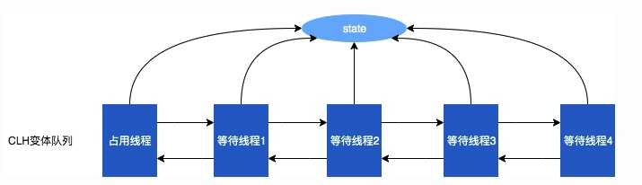

# Concurrent(并发编程)

## CAS

### 什么是CAS

CAS: `Compare And Swap`，比较并交换。一个CAS涉及如下操作：

> 假设内存中的的变量V，代码中期望的值为A，需要修改为B
>
> - 比较A和V是否相等（比较）
> - 如果比较成功，将B的值写入V
> - 返回是否操作成功

当多个线程同时对某个资源进行CAS操作时，只能有一个线程操作成功，并不会阻塞其他线程。更新失败的会收到失败信号，CAS是一种轻量级的乐观锁，或者认为是一种无锁编程的思想。

### CAS的应用

**Java中CAS的实现：** 底层基于`sun.misc.Unsafe`类实现

#### AtomicReference

Atomic家族主要保证在多线程环境下的原子性操作，相比我们使用`synchronized`关键字、`ReentrantLock`更加轻量。比较常用的如：`AtomicInteger`、`AtomicLong`等，但是这些都是针对指定类型的CAS操作；而`AtomicReference`作用是针对普通对象的CAS操作封装

**自旋锁**

```java
public class SpinLock {

  private AtomicReference<Thread> sign =new AtomicReference<>();

  public void lock(){
    Thread current = Thread.currentThread();
    while(!sign .compareAndSet(null, current)){
    }
  }

  public void unlock (){
    Thread current = Thread.currentThread();
    sign .compareAndSet(current, null);
  }
}
```

#### CAS的问题

**A-B-A问题**

当V从A变为B，再变成A，这个过程CAS操作是无法区分出来的。我们在绝大多数的场景下是无需关心的，但是针对版本有强需求的场景（尤其是类似于状态机的场景），可以使用`AtomicStampedReference`携带时间戳。

**自旋锁的性能消耗问题**

我们使用自旋锁的时候，大部分都是`while(true)`的方式，直到成功为止。优势是速度极快；缺点也很明显：一直在当前线程中循环，每个线程都要执行，占用CPU时间。

**参考**
> JAVA 中的 CAS: https://www.xilidou.com/2018/02/01/java-cas/

----

## 并发队列

### JUC中内置的队列

| 队列 | 边界性 | 是否有锁 | 数据结构 |
| ---- | ---- | ---- | ---- |
| ArrayBlockingQueue | 有界 | 加锁 | ArrayList |
| LinkedBlockingQueue | 可选有界 | 加锁 | LinkedList |
| ConcurrentLinkedQueue | 无界 | 无锁 | LinkedList |
| DelayQueue | 无界 | 无锁 | heap |

### 有锁队列

#### ArrayBlockingQueue

- 基于数组实现的有限队列
- 一把锁，读写冲突，并发度较低：因为数组是一组连续的内存，每次获取完元素后，需要对数组集合做resize，这需要原子性操作来保证并发时的线程安全
- 但仍然优先推荐使用：因为基于数组实现，在队列初始化时必须制定队列长度；一般我们基于内存和编码安全的角度考虑，还是不太允许内存中的队列元素无限增长的

#### LinkedBlockingQueue

- 基于链表实现的队列：由于链表的特性，在不指定初始化长度的情况下是无界队列
- 两把锁，读写不冲突：因为链表不是连续内存集合&通过指针关联。读的时候加`read`锁，只需要保证移除当前`head`和指定新`head`是原子性即可；写的时候加`write`锁，只需要保证当前`tail`元素指向下一个元素是原子性即可
- 并发度较高：如果可以确保队列中的消息可以足够快的被消费，可以使用；
- 在线程池中使用需要注意：如果使用无界的LinkedBlockingQueue作为等待队列，会导致线程池中只有核心线程数在工作

_均使用`ReentrantLock`加锁_

### 无锁队列

在处理并发线程安全时，一般有两种方式来完成同步，即：锁或者是原子变量。其中，有锁队列的操作均是基于`ReenternLock`实现的锁机制，对临界区进行锁定后，进行同步操作；而`原子变量`是基于CPU提供的CAS，对共享变量完成原子性的比较和替换，以达到无锁同步操作的目的。

#### 实现方式

**CAS原生方式**

- 使用`UnSafe`类的`compareAndSwap`方法完成对链表头尾或者数组尾的追加替换
- 如果操作失败，表示有并发冲突，通过自旋的方式进行重试，直到成功

**JUC中的AtomicReferenceArray**

_伪代码示例：_

```java
public class LockFreeQueue {
    private static AtomicReferenceArray<Integer> atomicReferenceArray;

    // 记录head位置指针
    private AtomicInteger head = new AtomicInteger(0);
    // 记录tail位置指针
    private AtomicInteger tail = new AtomicInteger(0);

    public LockFreeQueue() {
        atomicReferenceArray = new AtomicReferenceArray<>(10);
    }

    public boolean add(Integer o) {
        // 获取元素add的索引位置
        int index = tail.get() + 1;

        // 基于CAS自旋设置元素到tail，不成功递归调用
        while(!atomicReferenceArray.compareAndSet(index, null, o)) {
            return add(o);
        }

        // 设置成功，移动tail指针
        tail.incrementAndGet();
        return true;
    }

```

**问题与优势**

- 基于CPU提供的原子性操作，速度和效率高
- 冲突较高的时候，CAS自旋空循环会对CPU资源还是有很多的消耗，极端情况下甚至会打满CPU，其他线程无法获取到CPU时间
- Disruptor框架原理也是基于CAS，但是在索引位置冲突的时候会将线程挂起1纳秒后再去竞争，没有采用自旋空循环的方式


**参考**

> 高性能队列——Disruptor: https://tech.meituan.com/2016/11/18/disruptor.html
>
> java轻松实现无锁队列: https://www.cnblogs.com/linlinismine/p/9263426.html
>
> 你应该知道的高性能无锁队列Disruptor: https://juejin.cn/post/6844903648875528206

----

## 并发集合

### ConcurrentHashMap

#### HashMap

**K-V键值对，通过KEY的hashCode计算index位置**

**数据结构:** 数组(bucket) + (链表 + 红黑树)`解决hash冲突`

- 数组：存放hash key的桶(bucket)
- 链表：解决hash碰撞冲突
- 红黑树：当链表长度=`6`时进化为红黑树；当节点数小于`8`时，退化为链表
  - 进化为红黑树的目的在于快速查找，红黑树遍历的时间复杂度为：`O(logN)`;而链表遍历的时间复杂度为：`O(N)` _因为尾插法，最新的记录在尾部_
  - 为什么小于8时退化，这是避免频繁的在链表和红黑树间变化

**线程安全问题**

- jdk1.8采用尾插法，解决jdk1.7之前在扩容时hash碰撞导致的死循环问题；所以在jdk8之后多线程使用HashMap只有被覆盖的问题，没有死循环的情况
- `put()`方法的`++size`操作线程不安全，多线程情况下，最后统计`size()`会丢失

> **扩展思考**
>
> 既然红黑树的目的是提高查找速度，那为什么像MySQL这样的数据库引擎是使用B-TREE这种数据格式，而不是使用红黑树呢？
>
> 红黑树是平衡二叉树，根据二叉树的特性，右边节点一定是大于根节点的；这样就会产生一个问题，如果是聚簇(主键)索引(值一直递增)，二叉树是会退化成链表，时间复杂度退化为O(N)

#### ConcurrentHashMap的线程安全

- `get()`方法时无锁的
- `put()`操作时，如果bucket为null，基于`CAS`无锁的方式设值value；如果bucket已经有值或者CAS失败，对当前Node加synchronized锁同步

```java
public class ConcurrentHashMap<K,V> extends AbstractMap<K,V> implements ConcurrentMap<K,V>, Serializable {
    final V putVal(K key, V value, boolean onlyIfAbsent) {    
        for (Node<K,V>[] tab = table;;) {
            Node<K,V> f; int n, i, fh;
            if (tab == null || (n = tab.length) == 0)
                tab = initTable();
            // 当前位置为null，基于CAS赋值，如果此时hash冲突，进入下一次循环
            // Node<K,V> f 不为空，进入到synchronized (f)逻辑，加锁赋值
            else if ((f = tabAt(tab, i = (n - 1) & hash)) == null) {
                if (casTabAt(tab, i, null,
                             new Node<K,V>(hash, key, value, null)))
                    break;                   // no lock when adding to empty bin
            }
            else if ((fh = f.hash) == MOVED)
                tab = helpTransfer(tab, f);
            else {
                V oldVal = null;
                synchronized (f) {
                    // 尾插法解决hash冲突
                }
            }
        }
        return null;
    }

}
```

### CopyOnWriteArrayList

#### ConcurrentModificationException问题

对于`ArrayList`、`LinkedList`集合，在for循环中进行`remove`操作会抛出ConcurrentModificationException异常。

这并不是线程安全问题，而是针对`for`循环操作，JVM会优化为`Iterator`迭代器；如果调用`List`的`remove()`方法，会修改`modCount`的值；当迭代器进行下次迭代时，会比较该值是否与预期相等，此时会抛出该异常。

存在该异常的目的：也是一种集合线程安全的保证，针对可能存在的并发修改进行快速失败

**解决方案**

- 将List集合转换为`Iterator`迭代器进行迭代，使用其的`remove()`方法
- 使用`CopyOnWriteArrayList`

#### CopyOnWriteArrayList的线程安全

- 线程安全的ArrayList
- 基于读写分离与最终一致性模型
- 修改时，基于`ReentrantLock`加锁，copy一份副本进行修改，最后再重新指向
- 读取时，无锁，直接获取当前Array进行读取

----

## AQS

AbstractQueuedSynchronizer: 抽象队列同步器。

AQS的核心思想：如果被请求的共享资源是空闲的，就将当前的请求的线程置为有效线程，将共享资源设置为锁定状态；如果资源被占用，则线程进入等待队列阻塞等待被唤醒

### AQS的数据结构

**State变量:** 同步状态变量，实现者通过调用AQS通过提供对State变量的CAS操作，对线程的状态做出处理。CAS操作成功的线程，可以进行自己的处理；未能成功的，会被封装为`Waiter`添加到等待队列中。

**AQS队列:** Craig、Landin and Hagersten队列，是单向链表，AQS中的队列是CLH变体的虚拟双向队列（FIFO），AQS是通过将每条请求共享资源的线程封装成一个节点来实现锁的分配。

**exclusiveOwnerThread:** 当前持有共享变量的线程



> AQS与公平锁和非公平锁的关系: 没有直接关系。是否是公平锁还是非公平锁，是在各个Lock的实现中，获取锁阶段判断AQS等待队列中是否有线程在等待。公平锁是，有其他等待的线程就加入到队列中自旋或中断；非公平锁是直接参与一次对state的竞争，失败后再加入到队列中自旋或中断

### AQS的核心工作流程

**- AQS并没有完全实现共享资源竞争与释放的全部流程，它是一个抽象的编程框架，提供了state变量来实现对资源的占用与释放；它约定了获取(acquire)和释放(release)独占资源的流程，但是它没有实现如何去获取和释放资源的流程，AQS的更多关注于如何将线程添加和移除等待队列的过程**

```java
    // 获取
    public final void acquire(int arg) {
        if (!tryAcquire(arg) &&
            acquireQueued(addWaiter(Node.EXCLUSIVE), arg))
            selfInterrupt();
    }

    // 释放
    public final boolean release(int arg) {
        if (tryRelease(arg)) {
            Node h = head;
            if (h != null && h.waitStatus != 0)
                unparkSuccessor(h);
            return true;
        }
        return false;
    }
    
    // 将等待节点入队
    final boolean acquireQueued(final Node node, int arg) {
        boolean failed = true;
        try {
            boolean interrupted = false;
            for (;;) {
                // 获取前置节点
                final Node p = node.predecessor();
                // 前置节点如果是head，尝试再次获取资源(非公平锁时会有不成功的时候)，失败就自旋
                if (p == head && tryAcquire(arg)) {
                    setHead(node);
                    p.next = null; // help GC
                    failed = false;
                    return interrupted;
                }
                // 如果前置节点不是head，则将当前线程park-挂起
                if (shouldParkAfterFailedAcquire(p, node) &&
                    parkAndCheckInterrupt())
                    interrupted = true;
            }
        } finally {
            if (failed)
                cancelAcquire(node);
        }
    }    
```

_Interrupt中断：_ 在lockInterruptibly中有意义，在lock中没有意义，目的是代码复用

_acquireQueued中的自旋过程：_ AQS队列中是公平的，按照FIFO的原则唤醒线程；所以如果当前节点的前置是head的话，表示他理论上应该是下一个被唤醒的，但是非公平锁时，会被竞争；自旋的目的就是时刻检查自己是不是可以被`unpark-唤醒`

_acquireQueued中的挂起过程：_ 自旋是很占据cpu时间的动作，尤其是等待非常多的时候，会造成大量CPU时间被自旋消耗；所以，如果当前Node入队后，发现前置也不是head时，说明自己距离被唤醒还有一段时间间隔，则直接`park-挂起`，释放出CPU；等待`state`被释放，`unparkSuccessor()`流程唤醒，再进行自旋争抢锁

**- 持有锁的线程释放state后，获取等待队列中下一个要Node，尝试唤醒**

```java
    private void unparkSuccessor(Node node) {
        /*
         * If status is negative (i.e., possibly needing signal) try
         * to clear in anticipation of signalling.  It is OK if this
         * fails or if status is changed by waiting thread.
         */
        int ws = node.waitStatus;
        if (ws < 0)
            compareAndSetWaitStatus(node, ws, 0);

        /*
         * Thread to unpark is held in successor, which is normally
         * just the next node.  But if cancelled or apparently null,
         * traverse backwards from tail to find the actual
         * non-cancelled successor.
         */
        Node s = node.next;
        if (s == null || s.waitStatus > 0) {
            s = null;
            for (Node t = tail; t != null && t != node; t = t.prev)
                if (t.waitStatus <= 0)
                    s = t;
        }
        if (s != null)
            LockSupport.unpark(s.thread);
    }
```

### JUC中使用AQS实现的并发工具

**ReentrantLock** 可重入锁

- 使用state保存重入次数，release到0表示释放锁
- 作用在同步代码块
- 公平锁与非公平锁：公平锁是获取锁时检查等待队列是否有线程等待，有则直接入队，没有竞争；非公平锁不管等待队列是否有线程，都先竞争，失败后入队

**Semaphore** 信号量

- state保存令牌数，可用可还
- 限流类型的场景：简单实现可以，但是无法平滑的限流，可能会在突发时间点一下把令牌都拿走

**CountDownLatch** 倒数门栓

- state表示倒数计数，所有的`countDown()`方法扣减计数完成后，await才可以通过
- 一个或者多个线程，等待其他多个线程完成某件事情之后才能执行: 主线程`await()`到各个子线程`countDown()`完成再执行
- 计数器不可复用

**CyclicBarrier** 可循环使用屏障

- 使用ReentrantLock完成`await()`过程的加锁等待
- 多个线程互相等待，直到到达同一个同步点，再继续一起执行: 各个子线程`await()`,直到所有子线程的`await()`都执行完成后，再继续向下执行
- 计数器可以循环使用

**ReentrantReadWriteLock** 可重入读写锁

- state的高16位维持持有的写锁次数；剩下的16位维持持有的读锁次数
- 写写冲突、读写冲突、读读不冲突

**参考**
> 从ReentrantLock的实现看AQS的原理及应用 - 美团技术团队: https://tech.meituan.com/2019/12/05/aqs-theory-and-apply.html
>
> AQS源码解析（1）acquireQueued: https://www.jianshu.com/p/dcbcea767d69