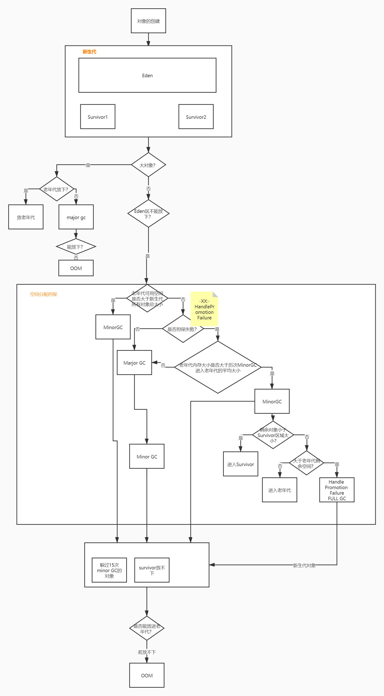
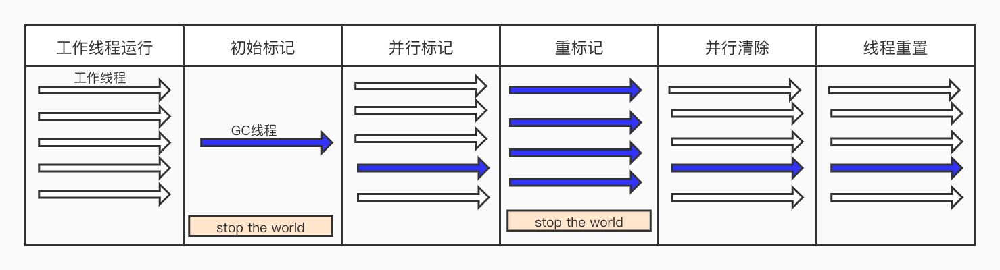
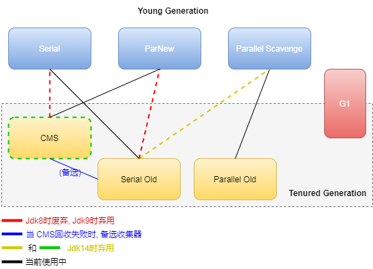

# JVM

## JVM内存模型


- 堆内存：
  - 年轻代：对象首先在Eden区完成分配，YGC后将Eden区存活的对象和S0或S1存活的对象，拷贝到另外一个区。各种GC回收器在这里都是使用的 **标记-复制** 算法
  - 年老代：经过15次YGC仍然存活的对象，存放在年老代。年老代的垃圾回收没有年轻代频繁，FGC时回收。
- 栈内存：表示的是线程栈内存，局部变量、基本数据类型在栈内存上分配
  - 局部变量表：维持线程内方法的局部变量信息
  - 操作数栈：可以理解为计算区域
  - 方法出口：在方法嵌套调用时，需要知道当前方法执行完以后，跳回到哪里，和程序计数器配合使用
- 本地方法栈：Native方法的栈内存空间
- 程序计数器：方法嵌套调用时，总要只要当前方法执行到哪里，子函数完成后要跳转回来
- MetaSpace元空间：
  - Class类元信息：通过ClassLoader加载的类、动态代理生成的代理类信息
  - 常量
  - 静态变量

## Java对象内存分配与GC策略

**对象在栈内存分配机制**
- 对象在分配内存时，JVM会基于逃逸分析先尝试在栈内存分配，大概逻辑是判断对象是否可能被外部引用，如果不会被外部应用，有可能会在栈内存分配
```java
public void test1() {
    User u = new User();
    // do something
    // 方法的返回值为void，u的生命周期和方法一直，不会被外部应用，jvm会尝试在栈分配对象
}
```
```java
public User test2() {
    User u = new User();
    // do something
    // 方法的返回值为User，u可能被外部引用，故不会在栈内存分配
    return u;
}
```

**大对象直接在年老代分配**
- 根据`-XX:PretenureSizeThreshold`参数的配置，大于该值的对象直接在老年代分配内存
- 如果: 老年代有足够的连续空间分配对象，直接分配
- 如果: 老年代没有足够的连续空间分配对象
  - 此时老年代没有进行垃圾回收，则进行 `MajorGC-老年代垃圾回收`
  - 此时老年代正在进行并发回收，会发生`Concurrent Mode Failure`,虚拟机启动 `Serial Old` 收集器 `stop the world` 单线程进行Major GC(原因: JVM设计)
- 上述的Major GC后仍然没有连续空间分配对象，抛出`OutOfMemoryException`

**一般对象在年轻代的Eden区分配**
> 对象优先在Eden区进行分配, 如果Eden的空间不足，是要转移其他存活对象，而不是尝试在年老代创建

- 如果Eden区有足够的连续空间分配对象，直接分配对象 -> 结束
- 当Eden区无法直接分配对象`需要保证年老代有足够的空间把年轻代存活对象放进去`：
  - 如果: 老年代的可用空间大于年轻代当前所有对象的大小, 触发`MinorGC`后，再次在Eden区分配对象
  - 如果: 老年代的可用空间不足 && 老年代预留空间足够，触发`MajorGC`（目的在于让晋升和S0存储不下的对象进入年老代）-> 触发MinorGC后，再次在Eden区分配对象
    - 如果年老代空间仍不足，抛出`OutOfMemoryExcetption`
  - 如果老年代预留空间不足(担保失败)，触发`MajorGC`基于 **标记-整理** 算法进行回收整理年老代 -> 触发MinorGC后，再次在Eden区分配对象 
    - 如果年老代空间仍不足，抛出`OutOfMemoryExcetption`
- 如果全部分配失败，抛出 ```OutOfMemory``` 异常，JVM宕机应用不在提供服务

**长期存活的对象进入年老代**
- 可以理解为被15次YGC后仍然存活的对象可以直接进入年老代
- 通过```-XX:MaxTenuringThreshold```指定长期存活的阈值
  - 如果设置较小，会导致新对象过早的进入到年老代；而设置过大，会让本应该进入年老代存活的对象在YGC时频繁的复制



> 参考：https://www.cnblogs.com/xjshi/p/7338847.html

----

## GC垃圾回收
### MinorGC、MajorGC与Old GC

#### MinorGC
- 年轻代GC，即Young GC；以ParNew收集器为例，在GC日志中显示的是`[ParNew: 3412467K->59681K(3774912K), 0.0971990 secs] 9702786K->6354533K(24746432K), 0.0974940 secs] [Times: user=0.95 sys=0.00, real=0.09 secs]`
- 因为Java对象具大多具备朝生夕死的特性，所以YGC会非常频繁，回收速度比较快
- 在各种收集器中，YGC时都会暂停用户线程，即`stop the world`

#### MajorGC
- 年老代GC，以CMS收集器为例，在GC日志中显示的是 `[GC (CMS Initial Mark) [1 CMS-initial-mark: 22630K(125696K)] 22743K(126848K), 0.0011803 secs] [Times: user=0.00 sys=0.00, real=0.00 secs]`
- 对于不同的收集器，有不同的 `stop the world` 的阶段
  - CMS收集器在初始标记和重新标记阶段
  - Prarllel Old整个阶段

#### FullGC
- 对整个堆空间进行GC，一般是由于老年代或元空间内存不足、分配失败而触发
- GC日志中的显示`[Full GC (Ergonomics) [PSYoungGen: 544K->0K(9216K)] [ParOldGen: 6144K->6627K(10240K)] 6688K->6627K(19456K), [Metaspace: 3286K->3286K(1056768K)], 0.0063048 secs] [Times: user=0.01 sys=0.00, real=0.01 secs]`
- 当出现FGC时，经常至少会伴随一次YGC(不绝对，可以通过不同收集器的参数进行配置)。FGC的速度一般比YGC慢10倍以上
- 基本上可以认为MajorGC与FullGC是一个概念，这是因为现在这两个概念已经完全混淆

----

### 垃圾对象的判断方式

**可达性分析算法：** 通过一系列成为 `GC-ROOT` 的对象作为起始点，从这些点看是向下搜索，搜索所走过的路径称为 `引用链`。当一个对象没有任何引用链（GC-ROOT不可达）时，说明这个对象是不可用的。

**可以作为GC-ROOT起点的对象:**
- 虚拟机栈内存中局部变量表引用的对象：因为局部变量表中维护着变量和堆内存对象的关系，如果当前对象的方法执行完成后，局部变量引用的对象可以被清除。
- 本地方法栈中引用的对象
> 可以抽象为：类中的每一个函数方法在执行完成后，局部变量的对象都会被回收
- 元空间中静态属性引用的对象: static属性作为类属性，除非将属性的值置为null，对象才会被回收(已经成为游离态)
- 元空间中的常量属性引用的对象

----

### 回收算法

- **标记-复制:** 年轻代垃圾回收器使用的算法，新对象在Eden区创建。YGC时将Eden+From和To区来回复制存活对象。

  *特点：整半区回收，无碎片问题、简单高效；只适用于年轻代，因为old区没有复制的目标区域*

- **标记-清除:** 年老代垃圾回收器使用的算法，标示垃圾对象，清除

  *特点：过程相对简单，但是只有清除过程，会产生内存碎片；容易因为没有连续空间分配空间，导致提前触发FGC整理内存空间*

- **标记-整理:** 年老代垃圾回收器使用的算法，整体流程与 **标记-清除** 一致，加入了内存整理的过程

  *特点：过程较为复杂、无碎片问题*

----

### 垃圾回收器
#### 关于吞吐量和停顿时间

- 吞吐量(throughput): 指用户代码的运行时间，在整个CPU耗时的比值。吞吐量 = 用户代码运行时间 / (用户代码运行时间 + 垃圾回收运行时间)。`系统停顿次数越少，用户代码执行时间越长，吞吐量越高。`
- 停顿时间(pause times): 垃圾回收时，用户线程的暂停时间。`暂停时间越小，每次请求的响应时间会越快，用户体验越好。`
- 吞吐量优先: 垃圾回收的频率不会很频繁，所以一次垃圾回收的更多，带来的是 `每次回收时用户线程响应时间相对较慢，但系统停顿的次数较少。`
- 响应时间优先: 垃圾回收的频率相对较高，所以一次回收的垃圾不多，带来的是 `每次回收时用户线程停顿时间较短，响应较快，但系统停顿次数较多。`

#### 年轻代垃圾回收器
_全部使用```标记-复制```算法_

**Serial串行收集器**
- 单线程收集，工作时所有用户线程必须停止等待
- 适用于单核CPU、Client场景，只要不是频发发生GC，这是可以接受的

**ParNew收集器**
- 常用的年轻代垃圾收集器，关注于减少停顿时间
- 是Serial收集器的多线程版本，工作时所有用户线程停止等待，多个GC线程并行工作
- 适用于关注延时的WEB系统；只有它可以与CMS回收器配合使用

**Parallel Scavenge收集器**
- JDK1.8默认的回收器，关注于系统吞吐量，让用户代码获取更多的运行时间
- 工作模式：与ParNew整体一致
- 适用于关注吞吐的批量、科学计算系统；与Parallel Old年老代垃圾回收器配合使用

#### 年老代垃圾回收器
**Serial Old收集器**
- 基于 ```标记-整理``` 算法（还有压缩，Mark-Sweep-Compact）
- 单线程收集
- 作为CMS收集器的后备预案，即CMS GC 运行期间，Old 区预留的空间不足以分配给新的对象，此时收集器会发生退化

**Parallel Old收集器**
- JDK1.8的默认老年代垃圾收集器
- 基于```标记-整理```算法；多线程并行收集，用户线程在GC期间完全暂停
- 与Parallel Scavenge年轻代垃圾收集器配合使用
- 工作流程:

  

**Concurrent Mark Sweep(并发标记清理)-CMS收集器**
- 常用的老年代垃圾收集器
- 基于 ```标记-清除```算法：不进行压缩操作，会产生内存碎片；初始标记、重新标记阶段用户线程完全暂停；
- 与用户线程并发执行，减少应用停顿，尽量减少STW的时间，关注与系统响应时间；与ParNew年轻代垃圾回收器配合使用

- 工作流程：

  - 初始标记(STW): 仅**单线程**标记一下能直接被GC-ROOT关联到的对象，目的在于找到本地不需要被回收的对象的根；速度非常快；STW的原因在于要确认根对象。`JDK8之前为单线程，之后可以根据CMSParallelInitialMarkEnabled调整`
  - 并发标记: **单线程**从直接关联对象向下寻找存活对象，此时**应用线程并发**运行，可能会遗漏刚刚new出来的存活对象
  - 重新标记(STW): 由于上一步的并发标记会导致部分刚刚new出来的对象被遗漏，此时为了保证收集的正确性，需要再次**GC线程并行**标记
  - 并发清除: **单线程**与**应用线程并发**清除垃圾对象

- CMS GC的触发时机：
  - 老年代的使用空间达到阈值，默认92%。如果太小，CMS会频繁发生；如果太大，线程在向老年代请求分配的内存空间小于预留空间(担保失败)，触发`concurrent mode failure-并发模式失败`，会触发FGC并进行内存压缩
  - 动态检查，JVM会根据最近回收历史，预估下一次老年代GC的时间
  - Metaspace区达到最大值，在收集Metaspace的垃圾时，会触发老年代的CMS GC

#### G1垃圾回收器
- 收集范围为全堆空间
- 保留分代概念，物理内存的空间不再互相隔离；整个堆划分为多个大小相等的独立区域（Region），年轻代和年老代都只是一部分无需连续的Region的集合
- 内存模型：

  
  - 每个Region被标记了E、S、O和H，E代表的是Eden，S代表的是Survivor，H代表的是Humongous，O代表的是老年代，灰色的代表的是空闲的region
  - Region可以说是G1回收器一次回收的最小单元,每一次的回收，G1会选择可能回收最多垃圾的Region进行回收，存活对象从一个Region转移到另一个Region
- 工作流程: 

  
  - 整体流程与CMS收集器类似
  - 初始标记(STW): 所有用户线程暂停，标记出从GC-ROOT开始可以直接关联到的对象
  - 并发标记: 通过初始标记存活的对象继续向下寻找
  - 重新标记(STW): 标记上以步过程中产生的新的存活对象
  - 筛选回收: 根据各个Region的价值排序，优先回收价值最高的区域(根据用户所期待的GC停顿时间等维度)

**G1与CMS收集器的对比**
- 内存模型不同:
  - G1回收器将整个堆内存视为整体，划分多个Region标示为年轻代和年老代，内存使用率更高，GC时可以针对某些个Region；
  - CMS收集器是传统的分代内存模型，GC时要针对整个内存，GC的性能与堆内存大小成线性相关
- 作用范围不同: 
  - G1作用于整个堆空间且无需与其他垃圾收集器配合；
  - CMS作用于年老代
- 回收算法不同:
  - G1从整体上看基于`标记-整理`，在两个Region中是基于`标记-复制`算法；
  - CMS基于`标记-清除`
- G1没有FULL GC: 只有针对年轻代的Young GC和回收年轻代与部分老年代的Mixed GC
- 停顿时间不同: G1和CMS都是为了追求最小停顿时间
  - G1基于停顿预测模型和`-XX:MaxGCPauseMillis`参数达到每次GC都在期望的停顿时间并且回收最有价值空间；
  - CMS的停顿时间不可预测，可能会很长


#### 垃圾回收器的组合关系



**为什么Parallel类的收集器只能和Parallel或者Serial组合？**
- Serial、PareNew、CMS、Serial Old回收器公用一套代码结构，因此可以自由搭配，只是根据不同的系统场景，进行不同的组合
- Parallel Scavenge和Parallel Old属于后来的代码框架，因此不能和其他四个随意搭配
- G1本身就有分代算法，也没有必要和其他垃圾回收器搭配
- Serial Old作为年老代收集失败的回退方案，其他的新生代垃圾回收器也要和它做兼容

**针对不同类型应用，如何选择垃圾收集器组合**
- 实时类应用系统：关注点在于降低请求的响应时间，应该使用```ParNew+CMS```垃圾收集器，一次垃圾回收停顿时间越短，用户体验越好
- 批量类、后台运算类系统：关注点在于提升系统吞吐量，快速完成数值计算、报表处理等业务。而吞吐量是一个目标值，目的是让用户代码执行的时间在整个CPU时间的占比比较高，所以应该使用```Parallel Scavenge + Parallel Old```垃圾回收器组合

**并发和并行回收的区别**

- 并行(Parallel): 多条GC线程同时运行，此时用户线程会暂停。ParNew、Parallel Scavenge、Parallel Old
- 并发(Concurrent): 用户线程和GC线程同时运行(不一定并行，可能会交替执行-这是CPU和操作系统调度决定的)，用户程序运行，而垃圾回收线程在另一个核上运行。CMS、G1

----

## JVM常见内存溢出与解决方案
- 前置条件：dump文件

```
-XX:+HeapDumpOnOutOfMemoryError  
-XX:HeapDumpPath=/usr/local/app/oom
```

- 一般都是代码问题导致的

**java.lang.OutOfMemoryError：Metaspace**-元空间内存溢出，当达到Max上限值并Full GC之后，仍然无法分配空间
- 使用了不合理的JVM参数，导致元空间内存分配过小
- 动态代理没有缓存代理类，而是每次都使用`.getProxy()`生成动态代理类，导致Class类元信息在元空间膨胀
- 使用自定义classloader，重复创建classloader或者重复加载class

**java.lang.OutOfMemoryError: Java heap space**-堆内存溢出
- 常见的内存溢出问题；需要根据Dump文件分析此时堆内存中占比较大的对象，并以此作为排查依据，分析发生问题的代码逻辑；同时要结合GC日志，确认是否是由于堆内存空间不足导致溢出等
- 原因1: 堆内存空间较小，系统又经常创建存活时间较久的大对象，导致新对象无法创建或存活对象无法进入年老代
- 原因2: 在循环中大量创建对象，或者在list中add大量对象；表象为dump文件中的大对象一般是应用内的对象
- 原因3: SQL查询没有分页，一次返回大量数据集，年轻代和年老代均无法分配空间；工具、拦截器打印输入输出的日志，输出流对象日志，导致堆内存打满

**java.lang.StackOverflowError**-栈内存溢出
- 原因1: 无限递归，还是要尽量避免递归的使用，即使使用，也要控制好跳出的条件
- 原因2: 循环中大量创建局部变量
- 原因3: 线程栈内存参数值过小，不符合应用的实际场景

----

## GC常见问题与解决方案
**表象: Young GC、Full GC频繁，一次Full GC后，年老代GC日志显示空间变化非常大**
- 原因分析: 新对象过早的晋升到年老代，导致Old区有大量本该被回收的垃圾。过早晋升不会直接导致GC性能降低，而当Eden区空间不足触发Young GC前会要求检查年老代空间或者年老代空间提供担保，此时由于这些垃圾对象的问题，会导致失败，进而引发Full GC
- 解决方案：
  - 检查`-XX:MaxTenuringThreshold`参数配置是否过小，默认为15次YGC晋升到Old区。也可以根据应用特点，适当调大
  - 年轻代或Eden区内存过小`-Xmn`: 导致分配对象时，无法在Eden区完成分配，提前触发YGC，导致对象提前进入Old区；后续分配空间时，YGC前需要Old区提供空间担保失败，进而触发Full GC

**表现: CMS old GC非常频繁(可能在某些监控平台会表现为Full GC频繁)，但是每次GC的耗时不是很久**
- 原因分析:
----

## JVM调优

**调优的整体思路**
- ddd

参考:
> 深入理解Major GC, Full GC, CMS: https://yq.aliyun.com/articles/140544
>
> 不可错过的CMS学习笔记: https://developer.aliyun.com/article/697097 
>
> Java虚拟机垃圾回收(三) 7种垃圾收集器: https://www.cnblogs.com/cxxjohnson/p/8625713.html 
>
> 来一道 PerfMa 面试必考的 GC 题: https://www.codercto.com/a/24558.html  
>
> G1垃圾回收器详解: https://www.jianshu.com/p/aef0f4765098
>
> Java中9种常见的CMS GC问题分析与解决: https://tech.meituan.com/2020/11/12/java-9-cms-gc.html 