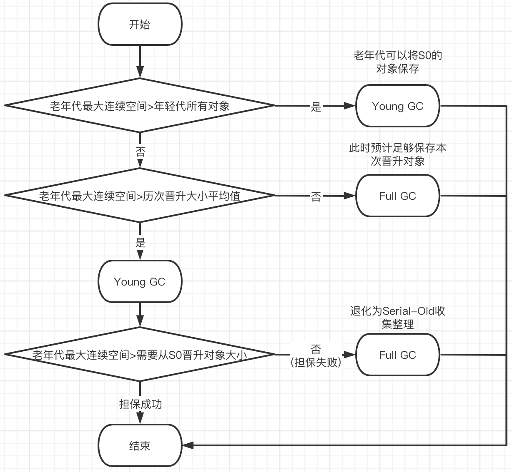

# Memory Distribution & GC Strategy(JVM对象分配与GC策略)

## 空间担保机制

**谁进行空间担保？**
- 在Young GC前进行空间担保流程
- 空间担保指的是老年代进行空间分配担保
- 在Eden区不足以分配对象，触发Young GC前，需要年老代提供空间担保

**为什么要进行空间担保？**
- Eden区使用`标记-复制`算法，如果大量对象在Young GC后仍然存活，且`S0`无法存放怎么办？此时需要把S0的对象移动到老年代
- 空间担保是一个悲观策略，万一需要将S0移入老年代；那么在这之前，尝试将老年代空间尽可能预留出来；完成空间担保后，仍然无法分配对象，则OOM
- 基于空间担保，决定是只触发Young GC还是Full GC(即`YGC`+`OGC`)

**空间担保流程**
- 检查1: `老年代最大可用连续空间大于新生代所有对象的大小`，执行Young GC并分配对象(目的：最悲观情况Eden区没有对象被回收，且已达到需要被移动到Old的年龄)
- 检查2: `老年代最大可用连续空间大于历次晋升对象的平均大小`，执行Young GC（乐观策略）；否则进行Full GC
- 步骤2 YGC后，检查3：`老年代最大可用连续空间大于新生代需要晋升的对象大小`，担保成功，完成对象分配
    - 否则`担保失败`触发`promotion failed-晋升失败`问题，`通知`CMS线程这是一次垃圾回收失败，需要触发Full GC
    - 当执行本次FullGC时，由于有用户线程分配内存失败，触发`concurrent mode failure-并发模式失败`，导致`Old区的CMS GC`退化为`Serial-Old`收集器(目的：老年代连续内存空间不够新生代晋升的大小，需要整理内存)
- 空间担保过程结束后，如果对象仍然无法进入年老代，抛出`OutOfMemoryException`



## 对象分配流程

**对象尝试在栈内存分配**

- 对象在分配内存时，JVM会基于逃逸分析先尝试在栈内存分配，大概逻辑是判断对象是否可能被外部引用，如果不会被外部应用，有可能会在栈内存分配

```java
public void test1() {
    User u = new User();
    // do something
    // 方法的返回值为void，u的生命周期和方法一致，不会被外部应用，jvm会尝试在栈分配对象
}

public User test2() {
    User u = new User();
    // do something
    // 方法的返回值为User，u可能被外部引用，故不会在栈内存分配
    return u;
}

```

**大对象直接在年老代分配**
- 根据`-XX:PretenureSizeThreshold`参数的配置，大于该值的对象直接在老年代分配内存
- 如果: 老年代有足够的连续空间分配对象，直接分配
- 如果: 老年代没有足够的连续空间分配对象
  - 此时老年代没有进行垃圾回收，则进行 `MajorGC-老年代垃圾回收`
  - 此时老年代正在进行并发回收，会发生`Concurrent Mode Failure`,虚拟机启动 `Serial Old` 收集器 `stop the world` 单线程进行Major GC(原因: JVM设计,连续空间不足,要整理内存)
- 上述的Major GC后仍然没有连续空间分配对象，抛出`OutOfMemoryException`

**一般对象在年轻代的Eden区分配**
- 如果Eden区空间足够分配，直接分配对象
- 如果Eden区空间不足，触发`空间担保`机制，决定是只进行YGC还是FullGC后，分配内存空间
- 如果上述过程完成后，仍没有空间分配，抛出`OutOfMemoryException`内存溢出

**长期存活的对象进入年老代**
- 可以理解为被15次YGC后仍然存活的对象可以直接进入年老代
- 通过```-XX:MaxTenuringThreshold```指定长期存活的阈值
  - 如果设置较小，会导致新对象过早的进入到年老代；而设置过大，会让本应该进入年老代存活的对象在YGC时频繁的复制
- 大部分对象都是`朝生夕死`，默认值足够

**参考**
> 【JDK1.8】String对象的内存分配: https://blog.csdn.net/Activity_Time/article/details/98605105