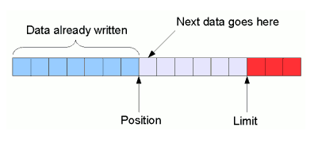
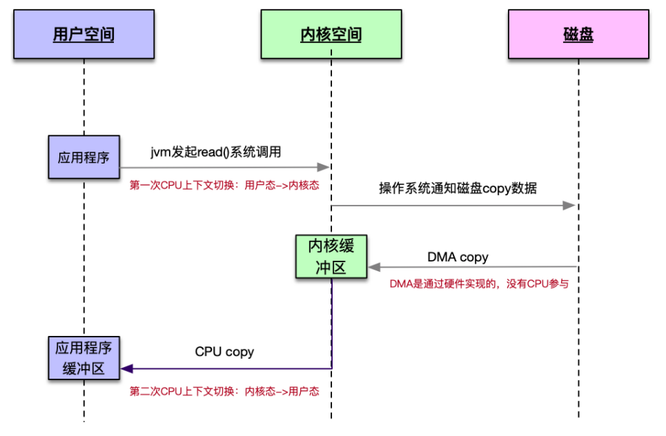
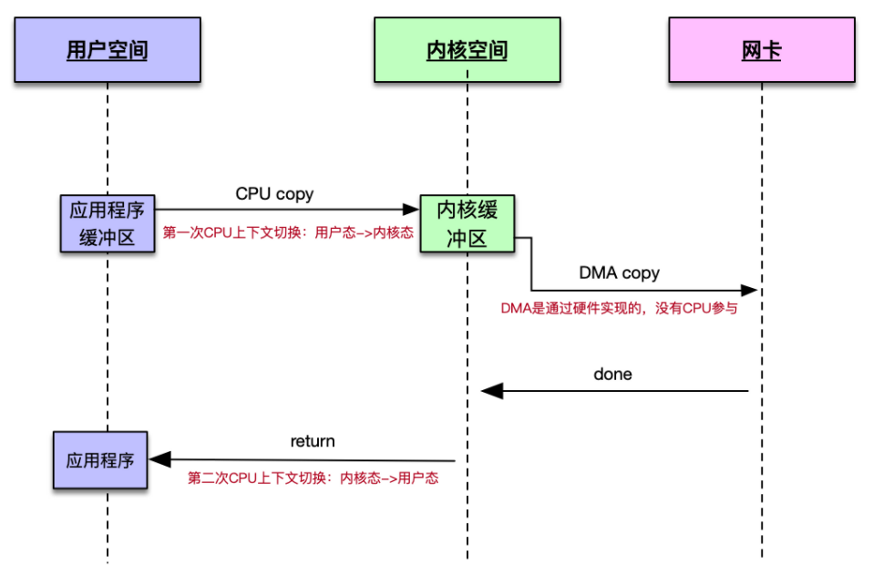
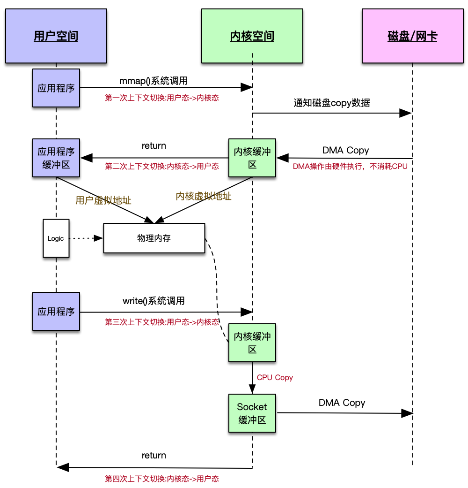

# NIO

## Java NIO编码范式

**Server端:**

```java
public class NIOServer {
	// Selector: 选择器
	private static Selector selector;

	public static void main(String[] args) throws IOException {
		// url: https://developer.51cto.com/art/201112/307685.htm

		start();

		listener();
	}

	// 开启server
	private static void start() throws IOException {
		// 初始化服务器配置
		ServerSocketChannel serverSocketChannel = ServerSocketChannel.open();
		serverSocketChannel.bind(new InetSocketAddress("127.0.0.1", 6379));
		serverSocketChannel.configureBlocking(false);   // accept非阻塞

		// 初始化NIO多路复用选择器
		selector = Selector.open();
		// 将服务端的Channel绑定到selector中，并对ON_ACCEPT事件关心(接受客户端连接事件)
		// 对于Unix系统而言，所有的Socket也是一个文件，我们可以将Channel理解成对于Socket套接字文件的抽象
		// Server启动，也有对应的套接字文件等待连接
		serverSocketChannel.register(selector, SelectionKey.OP_ACCEPT);
		System.out.println("start server success.");
	}

	// 监听事件并处理IO
	private static void listener() throws IOException {
		while (true) {
			// 调用操作系统poll or epoll 获取IO已经就绪的链接
			selector.select();
			// selector根据注册关心的事件，将就绪的channel封装在selectionKey中并返回
			Set<SelectionKey> selectionKeys = selector.selectedKeys();

			Iterator<SelectionKey> iterator = selectionKeys.iterator();
			while (iterator.hasNext()) {
				// 如果有就绪的channel，遍历处理
				SelectionKey selectionKey = iterator.next();

				// 要将channel移除本次iterator中
				// 如果没有remove掉 下一次select的时候 仍会返回上一次就绪的channel
				iterator.remove();

				// 如果是OP_ACCEPT-接入事件，表示有客户端连接到服务端
				if (selectionKey.isAcceptable()) {
					handlerAccept(selectionKey);
					continue;
				}
				// 如果是OP_READ-可读事件，表示有channel写入数据
				if (selectionKey.isReadable()) {
					handlerRead(selectionKey);
					continue;
				}
			}
		}
	}

	/**
	 * OP_ACCEPT事件channel处理，针对服务端开放端口的Socket文件Channel
	 *
	 * @param selectionKey
	 */
	private static void handlerAccept(SelectionKey selectionKey) throws IOException {
		// 获取服务端开放端口的Socket文件Channel
		ServerSocketChannel server = (ServerSocketChannel) selectionKey.channel();
		// 接受连接，并获取客户端连接的Socket文件Channel
		SocketChannel channel = server.accept();
		channel.configureBlocking(false);   // 设置read为非阻塞

		System.out.println("server accpet client connection.");

		// 将客户端连接Socket文件的Channel注册到selector中，并关心OP_READ事件
		// 将channel注册到selector时，可以写入附件信息，比如client_id
		Map<String, Object> attachment = new HashMap<>();
		attachment.put("client_id", UUID.randomUUID().toString());
		channel.register(selector, SelectionKey.OP_READ, attachment);
	}

	/**
	 * OP_READ事件channel处理，针对客户端连接Socket文件的Channel
	 *
	 * @param selectionKey
	 */
	private static void handlerRead(SelectionKey selectionKey) throws IOException {
		SocketChannel channel = (SocketChannel) selectionKey.channel();

		// 获取channel的附件信息
		Map<String, Object> attachment = (Map<String, Object>) selectionKey.attachment();

		ByteBuffer buffer = ByteBuffer.allocate(1024);
		if (channel.read(buffer) == -1) {
			// OP_READ阶段没有读取到数据，关闭连接
			channel.shutdownOutput();
			channel.shutdownInput();
			channel.close();
		} else {
			// 翻转buffer，准备读取
			buffer.flip();
			// 按照字符编码读取数据
			String receive = Charset.forName("utf-8").newDecoder().decode(buffer).toString();
			System.out.println("receive message. client:" + attachment.get("client_id") + ", receive:" + receive);
			buffer.clear();

			// 写出数据
			buffer = buffer.put("server received.".getBytes("utf-8"));
			buffer.flip();
			channel.write(buffer);
		}
	}
}
```

**Client端：**
```java
public class NIOClient {

	public static void main(String[] args) {
		try (SocketChannel socketChannel = SocketChannel.open()) {
			//连接服务端socket
			socketChannel.connect(new InetSocketAddress("127.0.0.1", 6379));

			// 从控制台获取输入
			Scanner    scanner = new Scanner(System.in);
			ByteBuffer buffer  = ByteBuffer.allocate(1024);
			while (true) {
				String line = scanner.nextLine();

				// 发送数据到服务端
				buffer.clear();
				buffer.put(line.getBytes("utf-8"));
				buffer.flip();
				socketChannel.write(buffer);

				// 读取服务器响应
				buffer.clear();
				int readLenth = socketChannel.read(buffer);
				if (readLenth < 0) {
					continue;
				}

				// 读取模式
				buffer.flip();
				byte[] bytes = new byte[readLenth];
				buffer.get(bytes);
				System.out.println(new String(bytes, "UTF-8"));
				buffer.clear();
			}

		} catch (IOException e) {
			e.printStackTrace();
		}
	}

}
```

---

## NIO关键概念

### Buffer(缓冲区)

在Java NIO中，所有数据都要通过Buffer进行读写。是与Channel进行交互的通道



- position：Buffer当前指针位置
- limit：Buffer缓冲器数据的大小
- capacity：缓冲区容量，一旦设置不可修改

**HeapByteBuffer(堆内存Buffer)：** 

- 由JVM进行内存管理。当数据进行发送时，会拷贝到直接内存，再进行后续操作（例如sendfile等）
- 申请方式：``` ByteBuffer.alloc(1024); ```
- **_使用场景：_**
    - 数据只在Java进程内传输使用，不与本地进行IO（例如磁盘、网卡）
    - 数据小，对GC负担小

**DirectByteBuffer(堆外直接内存Buffer)：**

```
       Java        |      native
                   |
 DirectByteBuffer  |      malloc
 [    address   ] -+-> [   data    ]
                   |
```

- 申请方式：``` ByteBuffer.allocDirect() ```
- 内存仍由JVM管理：
    - 由Full GC进行回收，通过System.gc()通知JVM在适当的时候进行回收
    - 创建DirectByteBuffer后，仍然会在堆内存中创建对象，记录着指向直接地址的address
    - **必须先释放堆内对象的引用，GC时才会去释放直接地址的空间**
    > 这里就很有可能由于对象引用没有被释放、多次YGC后进入老年代；导致对外内存无法回收，进而引发OOM
- **_使用场景：_**
    - 频繁的native IO，即java程序与本地磁盘、socket传输数据
    - DirectByteBuffer不会占用堆内存，也就是不会受到堆大小限制，只在DirectByteBuffer对象被回收后才会释放该缓冲区
    - 由于DirectByteBuffer的Cleaner是基于System.gc()的方式通知回收，所以JVM参数不要增加 ```-XX:+DisableExplicitGC``` - 禁止显示调用gc

> 参考：
> https://blog.csdn.net/liuxiao723846/article/details/89814005 
>
> https://yasinshaw.com/articles/54

### Channel(通道)
- 类似于Java IO中流的概念，但流是单向的，而Channel是全双工(双向)工作的
- 通过Buffer读取和写出数据
- Channel可以理解为Unix系统中，Socket文件的抽象(/proc/进程号/fd)

### Selector(选择器)
- 通过单线程来轮询符合响应事件的Channel的集合
- 可以理解为 select() 或 epoll() 的抽象
- Selector.select的过程一定是阻塞的，底层的调用实现因不同的操作系统而实现不同
- 基于Selector实现NIO多路复用

----

## 零拷贝(Zero-Copy)

### 零拷贝是什么？

- 零拷贝技术并不是说数据没有拷贝和上下文切换的过程
- 目的：为了避免数据在 **用户态（User space）** 和 **内核态（Kernel space）**中来回拷贝的技术
- 减少双态间的拷贝，即减少了CPU的切换，进而减少CPU为数据在内存之间的拷贝而消耗运算能力

### 传统IO操作

**读操作**



**写操作**



- 基于传统的IO操作，以一次读取文件并发送到网卡的操作，最少要经历`4`次CPU内核态和用户态的转换（消耗CPU资源）、`2`次CPU拷贝以及`2`次DMA拷贝
- 而在这个过程中，数据并没有任何变化，且`2`次CPU拷贝是没有意义的，知识把数据从用户态和内核态来回拷贝而已
- 传输效率低下，浪费CPU的计算资源
- 我们完全可以把数据放在一个既可以被`内核态`，又可以被`用户态`访问的区域

### Linux的零拷贝实现

**基于```mmap() + write()```实现**



- `mmap()`系统调用，将用户空间的虚拟地址和内核空间通过虚拟地址指向同一个物理内存空间。此时内核缓冲区读取完数据后，数据即被用户空间和内核空间共享。当业务逻辑对数据进行更改时，数据及时同步，减少了一次数据用内核态到用户态的CPU拷贝

- `write()`系统调用，由于用户空间和内核空间是共享物理内存，写出数据时，只需要内核缓冲区做一次CPU拷贝，将数据拷贝到Socket缓冲区，再通过DMA拷贝到网卡

**基于```sendfile()```实现**

- sendfile()也是一个系统调用，可以理解为将mmap()+write()系统调用整合为一次调用。这样做的好处是：减少两次上下文切换，降低上下文切换带来的CPU资源开销
- 适用于直接发送文件这样的场景，读取后没有任何业务逻辑需要处理的情况

### JavaNIO中的零拷贝
- DirectByteBuffer: 直接在堆外分配内存，相比于HeapByteBuffer对内内存，可以直接被内核访问，且减少数据的拷贝
- FileChannel:Java NIO提供的用于复制文件的类，可以把文件复制到磁盘或者网络等
    - map(): 底层调用操作系统mmap方法，返回DirectByteBuffer堆外内存引用
    - write(): 与map()方法配合，实现基于mmap() + write() 方式实现
    - transferTo(): 方法直接将当前通道内容传输到另一个通道，也就是说这种方式不会有内核缓冲区到用户缓冲区的读写问题。底层是``` sendfile() ```系统调用

**关于NIO零拷贝的相关资料**

> https://www.jianshu.com/p/a4325188f974
>
> https://www.imooc.com/article/289550