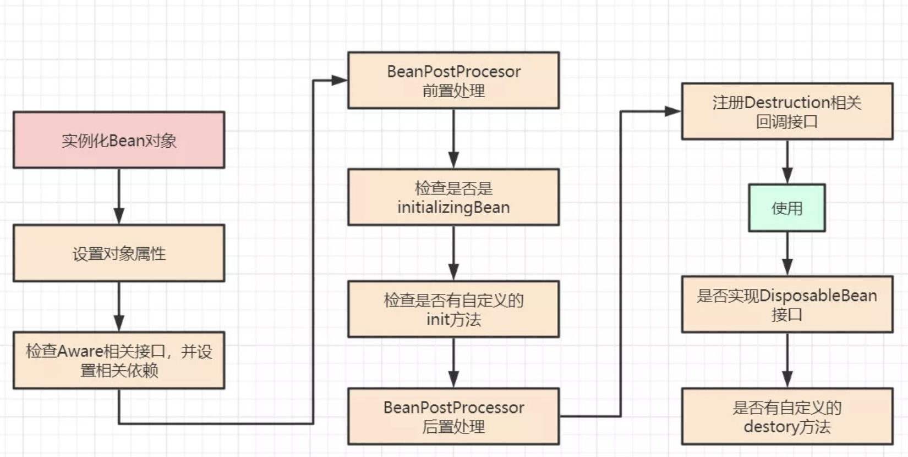
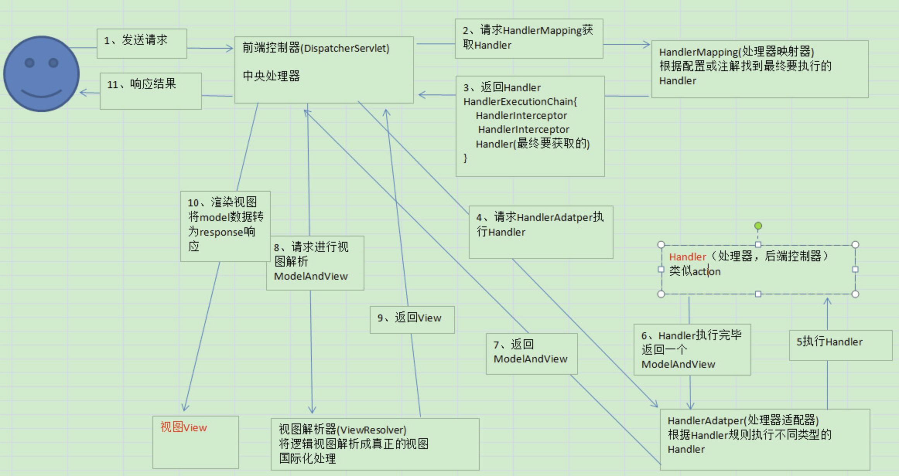

# Spring

## 核心概念

#### IOC: 控制反转
- Spring作为IOC容器，可以理解为一个非常大的Map
- Map中维持着对象名称和实例之间的映射关系

#### DI: 依赖注入
- IOC是一种思想，将实例和名称维护在一个大的容器中，将Bean与Bean之间的关系，交由容器维护
- DI是实现这种思想的手段，依赖由容器注入到使用方中

#### AOP: 面向切面编程
- 目标：提高代码复用，将通用的日志、拦截增强等操作进行抽象
- 通过**代理**方式实现AOP

**静态代理**
- 编译期实现增强，如`Aspect`

**动态代理**
- JDK动态代理
  - 基于接口实现。原因: 基于JDK动态代理生成的类，默认继承Proxy类，Java是不支持多继承
  - 通过 `ProxyGenerator.generateProxyClass` 生成动态代理类字节码, 通过native的findClass方法装载Class到Metaspace区
- CGLIB动态代理
  - 基于类实现。生成的动态代理类直接继承被代理类，完成增强环绕。所以，final方法是无法被代理的
  - 基于ASM改写字节码

-----

## Spring AOP

**在Bean实例化完成并注入属性后，初始化Bean之前。执行`AbstractAutoProxyCreator`的`postProcessBeforeInstantiation`方法，返回通过AOP增强的动态代理类对象**
- 即执行`BeanPostProcessor`的`before`方法
- 如果有Advised增强作用于当前bean，例如@Transactional、自定义AOP环绕等，则通过JDK或CGLIB动态代理生成代理类
- 生成的代理类继承Advised接口,表示被增强
- 否则直接创建类或接口实现类对象本身

> 为什么是执行`BeanPostProcessor`的`before`方法?
>
> 根据Bean的初始化流程来看，执行init方法前，Bean的属性应该是被动态代理完全的，总不能让初始化方法用一个还没有被增强的Bean
>
> 例如一个实际场景：bean初始化逻辑中要读取数据库，如果依赖的Bean还没有被增强，如何获取事务？如何获取JDBC Connection？

[AbstractAutoProxyCreator.java]
```java
public Object postProcessBeforeInstantiation(Class<?> beanClass, String beanName) {

    // ...省略其他步骤...

    Object[] specificInterceptors = this.getAdvicesAndAdvisorsForBean(beanClass, beanName, targetSource);
    // 创建动态代理类对象
    Object proxy = this.createProxy(beanClass, beanName, specificInterceptors, targetSource);
    this.proxyTypes.put(cacheKey, proxy.getClass());

    return proxy;
}
```

**Spring AOP与Aspect的关系**
- Spring实现了Aspect的注解规范，例如@Around @Before等，并没有基于Aspect实现代理

**如何强制使用Cglib生成动态代理类**```target-proxy=true```
- 如果不使用该配置，默认根据类是否实现了接口，决定采用哪种方式实现动态代理

**如何使Spring AOP生效**
- 在方法调用时，必须通过被增强的Bean调用才可以，此时是使用的代理类对象
- 如果直接this.xxx()或者super.xxx()是无效的，因为该方法并没有被增强

参考:
> 从动态代理实现到Spring AOP看这一篇就够了: https://mp.weixin.qq.com/s/EZ62B31Wxy47ISpiEKKVlg

----

## Spring Context

### 基本概念

- 实例化：创建Bean的原始对象，可以理解为只调用构造方法
- 依赖注入：根据BeanDefinition完成依赖Bean的实例化 + 注入 + 初始化(这是一个嵌套递归的过程，最底层的bean没有依赖，所以只有实例 + 初始)
  - 构造方法注入
  - Setter注入
  - @Autowaire注入 - 反射
- 初始化：依赖注入后到Bean完全可以使用之前
  - 依赖注入只会完成需要`@Autowire`、`setter`、`构造方法依赖`Bean的注入;也许Bean中还有其他属性需要初始化
  - 对于动态代理类，原始被代理的对象应该是一个基本功能完备的，例如Aware、其他前置处理都完成的Bean

### Context容器初始化流程

**容器初始化流程总结**
- BeanFactory初始化
- 装载Beandefinition，执行BeanFactoryPostProcessor，用以修改Bean定义
- 装载BeanPostProcessor，用以完成Bean初始化前后的操作
- 完成Bean的初始化、依赖注入、实例化
- 完成容器刷新，发送Event

_容器初始化整体源码流程_

[AbstractApplicationContext.java]
```java
public void refresh() throws BeansException, IllegalStateException {
	synchronized (this.startupShutdownMonitor) {
		// 容器刷新前的预处理操作：设置容器启动标示等操作.
		prepareRefresh();

		// 创建BeanFactory
		/*
		 * 1. createBeanFactory(): 创建BeanFctory
		 *
		 * 2. loadBeanDefinitions(): 装载BeanDefinition
		 */
		ConfigurableListableBeanFactory beanFactory = obtainFreshBeanFactory();

		// BeanFactory使用前预处理
		/**
		 * 1. 设置BeanFactory的ClassLoader
		 *
		 * 2. 添加ApplicationContextAwareProcessor：为实现Aware的Bean在初始化前注入所需的对象
		 *
		 * 3. 添加ApplicationListenerDetector：将实现ApplicationListener的Bean,在初始化后，通过BeanPostProcessor的After方法注册到Context中，为实现监听容器事件
		 */
		prepareBeanFactory(beanFactory);

		try {
			// BeanFactory后置处理，不常用.
			postProcessBeanFactory(beanFactory);

			// 执行BeanFactoryPostProcessors，以修改BeanDefinition（例如替换属性的value、移除某一些冲突的BeanDefinition）
			/**
			 * 1. 获取BeanDefinitionRegistryPostProcessor实现类的Bean并执行postProcessBeanDefinitionRegistry方法
			 * (一般来说我们可以直接实现该接口，这也是最常用的方式)
			 *
			 * 2. 获取直接实现BeanFactoryPostProcessor的Bean并执行postProcessBeanFactory方法
			 *
			 * 3. BeanFactoryPostProcessor的执行顺序，不受@Order注解控制；
			 * 优先排序并执行实现PriorityOrdered接口的Bean，然后再排序并执行实现Ordered接口的Bean
			 * 
			 * 4. BeanFactoryPostProcessor会通过BeanFactory的getBean方法提前实例化，但是不会注入属性和初始化，所以无法使用Bean
			 */
			invokeBeanFactoryPostProcessors(beanFactory);

			// 实例化并注册BeanPostProcessor实现类的Bean，用以扩展Bean初始化(init-method、afterPropertiesSet)前后的动作并返回被扩展的Bean对象
			/**
			 * 1. 要在实例化应用程序Bean之前，完成BeanPostProcessor实现类Bean的提前实例化，并注册到BeanFactory中
			 * 
			 * 2. 优先排序并执行实现PriorityOrdered接口的Bean，然后再排序并执行实现Ordered接口的Bean。同样不受@Order控制
			 *
			 * 3. 与BeanFactoryProcessor一样，Bean都是被提前实例化的，所以不能在实现类中注入应用程序Bean
			 */
			registerBeanPostProcessors(beanFactory);

			// 初始化消息处理，可理解为国际化支持
			initMessageSource();
	
			// 初始化容器事件广播组件，用来向各种ApplicationListener发送容器的Event
			initApplicationEventMulticaster();

			// 执行刷新方法，子类中实现刷新逻辑
			// 例如在Spring-boot-web中，在这个阶段创建createWebServer-web容器
			onRefresh();

			// 注册容器事件ApplicationListener监听器Bean
			/**
			 * 1. 将ApplicationListener实现类的BeanName注册到ApplicationEventMulticaster容器事件广播组件
			 * 
			 * 2. 使用beanName的方式，可以在监听器中使用应用程序Bean
			 */
			registerListeners();

			// 实例 + 初始化 非懒加载 的 应用程序Bean
			// beanFactory.preInstantiateSingletons() ---> AbstractBeanFactory.createBean() ---> AbstractAutowireCapableBeanFactory.doCreateBean() 完成
			finishBeanFactoryInitialization(beanFactory);

			// 完成容器初始化，并发布 ContextRefreshedEvent 事件.
			finishRefresh();
		}
	}
}
```

### Bean的创建流程



**Bean初始化流程总结**

- 实例化Bean对象：首先创建Bean对象实例，才可以进行后续的初始化和增强操作
- populateBean：根据BeanDefinition完成依赖属性注入
- 初始化Bean:
  - 注入Aware对象
  - 执行BeanPostProcessor的before方法: 目的是后续流程也许需要使用已经被proxy增强的功能，所以需要先执行
  - 执行afterPropertiesSet方法
  - 执行init-method方法
  - 执行BeanPostProcessor的before方法

_Bean创建整体源码流程_

[AbstractAutowireCapableBeanFactory.java]
```java
// 创建Bean的主流程
protected Object doCreateBean(String beanName, RootBeanDefinition mbd, @Nullable Object[] args) throws BeanCreationException {

	// 实例化Bean对象.
	BeanWrapper instanceWrapper = null;
	if (mbd.isSingleton()) {
		instanceWrapper = this.factoryBeanInstanceCache.remove(beanName);
	}
	if (instanceWrapper == null) {
		instanceWrapper = createBeanInstance(beanName, mbd, args);
	}
	Object bean = instanceWrapper.getWrappedInstance();

	// .... //

	// 初始化Bean对象.
	Object exposedObject = bean;
	try {
        // 注入属性
		populateBean(beanName, mbd, instanceWrapper);
        // 初始化Bean，理解为调用 init 方法、动态代理增强
		exposedObject = initializeBean(beanName, exposedObject, mbd);
	}

	// .... //
	return exposedObject;
}

// 初始化Bean
protected Object initializeBean(String beanName, Object bean, @Nullable RootBeanDefinition mbd) {
	// 为实现Aware接口的Bean，执行对应的注入属性或值的方法
	/**
	 * 1. 实现BeanNameAware接口的Bean，注入当前的BeanName
	 * 2. 实现BeanClassLoaderAware接口的Bean，注入当前的ClassLoader
	 * 3. 实现BeanFactoryAware接口的Bean，注入当前的BeanFactory
	 */
    invokeAwareMethods(beanName, bean);

	Object wrappedBean = bean;
	if (mbd == null || !mbd.isSynthetic()) {
		// 执行BeanPostProcessor的before方法
		/**
		 * 1. 所有BeanPostProcessor已经在registerBeanPostProcessors阶段，按照优先顺序添加到BeanFactory中
		 * 
		 * 2. 在这个阶段，调用AbstractAutoProxyCreator生成动态代理类对象（因为被代理对象已经被实例化了，可以createProxy了）
		 */
		wrappedBean = applyBeanPostProcessorsBeforeInitialization(wrappedBean, beanName);
	}

	// 执行初始化逻辑方法（先执行afterPropertiesSet 再执行init）
	/*
	 * 1. 如果Bean实现了InitializingBean接口，首先执行afterPropertiesSet()方法
	 *
	 * 2. 执行Bean的init-method方法
	 */
	invokeInitMethods(beanName, wrappedBean, mbd);

    // 执行BeanPostProcessor的after方法（会执行AbstractAutoProxyCreator）
	wrappedBean = applyBeanPostProcessorsAfterInitialization(wrappedBean, beanName);

	return wrappedBean;
}
```

### Spring循环依赖

- 只有通过@Autowire和setter注入的方式的单例Bean可以解决
- 基于三级缓存的模式
- 构造器注入无法解决，不能通过构造方法创建早期对象
- 要尽量避免循环依赖，将代码结构拆散解耦才是主要解决方案

----

## Spring JDBC

### Spring事务传播级别

- REQUIRED：当前线程支持事务，如果没有开启，如果有则加入到当前事务中（默认传播级别）
- REQUIRED_NEW：挂起当前事务，并开启新的事务
- SUPPORTS：如果当前上下文中存在事务，则加入事务；如果上下文中不存在事务，则以非事务的方式运行
- MANDATORY：上下文中必须存在事务。否则抛出异常；使用场景：例如我们要求某一个方法不能单独执行，一旦被调用，就必须处于一个已有的事务中
- NOT_SUPPORTED：不支持在事务中运行。如果当前上下文中存在事务则挂起，以非事务的模式执行
- NEVER：完全不支持事务运行。与`NOT_SUPPORTED`不同的是，该级别如果运行在事务中，会直接抛出异常
- NESTED：嵌套级别事务。整体与`REQUIRED`类似，但是有一个非常大的差别，即`REQUIRED`的子事务异常，父事务也会回滚；而`NESTED`级别即使子事务异常回滚，不会影响主事务提交

### 嵌套事务的处理问题

**在事务方法内，以本地调用方式调用其他方法，事务传播级别不会生效**

- 原因：Spring事务是基于Spring AOP实现的切面拦截，将DataSource信息写入到当前线程的`ThreadLocal`中；内部本地调用没有被动态代理拦截，没有执行动态代理类的方法，@Transactional拦截不生效
- 解决方案：
  - 将被调用方法拆分到另一个Bean中，通过Bean注入属性，再调用
  - 通过`ApplicationContext.getBean()`获取当前Class的Bean实例，再调用方法

**在REQUIRED传播级别中，嵌套事务异常对主事务回滚的影响**

- 场景1：外层方法try...catch..

> 结果：抛出异常并回滚所有事务
>
> 原因：内层事务AOP会拦截到抛出的Exception；内外层事务共用一个`TxObject`，内层事务失败时，会设置rollbackonly=true；外层事务提交时会检查该状态并回滚

- 场景2：内层方法try...catch..

> 结果：如果不抛出异常或者自定义异常，内外层所有已经执行的sql都会commit，但是外层有异常抛出时，内外层全部事务还是会回滚
>
> 原因：内层事务AOP并没有拦截到有Exception，所以表象为内层事务正常执行

**@Transactional的rollback**

_针对嵌套事务异常的问题，如果希望事务不回滚：_

- 内层事务抛出自定义异常，noRollbackFor指定为该类型异常不回滚，外层继续try...catch包裹即可
- 内层方法不开启事务(常用，一般来说事务应该加载最上层做逻辑组合)，即使抛出异常不会影响TxObject
- 内层方法使用REQUIRE_NEW，开启新事务并挂起当前事务：使用该方式要评估内层事务独立运行对业务流程的影响
- 内层方法内使用try...catch包裹，异常不抛出，以返回值方式标示是否成功执行(不建议使用，这样exception前的sql仍然会被commit；除非该方法只做一句update、delete)
- 内层事务传播级别为NESTED，外层仍然try-catch

**同一个事务的Connection都是一个**

mybatis-spring保证、jdbcTemplate保证：都是基于Spring-jdbc的DataSourceUtils获取连接

----

## Spring MVC

**核心：**Spring MVC基于Servlet实现，是非线程安全的，只有单例

**工作流程**



- DispatcherServlet接收请求，并查找HandlerMapping，获取Handler
- HandlerAdapter调用Controller中的具体方法（Handler），并返回ModelAndView
- ViewRelover解析处理ModelAndView，返回View对象（Json、Jsp、ftl等）
- DispatcherServlet根据View渲染结果（填充value属性）
- DispatcherServlet响应结果

----

## Spring 常用扩展点

### Spring通用扩展

#### 自定义标签

#### BeanDefinitionRegistryPostProcessor

#### BeanFactoryProcessor

#### BeanPostProcessor

#### Aware

#### Listener

#### FactoryBean

#### Spring Boot扩展

#### ApplicationContextInitializer

#### AutoConfiguration

**参考:**

> 聊聊Spring中的那些扩展机制：http://blog.itpub.net/31555607/viewspace-2214762/
>
> SpringBoot启动流程：https://www.processon.com/view/link/5f4c5d83e401fd14b2261d58?pw=src666
>
> 详解Spring Framework提供的扩展点：ApplicationContextInitializer应用上下文初始化器，以及它在SpringBoot中的应用: https://cloud.tencent.com/developer/article/1497696

----
