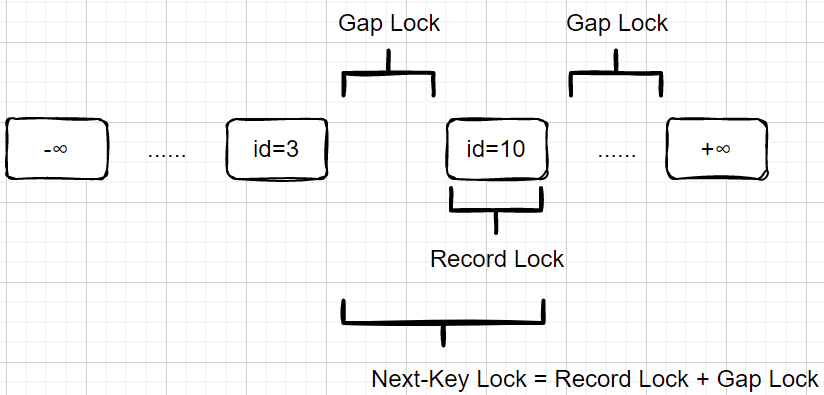
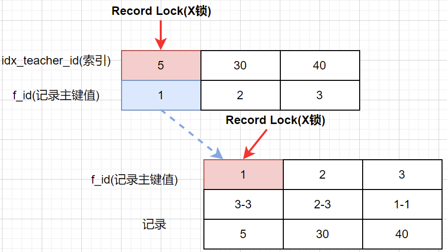
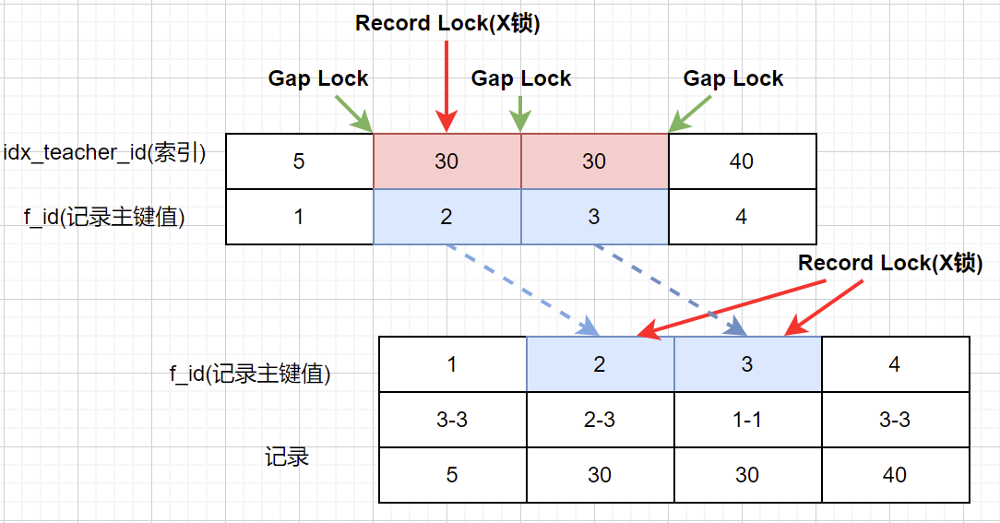

# Lock - 锁

## 乐观锁 & 悲观锁

### 乐观锁

乐观锁是相对悲观锁而言的，乐观锁假设数据一般情况下不会造成冲突，所以在数据进行提交更新的时候，才会正式对数据的冲突与否进行检测。

逻辑概念，即使是乐观锁更新，还是会有悲观锁；更新操作会加排它锁。提交的时候才去锁定。

#### 乐观锁的实现方式

乐观锁，大多数是基于数据版本(version)机制实现。所谓的数据版本，即为数据增加一个版本标示，一般来说为数据表新增一个类似`version`的字段。

**基于版本号实现乐观锁**

- 数据表设置一个独立的`f_version`字段，标示记录的当前版本号
- 当进行数据更新时，`WHERE`条件需要携带旧的`f_version`值并且更新记录新的`f_version = f_version + 1`
- 如果更新失败，表示该记录有并发冲突，进而进行冲突处理流程（重试 or 结束）

_表结构示例_

| f_id | f_name | f_version | f_created_time | f_updated_time |
| --- | --- | --- | --- | --- |
| 1 | TEST | 1 | NULL | NULL |

_SQL示例_

`UPDATE t_user SET f_name='1', f_version=f_version + 1 WHERE f_id = 1 AND f_version = 1;`

> 基于版本号实现的方式，适用于无状态流转的场景，这样即使由于并发冲突导致更新失败可以自旋重试到成功或明确失败

**基于状态机实现乐观锁**

- 基于状态的流转实现，状态的流转是`有限有向`的
- 进行数据更新时，`WHERE`条件需要携带旧的`f_state`值并且更新记录新的`f_state`到下一个流转的状态
- 如果更新失败，表示记录有并发冲突，状态已经无法从当前流转到期望的值，结束流程或进行其他异常业务处理

> 基于状态机实现的方式，适用于订单状态流转、定时任务捞取记录进行重试等场景

### 悲观锁

与乐观锁相对应的是悲观锁。悲观锁就是在数据操作前，就已经认为该操作会出现数据冲突，所以在每次操作时要先获取对记录的锁之后，再进行操作。

悲观锁的实现，一般都是需要依赖数据库提供的锁机制实现（也只有数据库层面提供的机制，才能真正的保证数据访问的排他性；否则，即使在系统内实现了排他机制，也无法保证系统外对数据的修改）。

在悲观锁的场景下，为保证事务的隔离性，一般都要在资源加载阶段加锁锁定，以保证一致性读且其他事务无法并发修改数据。

----

## MySQL锁模式

### 共享锁 & 排他锁

**锁粒度:** 行级别

#### 共享锁（S）

事务可以并发读取数据，但任何事务都不能对数据进行修改，直到所有事务都释放共享锁，所以共享锁也可以被称为`读锁`；

使用共享锁的目的也是在于保护数据在事务执行过程中被加载后，不被其他事务修改的同时，提高对行记录操作的并发度。

**实现方式：** `SELECT * FROM T_USER LOCK IN SHARE MODE`

**使用场景**

相对不多。绝大多数业务场景需要在整个事务中锁住记录并进行修改；对于又`父-子`关系的表中，且父表记录会频繁更新&子表无数据唯一性的场景，可以为父表记录添加读锁，防止父表的记录被修改。

例如：生成订单商品快照的场景，如果用排他锁锁住订单信息，就会导致其他服务无法读取商品信息进行其他业务逻辑操作。但一般也不会这么使用，我们完全可以用商品信息版本的方式来实现，在这里只是抛砖引玉。

**死锁场景示例**

在使用共享锁的事务和逻辑中，要避免更新操作，否则会产生死锁。

| Transction A | Transaction B | 说明 |
| ---- | ---- | ---- |
| `SET autocommit = 0;` | `SET autocommit = 0;` | 设置Session不自动提交 |
| `SELECT * FROM t_user_info WHERE f_id=100000 LOCK IN SHARE MODE;` | `SELECT * FROM t_user_info WHERE f_id=100000 LOCK IN SHARE MODE;` | 使用共享锁查询记录，此时行记录均上S锁 |
| `UPDATE t_user_info SET f_email='ad.xueqi@123.com' WHERE f_id=100000;` | - | 事务A更新记录，此时需要等待事务B释放S锁后，才可以加X锁 |
| waiting... | - |
| waiting... | `UPDATE t_user_info SET f_email='ad.xueqi@123.com' WHERE f_id=100000;` | 事务B更新记录，此时需要等待事务A释放S锁后，才可以加X锁 |
| Query OK, 0 rows affected (8.46 sec) | ERROR 1213 (40001): Deadlock found when trying to get lock; try restarting transaction | 两个事务互相等待锁释放，死锁，其中一个事务异常，另一个事务完成 |

#### 排他锁（X）

排他锁是用来锁定数据进行操作的，所以也称为`写锁`。若某个事务对某一行加上了排他锁，在事务结束之前，其他事务不能再获取该条记录的共享锁和排他锁。

其他事务可以无锁读，排他锁是悲观锁的主要实现，通过排他锁可以将对记录的并发操作串行化。

**实现方式：** 

- 自动加排他锁：我们在操作数据的时候，包括增删改，都会默认加上一个排它锁
- 手工加排他锁：`SELECT  + FOR UPDATE`

**使用场景：**

非常多。例如分布式锁，或者需要较高数据一致性的场景。

**排他锁验证**

| Transction A | Transaction B | 说明 |
| ---- | ---- | ---- |
| `SET autocommit = 0;` | `SET autocommit = 0;` | 设置Session不自动提交 |
| `UPDATE t_user_info SET f_email='ad.xueqi@123.com' WHERE f_id=100000;` | - | 事务A通过主键更新记录，此时记录上X锁 |
| `Query OK, 1 row affected (0.01 sec)` | - | - |
| - | `UPDATE t_user_info SET f_email='ad.xueqi@123.com' WHERE f_id=100000;`（Block）| 事务B通过主键更新记录，由于此时记录上已有事务A的X锁，所以挂起等待 |
| `commit` | - | 事务A提交 |
| - | `Query OK, 0 rows affected (9.22 sec)` | 事务B获取到X锁，完成更新 |
| - | `commit` | 事务B提交 |

### 意向锁

**锁粒度:** 表级别

意向锁的目的是表示某个事务要在当前表上获取共享锁或者排他锁，重点在于表明加锁动作的`意图`。

InnoDB支持两种意向锁：

- 意向共享锁(IS): 事务要在当前表的一条或多条记录上获得共享锁
- 意向排他锁(IX): 事务要在当前表的一条或多条记录上获取排他锁

**加锁流程**

- 在一个事务获取某行记录的S锁之前，它必须对该表获取一个IS锁或者是更高级别的锁
- 在一个事务获取某行记录的X锁之前，它必须对该表获取一个IX锁

**为什么存在意向锁**

在绝大多数的开发场景中，我们都是对表里的某条或者某几条记录进行加锁，无论是S锁还是X锁，前提是`WHERE`要命中索引，因为InnoDB的锁是基于索引级别的。

当某个事务需要获取 **`整张表`** 的锁时（例如`SELECT * FROM table FOR UPDATE`或者`WHERE`条件没有名字索引的场景下），如果要逐行扫描每一条是否有冲突锁的话效率是很低的。

此时，对于数据库来说，只需要关注这张表上是否有相关的意向锁即可，提高了处理 **`表锁`** 时锁冲突的效率和性能。

### 锁模式兼容矩阵

| \ | IS | IX | S | X |
| ---- | ---- | ---- | ---- | ---- |
| IS | + | + | + | - |
| IX | + | + | - | - |
| S | + | - | + | - |
| X | - | - | - | - |

总结：意向锁之间互相兼容，共享锁类之间是互相兼容的，除此之外意向锁和共享排他锁之间不兼容。

----

## MySQL行锁类型

**加锁时机**

- 执行DDL语句：`INSERT`、`UPDATE`、`DELETE` 时
- 事务中的查询语句加排他锁(X)：`SELECT ... FOR UPDATE` 时
- 事务中的查询语句加共享锁(S)：`SELECT ... IN SHARE MODE` 时

**行锁的生效条件**

- 锁是加在索引上而非具体的行上。所以，只有当需要获锁的SQL语句没有使用索引的情况下，MySQL基于优化的策略，会进行锁表

### Record Lock - 记录锁

对单条索引记录上加的锁。

当基于`一般索引`或`唯一索引`查询时，因为InnoDB聚簇索引的特性，Record Lock在索引上加锁后，也会在索引记录对应的聚簇索引上加锁。这样做的目的也是在于，不同的普通索引最后都会对应同一个聚簇索引，要保证锁在不同的查询条件下仍然互斥。

**加锁情况说明**

SQL：`select * from t_class_teacher where f_teacher_id = 5 for update;`

idx_teacher_id可以为普通索引，也可以为唯一索引，我们统称为 _辅助索引_

### Gap Lock - 间隙锁

对索引记录的区间加的锁。可以是在一条索引记录之前，也可以在一条索引记录之后

只有`Repeatable Read`隔离级别存在，作用是保证运行在RR级别的事务在执行`加锁`类动作后，防止其他事务向GAP内插入新的记录，避免产生 **`幻读`** 的情况。

即使查询的条件没有记录，也会在区间中加上`Gap Lock`

**加锁情况说明**

SQL：`select * from t_class_teacher where f_teacher_id = 30 for update;`

idx_teacher_id可以为普通索引，也可以为唯一索引，我们统称为 _辅助索引_

**参考**

> Innodb中的事务隔离级别和锁的关系: https://tech.meituan.com/2014/08/20/innodb-lock.html
>
> MySQL探秘(四)MySQL事务与锁详解: https://princeli.com/mysql%E6%8E%A2%E7%A7%98%E5%9B%9Bmysql%E4%BA%8B%E5%8A%A1%E4%B8%8E%E9%94%81%E8%AF%A6%E8%A7%A3/
>
> 全面了解mysql锁机制（InnoDB）与问题排查: https://juejin.im/post/5b82e0196fb9a019f47d1823
>
> 详解MySQL中得锁机制及实现: https://cheng-dp.github.io/2019/05/13/mysql-lock/