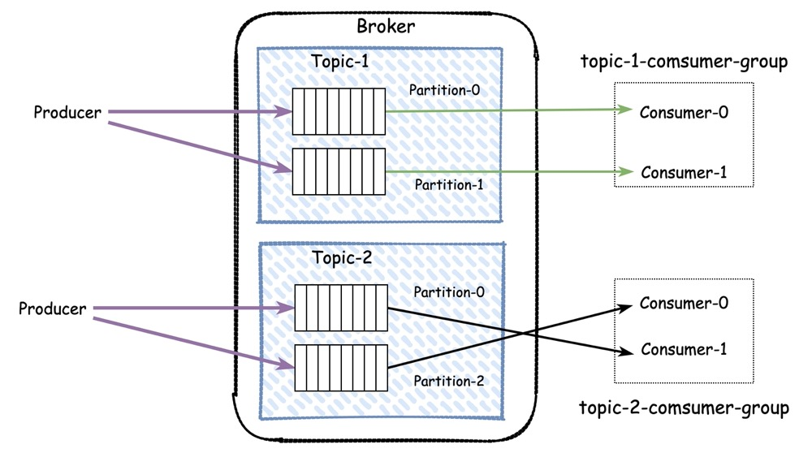
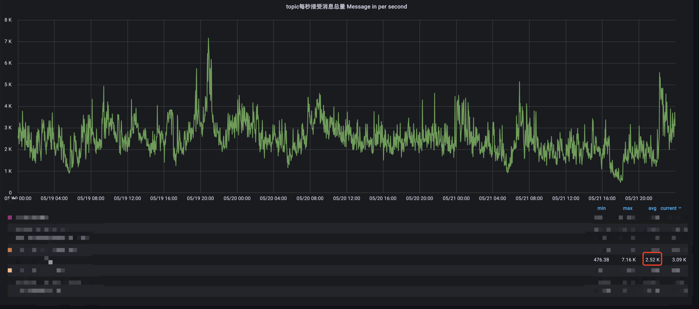

# Kafka

## 关键术语

**Broker**

Kafka的服务器端是由被称为Broker的进程组成，一个Kafka集群是由多个Broker组成。Broker负责接收客户端发送的请求，并对消息进行持久化。虽然多个Broker可以运行在一台服务器上，但更常见的做法是将不同的 Broker 分散运行在不同的机器上，这样如果集群中某一台机器宕机，即使在它上面运行的所有 Broker 进程都挂掉了，其他机器上的 Broker 也依然能够对外提供服务。这其实就是 Kafka 提供高可用的手段之一。

**Topic**

发布订阅消息的对象主体是`主题`，你可以为每个业务、每个应用甚至是每类数据都创建专属的主题。

**Producer**

消息生产者。发布消息的客户端应用成为生产者。

**Consumer**

消息消费者。订阅这些主题消息的客户端应用程序就被称为消费者。

**Partition**

分区。在Kafka中，一个Topic被分配为多个分区(`Partition`)，每个分区是一组有序的消息日志。生产者在某一个Topic上生产的消息，只会被发送到该Topic的其中一个Partition中。这也就是说，一条消息不是在Partition-0，就是在Partition-1。

> 为什么要有Partition的概念？
>
> - kafka中，Topic是一个逻辑上的概念，而Partition是物理上的概念。生产者和消费者只对Topic感兴趣，至于Topic在Broker上是如何组织存储的，是不关心的。
>
> - 出于性能考虑，如果一个Topic的数据都存在一个Broker或者队列中，那么这个Broker或者队列就成为了性能和可用性的瓶颈。而基于Partition的概念，一个Topic的存储就可以做到横向的扩展。
>
> - 在物理上，一个Partition对应一个物理文件夹，我们可以认为消息在文件中是顺序写入的（磁盘顺序写入的性能是远大于随机写入的，不论是机械硬盘还是SSD硬盘）；而一个Broker中，一个Topic可以存放多个Partition文件
>
> - 这样，Producer在生产消息时，可以将消息负载分发到某一个Broker中的某一个Partition中

**Segment**

段。Partition在物理上是由多个`Segment-段`组成的；在Broker的物流磁盘中，Partition是一个文件夹，而消息是按照时间顺序存储在一个一个的Segment文件中。

> 既然已经有了Partition分区概念，为什么还需要Segment？
>
> - 如果不引入Segment的概念，一个Partition的消息都在同一个文件中，随着时间的推移，这个文件会越来越大，必然需要处理文件压缩的问题，否则空间会被无线浪费
>
> - 消息在Partition中按照Partition组织后，当Kafka进行数据压缩时，只需要将旧Segment文件进行删除即可，并不会影响到新Segment文件的顺序写入

**Consumer Group**

消费者组。指的是多个消费者实例共同组成一个组(groupId)来消费一组`Topic-主题`。Topic的每个`Partition-分区`在同一个`Consumer Group-消费者组`中，只能有一个`Consumer`；但是，这一个消费者可以消费多个分区。

同时，同一个消费者组内的消费者实例不要大于Partition的数量，否则多余节点是不会消费消息的。

> 为什么一个Partition在同一个Group中只能有一个Consumer？
>
> - Partition是最小单位，如果说同一个Group内的多个Consumer同时消费Message的话，由于每一个节点的处理速度一定是不一样的，那必须等待所有的消费者消费完消息后，才可以推送（或者叫被拉取）下一条消息，否则同一个组内的消费就不是`顺序`和同步的
>
> - 我们可以认为不同的消费者组，有不同的消费逻辑（即使是同样的代码）；那只需要维持每一个消费者组已经消费的offset即可，这也降低了复杂性
>
> - 关键还是为了保证消费消息时的顺序性
>
> 如果我们希望应用的所有节点，都可以消费到Topic中的消息怎么办？
>
> - 应用启动时，每一个节点随机生成一个唯一的消费者组名称



**Consumer Offset**

偏移量。每个消费者在消费Partition的消息时，一定有一个字段记录已经消费到哪一个位置，这个字段就是消费者位移（Consumer Offset）。注意，这个和分区位移是不同的。

分区位移是消息在Partition的位置，一旦消息被成功的写在某一个Partition上后，这个值就是固定不变的。

而消费者位移则不同，它是消费者消费进度的指示器嘛，不同消费者的位移是不同的。可以理解为书签。

**Replication**

副本。副本是把相同的数据拷贝到多台机器上来实现高可用。分为领导者副本和跟随者副本。

领导者对Producer和Consumer提供服务，而Replication只从Leader接受数据同步。和Raft中的Leader、Replication关系一致，Replication即使接收到Consumer的请求，也会将其转发到Leader节点。

**Rebalance**

重平衡。这是Kafka实现高可用的手段之一，当一个Consumer节点挂掉之后，kafka会检测到并将挂掉实例负责的分区，重新分配给其他消费者。

----

## 主要配置参数

### Broker参数

#### auto.create.topics.enable

是否允许自动创建 Topic。开发测试环境允许自动创建，生产环境应该由运维根据工单操作。

#### message.max.bytes

Broker 端对 Producer 每批发送过来的消息也有一定的大小限制。

默认值：`1M`

#### replica.fetch.max.bytes

Broker可复制的最大字节数。要大于`message.max.bytes`的配置，否则Master节点可以接受消息，但是无法复制到Replication节点，从而造成数据丢失。

#### log.retention.hours/log.retention.minutes/log.retention.ms

消息保存时长。个参数可以同时设置，kafka会优先使用最小值的参数，kafka默认log.retention.hours=168， topic具有相同的参数，会覆盖调broker配置。

### 生产者参数

#### acks

broker的确认数，通常有`0、1、all`三种常见配置。

0：生产者完全不等待Broker的响应，记录添加到Producer缓冲区后就视为发送成功。这种配置，生产者吞吐量最高，但是不能保证消息被成功投递；适合非重要消息、oneway消息；

1：生产者同步等待Broker主节点已经成功确认消息，即视为发送成功。不会等待Replication节点的同步结果。这种配置最平衡，只要主节点刷盘成功，消息就不会丢失；只有主节点没有刷盘，同时也没有同步到Replication节点，宕机恢复后，消息会丢失；

all：表示领导者和跟随者都确认成功，才视为已发送。效率是三者里面最低的。如果要确保不丢消息就要设置为all

#### buffer.memory

指定Producer本地内存缓冲区大小。KafKa使用异步发送的消息架构，Producer在启动时会划分一块内存区域缓冲保存待发送的消息，然后由专属线程负责从缓冲区真正读取消息然后发送到Broker。

默认值：`32M`

消息在大量快速生成的过程中，会将buffer内存填满；此时Producer再发消息时会被阻塞，这段时间不能超过`max.blocks.ms`设置的值，一旦超过，producer则会抛出`TimeoutException`异常。

如果说，我们的消息生产者经常报`TimeoutException`异常时，是需要考虑调大`buffer.memory`的配置；由于Producer是线程安全的，多线程共享kafka producer时，很容易把 buffer.memory 打满。

#### max.block.ms

消息发送阻塞时间。如果消息发送过快导致buffer区被打满，此时Producer会被阻塞，如果超过了`max.block.ms`配置的时间，会抛出`TimeoutException`异常

默认值：`60000`

#### compression.type

消息压缩类型。有效值为`none、gzip、snappy、lz4或zstd`。Broker会适配压缩配置，压缩的目的在于缩减带宽，但是会降低性能

压缩动作发生在Producer端，Broker不做压缩动作（生产者压缩格式千千万，Broker适配的成本太高，只要可以成功接收、落盘、push出去即可），Consumer做解压。一般消息无需压缩

默认值：`none`

#### retries

重试次数。失败后自动重试的次数，一直重试到配置值或broker返回ack

默认值：`Integer.MAX_VALUE`

#### batch.size

批次大小。当消息发送到相同的Partition时，是会被打包成一批发送的，这样可以减少网络交互的开销；

但是这个配置也不能太大，如果太大的话，Producer生产的消息一直在缓冲区发不出去，那消息的延迟就会非常高。

默认值：`16KB`

一般和`linger.ms`搭配使用

#### linger.ms

批处理延迟时间。很多应用不会频繁大量生成消息，可能需要缓冲区发送到同一个分区的消息才能凑够`batch.size`配置的大小，如果只是简单等到batch.size大小再发送消息，可能很多系统永远都没办法发出消息了；

linger.ms的作用是，即使缓冲区没有凑够batch.size`配置的大小，到时间也要将该分区的消息发送出去，降低消息的延迟

一般和`batch.size`搭配使用，同时设置batch.size和 linger.ms,就是哪个条件先满足就都会将消息发送出去

### 消费者参数

#### fetch.max.bytes

Consumer一次从Broker中拉取消息的最大数据量。

默认值：`50M`

#### max.partition.fetch.bytes

Consumer一次拉取中，每一个`partition`的最大数据量。

默认值: `1M`

这个参数和`fetch.max.bytes`的区别在于，`fetch.max.bytes`关注一次拉取的所有分区数据量大小之和，而`max.partition.fetch.bytes`关注的是每一个分区的数据量大小

#### fetch.min.bytes

每次拉取的最小字节数。如果Broker可用的数据量小于 fetch.min.bytes 指定的大小，那么它会等到有足够的可用数据时才把它返回给消费者。这样可以降低消费者和 broker 的工作负载。

和`fetch.max.wait.ms`搭配使用，一般不用配置。

#### fetch.max.wait.ms

从Broker拉取消息的最大等待时间。同时设置`fetch.min.bytes`和`fetch.max.wait.ms`,哪个条件先满足就都会拉取消息。

默认值：`500`，一般来说无需配置

#### group.id

消费者组名称。多个消费者实例共同组成的一个组，同时消费多个分区以实现高吞吐。

#### heartbeat.interval.ms

心跳间隔。与`session.timeout.ms`配合使用

heartbeat线程每隔`heartbeat.interval.ms`时间向`broker-coordinator`发送心跳包，证明还活着。

如果`broker-coordinator`在一个`session.timeout.ms`周期内未收到consumer的心跳，就认为consumer已经挂掉了，会将该消费者移出组，并触发rebalance

默认值：`3000`

#### session.timeout.ms

会话超时时间。与`heartbeat.interval.ms`配合使用

默认值：`3000`

#### auto.offset.reset

当Kafka中不存在当前偏移量时的处理逻辑。

取值范围：`latest-从最新offset开始消费`;`earliest-从最早的offset开始消费`

默认值：`latest`

#### enable.auto.commit

是否开启自动提交。如果开启自动提交，会根据`auto.commit.interval.ms`配置的时间间隔，自动提交当前的offset。

但是开启自动提交，会有重复消费的可能。

默认值：`true`

#### auto.commit.interval.ms

自动提交时间间隔。与`enable.auto.commit`配合使用，根据配置的时间间隔，提交当前消费的offset

默认值：`5000`

#### max.poll.records 和 max.poll.interval.ms

max.poll.records：单次消费者拉取的最大数据条数

> poll的过程是从缓冲区拉取，有可能会有网络的`fetch`操作：如果缓冲区为空或`nextInLineRecords`需要fetch，Consumer会从Broker拉取`max.partition.fetch.bytes`限制的数据，这时可能拉取回来1000条
>
> max.poll.records的作用是，调用`kafkaConsumer.poll()`方法，每次从缓冲区拉回多少条数据：例如配置10，那么要把刚才fetch回来的消息全部拿到，需要call 100次poll方法

max.poll.interval.ms：最大拉取时间间隔

> 如果Consumer超过这个时间间隔仍然没有发起poll操作，但是仍然发出心跳；Broker会认为该Consumer处于livelock状态，认为这个Consumer的处理能力太弱，会将其剔除Consumer Group，触发Rebalance操作
>
> Consumer为了自己不被踢出Group，应该不间断的发起poll操作；同时，即使在poll到消息以后，应该尽快提交到工作线程池处理，避免由于消息业务处理时间太长而超时
>
> 不间断发起poll操作的过程，client没有为我们提供实现，需要在应用中自己编码完成

#### partition.assignment.strategy

分区策略。

RangeAssignor（范围）：该策略会把主题的若干个连续的分区分配给消费者

RoundRobinAssignor（轮询）：该策略把主题的所有分区逐个分配给消费者

StickyAssignor（粘性）：粘性的分区分配策略。该策略会尽可能地保留之前的分配方案，尽量实现分区分配的最小变动。

----

## 编码范式

### 消息生产者

```java
public class Producer {
	private static KafkaProducer<String, String> producer;

	private Producer() {
	}

	private static class InnerKafkaProducer {
		private static final Producer INSTANCE = new Producer();
	}

	/**
	 * 获取单例的Producer
	 *
	 * @return
	 */
	public static Producer getInstance() {
		producer = new KafkaProducer<>(producerConfigs());
		return InnerKafkaProducer.INSTANCE;
	}

	private static Map<String, Object> producerConfigs() {
		Map<String, Object> props = new HashMap<>();
		// SERVER 地址，从环境变量：KAFKA_BOOTSTRAP_SERVERS 中获取
		props.put(ProducerConfig.BOOTSTRAP_SERVERS_CONFIG, System.getenv("KAFKA_BOOTSTRAP_SERVERS"));
		// retries 重试次数配置：0表示不配置，默认 Integer.MAX_VALUE = 2147483647，如果消息必须尽最大努力要送达，建议不配置
		props.put(ProducerConfig.RETRIES_CONFIG, 10);
		// batch.size 批次大小：当消息发送到相同的Partition时，是会被打包成一批发送的，默认16K；如果希望消息尽快被发送，可以调整小一些，我们生产配置10K
		props.put(ProducerConfig.BATCH_SIZE_CONFIG, 10240);
		// linger.ms 批处理延迟时间：同一个Partition缓冲区发送消息间隔，一般配置10ms，太久了消息延迟太大
		props.put(ProducerConfig.LINGER_MS_CONFIG, 10);
		// buffer.memory 生产者本地缓冲区大小：默认30M，一般配置64M
		props.put(ProducerConfig.BUFFER_MEMORY_CONFIG, 67108864);
		// acks 消息投递确认配置：0-会丢消息 all-吞吐太低 1-较为均衡，master确认接收即可
		props.put(ProducerConfig.ACKS_CONFIG, "1");
		// key.serializer key序列化方式：我们一般使用kafka提供的StringSerializer足以
		props.put(ProducerConfig.KEY_SERIALIZER_CLASS_CONFIG, StringSerializer.class);
		// value.serializer value序列化方式：我们一般使用kafka提供的StringSerializer足以
		props.put(ProducerConfig.VALUE_SERIALIZER_CLASS_CONFIG, StringSerializer.class);

		return props;
	}

	/**
	 * 获取KafkaProducer
	 *
	 * @return
	 */
	public KafkaProducer<String, String> producer() {
		return Producer.producer;
	}

	public static void main(String[] args) throws Exception {
		// Producer是线程安全的，多个线程可以共享一个实例
		KafkaProducer<String, String> kafkaProducer = Producer
				.getInstance()
				.producer();

		// 发送消息：直接异步发送，不管结果，有些异常无法捕获 oneway方式
		kafkaProducer.send(
				new ProducerRecord<>("topic_hb_hp_tester", "hello-world!")
		);

		// 发送消息：同步发送，等待发送结果
		try {
			RecordMetadata recordMetadata = kafkaProducer.send(
					new ProducerRecord<>("topic_hb_hp_tester", "test-key", "sync-hello-world!")
			).get();

			System.out.println("----同步发送----");
			System.out.println("topic:" + recordMetadata.topic());
			System.out.println("partition:" + recordMetadata.partition());
			System.out.println("offset:" + recordMetadata.offset());
		} catch (Exception e) {
			// log error
			e.printStackTrace();
		}

		// 发送消息：异步发送，执行回调函数
		kafkaProducer.send(
				new ProducerRecord<>("topic_hb_hp_tester", "test-key", "callback-hello-world"),
				(metadata, exception) -> {
					System.out.println("----异步发送----");
					System.out.println("topic:" + metadata.topic());
					System.out.println("partition:" + metadata.partition());
					System.out.println("offset:" + metadata.offset());
					System.out.println("exception:" + exception);
				}
		);

		// 应用结束前，要close掉producer
		kafkaProducer.close();

		// 为了演示回调，sleep
		Thread.sleep(10000L);
	}
}
```

### 消息消费者
```java
public class Consumer {
	private static final String TOPIC_OFFSET_TMP_PATH = "/Users/xueqi/Development/logs/";

	/**
	 * Consumer执行线程池. Kafka线程只负责poll消息，消息的处理均在工作线程执行
	 */
	private ThreadPoolExecutor            consumerExecutePool;
	/**
	 * kafka consumer实例
	 */
	private KafkaConsumer<String, String> kafkaConsumer;
	/**
	 * 保存各TopicPartition消费到的进度offset
	 */
	private Map<String, Long>             offsetMap = new ConcurrentHashMap<>();
	/**
	 * 消费者topic
	 */
	private String                        topic;
	/**
	 * 消费者组
	 */
	private String                        groupName;

	private Consumer() {
	}

	/**
	 * 创建Consumer
	 *
	 * @param topic
	 * @param groupName
	 */
	public Consumer(String topic, String groupName) {
		this.topic = topic;
		this.groupName = groupName;
		init();
	}

	private void init() {
		// 初始化线程池: 只有1个线程维持Consumer工作,以保证线程安全
		consumerExecutePool = new ThreadPoolExecutor(1, 1, 0L,
				TimeUnit.MILLISECONDS, new SynchronousQueue<>(),
				new ThreadFactoryBuilder().setNameFormat("kafka-consumer-%d").build()
		);

		// 拉取消息工作
		consumerExecutePool.submit(this::pollMessage);
	}

	public void detory() {
		if (consumerExecutePool != null) {
			consumerExecutePool.shutdown();
		}
		if (kafkaConsumer != null) {
			kafkaConsumer.close();
		}
	}

	/**
	 * 定时备份offset
	 */
	public void backupOffset() {
		for (String topicPartitionKey : offsetMap.keySet()) {
			storeOffset(topicPartitionKey);
		}
	}

	/**
	 * 创建消费者实例
	 *
	 * @param groupName
	 */
	private void createConsumer(String groupName) {
		Properties props = new Properties();
		// SERVER 地址，从环境变量：KAFKA_BOOTSTRAP_SERVERS 中获取
		props.put(ConsumerConfig.BOOTSTRAP_SERVERS_CONFIG, System.getenv("KAFKA_BOOTSTRAP_SERVERS"));
		// 消费者所属消费者组：一个应用中可以有多个消费者组，如果消费同一个topic的话，每一个节点都可以消费所有分区的消息
		props.put(ConsumerConfig.GROUP_ID_CONFIG, groupName);
		// 是否开启自动提交：不开启，由消费者自行维护offset
		props.put(ConsumerConfig.ENABLE_AUTO_COMMIT_CONFIG, false);
		// 自动提交时间间隔：如果没开启自动提交，无需配置；如果配置自动提交，建议配置100ms，尽快提交offset
		props.put(ConsumerConfig.AUTO_COMMIT_INTERVAL_MS_CONFIG, 100);
		// 会话超时时间: 与心跳超时时间配合，在会话超时时间内没有收到心跳，会触发rebalance
		props.put(ConsumerConfig.SESSION_TIMEOUT_MS_CONFIG, 6000);
		// 心跳时间，要小于回话超时时间；但是也不要设置的过于频繁
		props.put(ConsumerConfig.HEARTBEAT_INTERVAL_MS_CONFIG, 2000);
		// Consumer一次拉取中，每一个partition的最大数据量
		props.put(ConsumerConfig.MAX_PARTITION_FETCH_BYTES_CONFIG, String.valueOf(1024 * 1024 * 5));
		// Consumer一次从Broker中拉取消息的最大数据量,一般来说一个Consumer消费一个Partition，两者一致是可以的
		props.put(ConsumerConfig.FETCH_MAX_BYTES_CONFIG, String.valueOf(1024 * 1024 * 15));
		// 最大拉取时间间隔,如果两次拉取超过该时间，会触发rebalance：不要太短；同时poll的主逻辑不要太耗时
		props.put(ConsumerConfig.MAX_POLL_INTERVAL_MS_CONFIG, 300000);
		// 一次poll调用返回的最大记录数: 根据消息大小规划，不要过多，会导致遍历处理时间过久，超时会rebalance
		props.put(ConsumerConfig.MAX_POLL_RECORDS_CONFIG, 500);
		// 当Kafka中不存在当前偏移量时的处理逻辑
		props.put(ConsumerConfig.AUTO_OFFSET_RESET_CONFIG, "earliest");
		// 分区分配策略
		props.put(ConsumerConfig.PARTITION_ASSIGNMENT_STRATEGY_CONFIG, "org.apache.kafka.clients.consumer.RoundRobinAssignor");
		// 消息key反序列化策略
		props.put(ConsumerConfig.KEY_DESERIALIZER_CLASS_CONFIG, "org.apache.kafka.common.serialization.StringDeserializer");
		// 消息value反序列化策略
		props.put(ConsumerConfig.VALUE_DESERIALIZER_CLASS_CONFIG, "org.apache.kafka.common.serialization.StringDeserializer");

		this.kafkaConsumer = new KafkaConsumer<>(props);
	}

	/**
	 * 消费者订阅topic
	 *
	 * @param topic
	 */
	private void subscribeTopic(String topic) {
		Pattern pattern = Pattern.compile(topic);

		// 消费者订阅指定topic，并传入处理offset的逻辑
		this.kafkaConsumer.subscribe(pattern, new ConsumerRebalanceListener() {

			/**
			 * 当kafka-manager将partition从当前consumer调度走 - 更新当前partition的订阅进度
			 *
			 * @param partitions
			 */
			@Override
			public void onPartitionsRevoked(Collection<TopicPartition> partitions) {
				// 以写入文件为例，实际环境可以写入到redis或db中
				for (TopicPartition partition : partitions) {
					storeOffset(topicPartitionKey(partition.topic(), partition.partition()));
				}
			}

			/**
			 * 当kafka-manager将新partition调度到当前consumer - 获取新partition的起始订阅位置
			 *
			 * @param partitions
			 */
			@Override
			public void onPartitionsAssigned(Collection<TopicPartition> partitions) {
				// 以从文件中读取为例，实际环境可以从redis或db中读取
				for (TopicPartition partition : partitions) {
					restoreOffset(partition);
				}
			}
		});
	}

	/**
	 * 拉取消息
	 */
	private void pollMessage() {
		// 创建消费者实例
		createConsumer(groupName);

		// 订阅Topic
		subscribeTopic(topic);

		// 只要当前线程没有被中断，就持续拉取消息
		while (!Thread.currentThread().isInterrupted()) {
			// 要预估好超时时间，不能大于拉取超时时间，否则有可能触发Rebalance
			ConsumerRecords<String, String> records = kafkaConsumer.poll(Duration.ofMillis(50));
			if (records.isEmpty()) {
				continue;
			}

			try {
				// 持久化消息
				persistenceMessage(records);

				// 记录当前offset的位置,由于Consumer是单线程拉取，可以安全操作map
				records.forEach(record -> {
					String topicPartitionKey = topicPartitionKey(record.topic(), record.partition());
					Long   lastOffset        = offsetMap.computeIfAbsent(topicPartitionKey, key -> 0L);
					if (record.offset() > lastOffset) {
						offsetMap.put(topicPartitionKey, record.offset());
					}
				});

				// 最后处理消息
				dealMessage(records);
			} catch (Exception e) {
				// 处理异常不应该让整个拉取停止
				e.printStackTrace();
			}
		}
	}

	/**
	 * 持久化消息，这样在本地可以被追溯或重试,避免消息积压
	 *
	 * @param records
	 */
	private void persistenceMessage(ConsumerRecords<String, String> records) {
		for (ConsumerRecord<String, String> record : records) {
			System.out.println(String.format(
					"topic:%s,partition:%s,offset:%s => message:%s",
					record.topic(), record.partition(), record.offset(), record.value()
			));
		}
	}

	/**
	 * 处理消息，如果逻辑耗时较长，可以再提交到一个工作线程池中完成
	 *
	 * @param records
	 */
	private void dealMessage(ConsumerRecords<String, String> records) {
		// do something
		records.count();
	}

	/**
	 * 备份offset
	 *
	 * @param backKey
	 */
	private void storeOffset(String backKey) {
		try {
			// 实际消费的offset要以本地cache的为准，因为offset是不自动commit的
			File topicPartitionOffsetFile = new File(TOPIC_OFFSET_TMP_PATH + backKey + "-offset.txt");
			if (offsetMap.containsKey(backKey)) {
				long offset = offsetMap.get(backKey);

				Files.write(String.valueOf(offset).getBytes(), topicPartitionOffsetFile);
			}
		} catch (Exception e) {
			e.printStackTrace();
		}
	}

	/**
	 * 恢复offset
	 *
	 * @param partition
	 */
	private void restoreOffset(TopicPartition partition) {
		String backKey                  = topicPartitionKey(partition.topic(), partition.partition());
		File   topicPartitionOffsetFile = new File(TOPIC_OFFSET_TMP_PATH + backKey + "-offset.txt");


		try {
			// 如果有备份文件，再设置seek
			if (topicPartitionOffsetFile.exists()) {
				long offset = Long.parseLong(Files.readFirstLine(topicPartitionOffsetFile, Charset.defaultCharset()));

				// 设置Consumer的offset
				System.out.println("thread: " + Thread.currentThread().getName() + ", consumer partition:" + partition + ", restoreOffset:" + offset);

				// 实际要指向的position = offset + 1
				long position = offset + 1;
				kafkaConsumer.seek(partition, position);
			}
		} catch (Exception e) {
			e.printStackTrace();
		}
	}

	/**
	 * 组装topic partition key
	 *
	 * @param topic
	 * @param partition
	 * @return
	 */
	private String topicPartitionKey(String topic, int partition) {
		return topic + "-" + partition;
	}

	public static void main(String[] args) {
		// 创建一个Consumer，如果需要一个节点消费多个partition，可以创建多个Consumer并指定不同的group名称并加入到线程池中
		Consumer consumer = new Consumer("topic_hb_hp_tester_3", "common-topic-group_topic_hb_hp_tester");

		// 模拟定时写入offset备份
		// debug: consumer.backupOffset();

		// 关闭Consumer
		// debug: consumer.destory();
	}
}
```

----

## 生产应用

### 容量规划

在生产环境创建Topic的时候，作为技术同学，肯定要规划所使用Topic的一个容量；以供运维同学进行存储容量的规划，甚至是集群的分配。容量规划时，主要考虑以下几点：

- 日新增消息数：例如有些定时应用的框架，会靠Queue来驱动job节点执行，小规模调度时，消息量非常低；而交易类应用，Queue的消息增长和TPS一般来说是成正相关的
- Broker端的消息留存时间：Broker配置一般是由运维同学负责；但是作为应用开发方，我们可能会重置offset消费历史数据，此时也要关心消息的留存时间
- 平均消息大小（关键）：根据消息大小，可以计算出在一段周期内，Topic在Broker上磁盘的空间占用规模
- 副本数量
- 是否启用压缩策略

以某业务的日消息TPS监控为例：



该Topic每秒的消息平均值在2.5K左右

> 一天消息量：2500 * 86400 = 216000000 条
>
> 以一条消息1kb计算：1 * 216000000 = 216000000 kb = 216GB
>
> 以向上浮动20%做buffer：216*(1+0.2) = 259.2GB
>
> 根据业务需求，该Topic是有序队列，则只有1个Partition；运维部署架构是3副本：259.2GB * 3 = 777GB
>
> 消息压缩比0.75：777GB * 0.75 = 583.2GB
>
> 消息留存7天：583.2GB * 7 = 4TB

这说明为了维持该Topic的正常工作，我们一个Broker至少要预留出4TB的存储空间
 
### 高可用

### 问题排查

#### 1. 消费者fetch.max.bytes参数设置不合理导致应用OOM，启动失败

**问题表现**
- 应用启动过程中，频现OOM日志，导致启动失败
- 首先尝试横向扩容，即增加消费者应用节点数，实例逐台启动的过程中，始终OOM无法启动
- 尝试纵向扩容，即增加单台容器的CPU核数和内存大小，应用顺利启动

**原因分析**
- 纵向扩容成功，说明当前应用有内存泄露的问题；而该应用主要是作为消费者处理业务，初步已经怀疑是不是消费了大量数据；但此时仍然认为是成功消费后，代码处理逻辑有问题
- 检查topic当前logSize和应用的offset备份，发现已经有大量的消息积压；初步预估每个partition积压的消息在1G左右（200w消息）
- 应用内启动了5个消费者线程，实例逐台启动时，kafka会将partition全部assign到这一台实例
- 消费者`fetch.max.bytes`和`max.partition.fetch.bytes`配置为1G，此时实例启动后，5个消费者各拉了1个G的数据到Consumer的缓冲区，导致JVM内存溢出，应用启动失败

**解决方案**
- 由于该Topic存放订单信息，各个实例内部要进行留存为后续内存撮合处理做准备，所以每个节点是独立消费者组，消费5个Partition的数据这个不能变
- 将`fetch.max.bytes`和`max.partition.fetch.bytes`默认值，保证应用可以正常启动，由于节点内都是内存操作速度较快（不是所有消息都会被缓存在内存中的），可以快速消费积压消息

#### 2. 消费者服务频发rebalance，导致消费者集群处理能力下降

#### 3. 超大消息导致消费者节点CPU飙升

----

## 技术方案

### 丢消息与重复投递

### RabbitMQ和Kafka的选型对比思考

-----

**参考：**
> Kafka中文文档：https://kafka.apachecn.org/
>
> Kafka万亿级消息实战：https://cloud.tencent.com/developer/article/1825906
>
> kafka_pro: https://github.com/youyangkou/kafka_pro
>
> kafka学习非常详细的经典教程: https://blog.csdn.net/tangdong3415/article/details/53432166
>
> kafka存储机制: https://www.cnblogs.com/cynchanpin/p/7339537.html
>
> Kafka导致重复消费原因和解决方案: https://blog.csdn.net/lyonliyang/article/details/107310539
