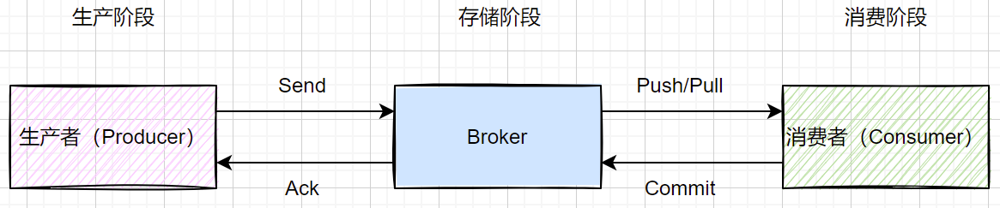
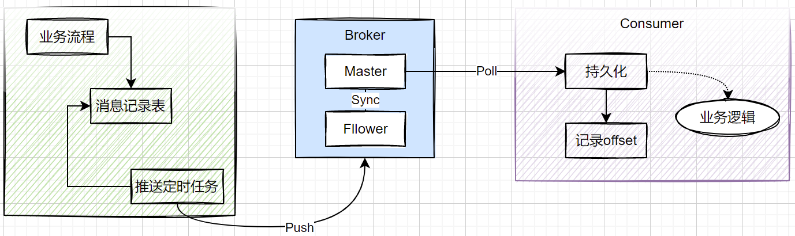

# 高可靠消息实践

## 高可靠消息的维度

从图中可以看到，一条信息如果要做到全程不丢失，需要站在`生产阶段`、`存储阶段`、`消费阶段`三个维度来处理，以保证消息的高可靠，不丢失。

### 消息生产阶段

生产者需要保证消息可以成功且尽最大可能投递到Broker，并获得Broker消息已提交的响应。

**实现手段:** 参数优化、同步投递、异步回调、消息持久化定时发送

### 消息存储阶段

Kafka Broker只对`已提交`的消息做有限度的持久化保证。

**什么是已提交**

- 当Kafka的若干个Replication成功的接收到一条消息并写入到日志文件后，它会告诉生产者这条消息已经成功提交。此时，这条消息在Broker维度上来说，已经变为`已提交`消息。
- 为什么是_若干个Replication_，这取决于生产者对`已提交`的定义
    - 可以选择 `一个Replication` 成功保存该消息就算是已提交，即`Master Replication`
    - 也可以选择 `所有Replication` 成功保存该消息算是已提交，即`Master Replication` 和 `Fllower Replication`

**什么是有限度的持久化保证**

- 有限度是kafka不丢失消息的前提
- 假设消息保存在N个`Replication`或者说是N个`Broker`上时，那么这个条件就是这N个`Replication`或者说是N个`Broker`至少有一个时存活的，否则由于不可控因素、物理故障，还是会导致消息丢失

**实现手段:** 部署架构优化、参数优化

### 消息消费阶段

消费者需要成功消费或成功处理所接收的消息后，才可以向Broker提交确认。否则，消费者一接收就提交确认，会导致处理失败的消息不再投递。

**实现手段:** 参数优化、手工提交、消息持久化异步处理

----

## 设计方案

### Producer端

#### 参数配置优化

**retries:** 发送重试次数

- 建议值: 10~100

- 说明：默认是Integer.MAX_VALUE, 如果在极端条件下会严重降低系统性能，但是过小的重试次数针对时间略微较长的网络抖动或者Broker服务短时间不可用的场景又不太适用。

**acks:** 消息投递确认

- 建议值: 1

- 说明: 绝大多数场景配置为1，即`Master Replication`确认提交就算消息发送成功，后续的消息在`Fllower Replication`间的同步由Broker运维层来保证；但是，在强可靠性的场景下，可以设置为`all`，但是会降低生产者应用的TPS。

#### 应用实现方案

**消息投递模式**

- 同步发送模式：`send().get()`，等待响应
- 异步发送模式：`send()`方法注册`callback`函数，等到broker回调发送结果进行后续处理

**消息持久化**

- 业务逻辑完成后，在同事务中将待发送消息记录到`Message`表中，状态为`待发送`
- 启动定时任务，捞取`Message`表中`待发送`记录，乐观锁更新状态为`发送中`
- 发送消息，在同步结果或异步回调中更新`Message`记录状态

> **同步、异步模式方案的对比**
>
> - 同步模式可以快速感知消息发送的结果，最多在timeout的时间内获得；劣势在于会拉长定时任务的处理时间，但是基于乐观锁锁住Message记录，不会造成重复投递
> - 异步模式可以提高定时任务的执行效率，但是注册Callback回调是在当前生产者的应用内的线程池中，如果发生JVM宕机等问题，Message记录的状态无法反转到下一个状态，需要系统配合有其他的补偿监控机制
>
> **Message表设计**
>
> - Message表只是一个概念，可以是实际的物理表；也可以在内存中维护等待队列，只不过此时需要保证内存队列中的数据可以被持久化，即应用不再是无状态的，而是有状态的，重启时需要有冷启动的过程，完成消息记录的备份与恢复

### Broker端

#### 部署架构优化

- 集群部署，单点部署在实际生产环境中并不存在
- 运维监控，磁盘、网卡、CPU、内存，并即使告警
- Kafka监控，连接数、线程数、Topic积压
- 合理的数据归档机制
- 集群内网络规划，尤其是避免与其他应用共用zk、同机房部署

#### 参数配置优化

**unclean.leader.election.enanle:** 是否允许在非ISR的副本中选择leader

- 建议值：false

- 说明：非ISR列表中的副本，可能落后原Leader节点的数据太多，如果选择的话，会造成消息丢失

**replication.factor:** Topic的副本数

- 建议值: >=3

- 说明：副本位于集群中不同的broker上，也就是说副本的数量不能超过broker的数量，否则创建主题时会失败

**min.insync.replicas:** 控制的是消息至少要被写入到多少个ISR副本才算是“已提交”

- 建议值: > 1 针对3副本场景，一般配置为2

- 说明：该配置要与`acks`参数搭配使用，只有当`acks=all`时起效；因为当`acks=1`时，只需要写入一个副本，即`Master`就算已提交

_不要配置为1，因为Master副本也是在ISR中，如果配置为1和acks=1没有区别_

### Consumer端

#### 参数配置优化

**enable.auto.commit：** 是否开启自动提交

- 建议值: false

- 说明: 即使配置为`true`, 自动提交也是在`auto.commit.interval.ms`的时间间隔内定时提交，一旦系统宕机重启，partition的offset没有提交，会导致重复消费；如果先commit，但是后面的消费处理失败，会导致丢消息。应该由消费者自行维护

#### 应用实现方案

**消息拉取模式**

- 应用内启动单线程线程池循环拉取Topic中的消息
- 将拉取到的Message进行持久化（logger file、数据表均可）

**提交offset**

- 方式1：调用`commit()`方法，提交到kafka集群中，由kafka集群的zk维护topic partition的offset；需要同步提交

- 方式2：应用自身维护topic partition的offset，消息持久化完成后，更新partition的offset到redis或其他位置

_应用维护topic partition的offset优势在于灵活，针对各种场景可以灵活处理且便于监控消息是否有积压、consumer的消费速率是否有延迟；缺点是需要引入额外的逻辑和依赖，且发生`rebalance`时、consumer重启时，要有冷启动阶段，完成consumer对应的partition的offset位置的备份与恢复_

**消息异步处理**

- 持久化的消息需要记录offset、partition等信息，便于回溯处理
- 将持久化的消息信息提交到异步处理队列中或定时任务扫描执行

**参考**
>
> kafka的高可靠性实现方案及保障机制: https://z.itpub.net/article/detail/BF02BE2DA149741262A9EBC7F81290EE
>
> JMS规范-可靠消息传送: https://docs.oracle.com/cd/E19435-01/819-2223/msg_delivery.html
>
> Kafka 的线上集群部署方案是怎样的: https://juejin.cn/post/6997320516008673288