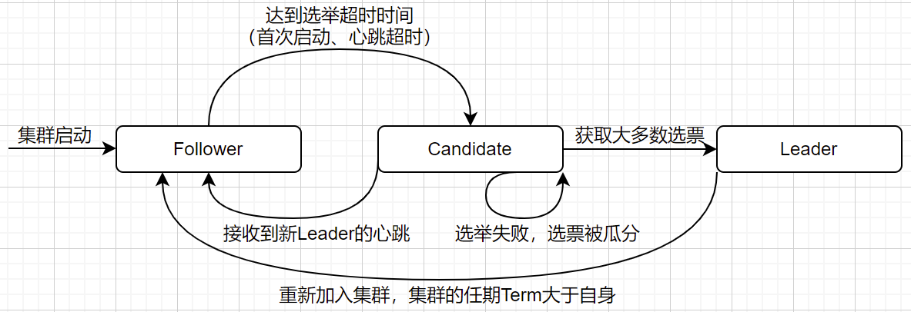
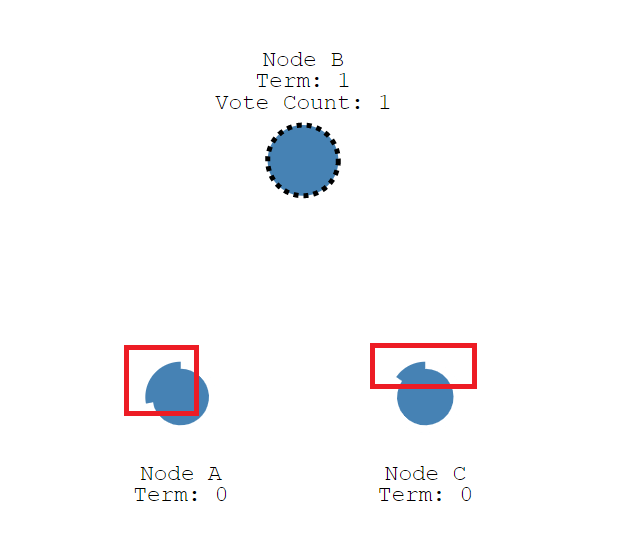

# Raft分布式一致性协议

## CAP定理

**Consistency 一致性** 

在分布式系统中的所有数据备份，在同一时刻是否同样的值

**Availability 可用性** 

只要收到用户的请求，服务器就必须给出回应

**Partition tolerance 分区容错性**

以实际效果而言，分区相当于对通信的时限要求。系统如果不能在时限内达成数据一致性，就意味着发生了分区的情况，必须就当前操作在C和A之间做出选择

- 其中`分区容错性`是一定可以实现的，例如我们的服务有两个集群，其中一个挂掉并不影响整个系统对外提供服务。

- 但是CAP定理是理论上的，它没有考虑网络传输的延迟。所以，即使是保证CP的场景，也是一种`最终一致性`。

- 在分布式系统设计中，我们总是在追寻CAP定理的最佳组合。

## Raft如何保持分布式系统的一致性

**强leader机制：**

由Leader接收所有的客户端请求，强Leader机制会使分布式系统变得简单

**日志复制机制**

- Leader收到客户端请求后，将其先记录下来（此时数据变更未提交到状态机存储）
- 通过广播（心跳）机制复制到各个Follower节点，当收到一半及以上Follower节点成功响应后，本地提交变更并响应客户端请求（否则会hang住客户端请求直到客户端超时）
- 最后通过广播（心跳）机制通知所有Follower提交变更

----

## Raft算法中的三种角色

**Leader: 领导者**

负责接收客户端请求/响应，并完成日志复制过程。在一个任期(Term)中，Leader节点会一直认为自己是Leader直到宕机或关闭

**Follower: 跟随者**

领导者的日志和数据的副本。存在Follower的意义也是在于保证当Leader挂掉后，集群快速恢复并保证数据的一致性

**Candidate: 候选人**

感知到Leader并达到`选举超时`的Follwer会将自身转变为Candidate，请求其他节点为自己投票(Vote Request)

**说明：**

- 在正常情况下，集群中只有一个领导者(Leader)和多个跟随者(Follower)
- 客户端可能会向Follower发送请求，但是在Raft算法中只有Leader接收客户端，Follwer会将请求进行重定向
- 一些性能优化的方案中，会增加Observer(观察者)或者Follower节点响应查询请求。优点在于减少了转发重定向的过程
- 如果使用观察者节点的模式，会有数据不一致的问题，但观察者只做同步，最终一致性是可以接收的；而Follower节点，存在某一个节点的log index与Leader相差较多的情况（1个Follower发生网络分区时）

----

## 关于Raft中的两个超时时间

**randomize election timeout: 随机选举超时**

Follower等待成为Candidate发起投票的时间；所有节点的选举超时时间应该是在`（150-300ms）`之间随机的，`每一轮选举前都随机生成`；这样会最大程度保证只有一个节点先超时发起投票，降低系统复杂度

**hearbeat timeout: 心跳超时**

当集群中已经存在Leader之后，Leader会向Follower发送心跳。如果Follower在规定时间内没有收到Leader心跳，此时要经过一个`randomize election timeout`，发起选主流程。心跳超时时间在各个节点都是一样的，一般是秒级。

> 节点先达到心跳超时，再达到选举超时，发起投票请求

----

## Raft选举的流程

- **初始阶段，由于集群中并没有Leader，各个节点发生`心跳超时` + `选举超时`，谁`先`达到超时时间，谁先成为`Candidate`，进入投票流程**

- **节点成为`Candidate`后，首先为自己投一票；然后增加任期号(Term)并向其他节点`并行`的发送`投票请求(Vote Request)`**

> 一个节点在一个任期(Term)内的请求，投一次票：根据`FIFO(先进先出)`原则响应投票，先到的请求会得到该节点的投票，大前提时候选人的信息（任期、logIndex）等比节点要新

- **Candidate`在发起投票后，会有三种结果**

> A. 自己成为Leader
>  - 当一个`Candidate`从整个集群的大多数服务器节点获得了针对同一个任期号(Term)的选票，那么他就赢得了这次选举并成为`Leader`
>  - 向其他节点发送心跳，建立自己的权威并阻止产生新的Leader
>
> B. 其他节点成为Leader
>  - 如果收到其他新Leader的心跳消息中，任期号(Term)不小于自己当前的任期号，则立即认可新Leader的地位，并将自己的角色变为Follower
>  - 如果新Leader心跳的任期号(Term)小于自己的任期号，则直接抛弃并一直保持自己候选人的角色；直到有符合要求的Leader出现或本次本次投票结束，选票被瓜分，没有任何一个`Candidate`赢得选举
>
> C. 本次任期的投票，没有选出Leader
>  - 一般是多个`Follower`同时成为`Candidate`时，会出现选票被瓜分，没有一个`Candidate`成为获取绝大多数选票的节点（算上自己为自己的投票）
>  - `Candidate`经过`选举超时`时间后，再次发起选举流程

所以，Raft算法为了防止选票被瓜分的情况，每一个候选人在开始一次选举的时候会重置一个随机的选举超时时间，然后在超时时间内等待投票的结果；这样减少了在新的选举中另外的选票瓜分的可能性

选举超时时间也不能太短，否则某一个候选人成为Leader之后，心跳包还没发出去，又有一个节点选举超时，成为候选人，导致集群选主的时间过久

根据Raft论文给我们的提示，一般在`150-300ms`之间随机生成

----

## Raft日志复制

日志复制是实现分布式系统一致性的共识机制

**日志的组成结构：** 所属任期号、索引位置号、日志内容

### 日志复制过程

#### Leader接收到请求

**Leader收到客户端的请求后，会将请求进行记录(仅记录，变更并没有提交)，接着将日志内容包装到`心跳`RPC中，并行广播给其他Follower节点并hang住客户端响应**

- 心跳和日志复制调用的时同一个RPC；只是心跳广播没有日志内容
- Follower节点收到心跳后，会重置`心跳超时`计数器

**当一半及以上的Follower节点响应成功后，Leader会将修改持久化到存储中，并响应客户端成功**

- 因为Leader自己也缓存了日志，只要有`一半`的Follower响应成功，就表示集群中绝大多数节点已经认同这一次修改

**Leader再次发送心跳广播，通知其他Follower可以将本次任期内的，指定index的日志持久化到存储中**

- 将二阶段提交优化为一阶段(大多数节点回应成功即可)，此时无需同步的发送确认心跳广播，降低了一半的消息延迟

#### Follower接收到请求

**根据Raft协议的定义，集群中只有Leader可以对外提供请求/响应服务**

- Follower直接拒绝客户端请求，并将领导者的地址返回给客户端：实现简单粗暴，但是会增加重新连接到leader的消耗
- 直接将请求转发给Leader，并进行后续的共识决策：对Client来说影响最小，共识完成后，由该Follower节点响应客户端请求(Zookeeper是这种实现)

### 关于读操作的一致性

**Raft是一个共识算法，更多的时候我们在强调`写`的一致性，它并不是原生的`读`一致性**

**实现`读一致性`的几种思路：**

- 读Leader节点，但是需要有半数Follower节点对读取的结果进行共识验证（类似于日志同步的过程），这样一定不会返回脏数据或者旧数据
- 只读Leader节点，在绝大多数场景下没有问题。但是，如果此时集群已经分裂，新集群已经选出了新的Leader；由于网络问题，客户端还没有感知到Leader已经变化，或者旧的Leader重新加入集群，而新的Leader已经将数据修改，导致不一致

----

## Raft的安全性

_安全性主要指：已经提交的日志，不论哪一个节点被选举为Leader后，都不会丢失_

**领导者不能删除和覆盖自己的日志，只能新增；如果Follower和Leader的日志不一致，强制让Follower同Leader进行同步**

- 根据选举限制，只有日志最新的人才可以被选为Leader，这也保证了Leader的日志一定是最新最全的(index比自己还低的节点，不会得到投票)

**节点响应投票请求，除了`FIFO`先到先得原则外，还会判断请求发起方的日志是否最新**

- `Candidate`为了成为Leader，是需要联系集群中大多数节点，请求其为自己投票；这意味着，已经提交的日志，至少在某一个节点已经存在
- 如何确定日志是最新的？
  - 任期号相同：日志index大的新；任期号不同，则任期号大的新
  - 以此原则选出的Leader，日志一定是最新最全的

**如果当Leader将`半提交`的日志同步给Follower后，通知节点`提交`前宕机**

- 根据选举限制，新选举出的Leader日志是最全的，他会把自己从上一个Leader里接收到的`半提交`日志直接提交，并通知其他节点提交

> 关于日志：日志是Action的流水，根据日志我们可以得到动作并且Redo

----

## Raft集群变化

### 脑裂问题

**原因：任何有主从之分的分布式系统中，都会出现该问题**

- Follower不知道Leader到底是挂了，还是因为网络问题暂时失效（此时Leader没有挂掉）

- 基于上述原因，集群中的某一个Follower会在选举超时后，发起投票，并成为新的Leader

- Follower不知道Leader到底是挂了，还是因为网络问题暂时失效（此时Leader没有挂掉）

- 如果旧的Leader没挂，此时集群中是有两个Leader的

**导致的问题：**

- 读场景： 两个Leader都可以对外提供服务，导致Client每次获得数据越来越不一致，进而导致混乱甚至无法修复

- 写场景：Client如果没有感知到新的Leader，仍然向旧的Leader发出写请求；而旧Leader由于无法完成共识，导致写请求永远无法成功，集群不可用

**解决方案：**

- Raft日志复制需要多数节点达成共识，所以针对旧的Leader撑死会提供读服务，写服务完全无法提供；针对读方来说，数据最终一定是不一致的

- 客户端需要`定时`或者`写失败`后轮询集群，获取Term最大的节点作为当前可信的Leader；

  _因为分裂成两个集群后，旧Leader的集群不会发生选举，即使选举也不会选举成功（它是少数）_

### 新增节点

每次向集群添加一个新的节点，这样就不会形成一个新的大多数；这样也就避免了集群产生`脑裂`的问题，及分裂成两个大多数，并且各自有一个`Leader`的情况

### 减少节点

始终要符合 `集群节点数 = 2N+1` 的等式，否则减少节点后，集群无法达成共识，进而无法对外提供写服务

**参考：**
> RAFT论文中文版：https://github.com/maemual/raft-zh_cn/blob/master/raft-zh_cn.md
>
> RAFT算法动画演示：http://thesecretlivesofdata.com/raft/
>
> zookeeper-客户端发写请求给follower，是转发给leader写？: https://blog.csdn.net/waltonhuang/article/details/106097257
>
> Raft-共识算法解析: https://yuerer.com/Raft-%E5%85%B1%E8%AF%86%E7%AE%97%E6%B3%95%E8%A7%A3%E6%9E%90/
>
> Raft中 几种特殊情况分析: https://zhuanlan.zhihu.com/p/266860228