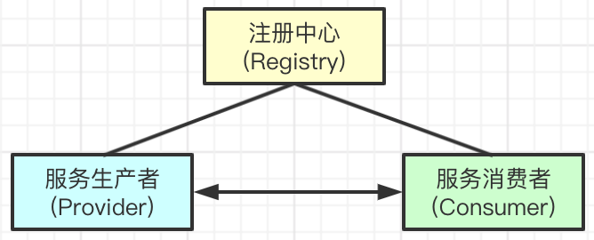
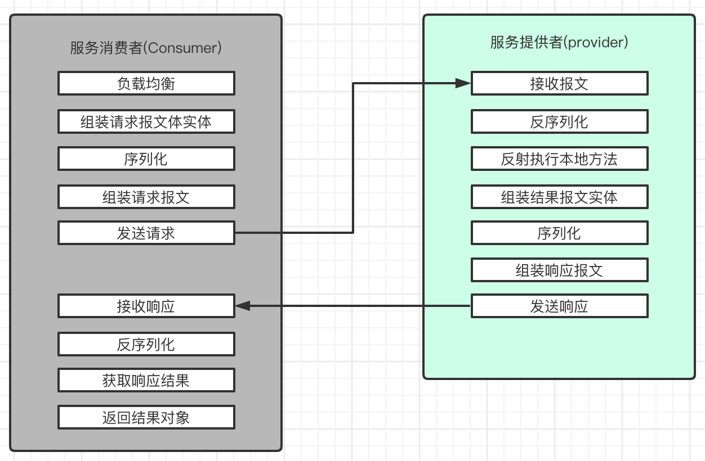

# RPC

## RPC框架主要工作流程

**服务注册与发现**
- `服务生产者(Provider)`启动后，将机器与服务元信息注册到`注册中心(Registry)`
- `服务消费者(Consumer)`引入服务后，根据服务坐标在`注册中心(Registry)`查询服务提供者列表

**服务调用流程**

- 负载均衡: 当服务有多个提供者时，`服务消费者(Consumer)`需要根据一定的负载均衡策略，选择一个`服务生产者(Provider)`进行远程调用
- 组装报文体实体: 
  - 请求报文实体一般包括: 请求的方法路径、参数列表(类型 + 值)、请求序列号等信息
- 序列化: 将请求报文实体序列化为二进制数据
- 发送请求: 通过Socket HTTP等方式将报文发送至负载均衡筛选出的服务提供者
- 反序列化请求报文: 将请求报文中的报文体，反序列化为请求报文对象
- 执行本地方法:
  - 通过请求报文对象的方法路径、参数列表，反射执行目标Method
- 组装响应报文实体:
  - 响应报文实体一般包括: 方法路径、返回值、是否异常、异常信息等
- 服务消费者接受响应后，反序列化为响应报文实体，返回反序列化后的方法返回值
----

## RPC通信协议的设计

**无论何种RPC框架，通信的协议格式大同小异，均需要有以下几点：**

- 魔数(Magic): 约定这这是一个合法的协议类型，如果魔数不一致，直接拒绝连接
- 请求类型(type): 标示报文的类型。请求、响应、心跳等
- 报文体长度(body_length): 用来处理TCP粘包拆包的问题，需要让处理器知道，本次需要处理的报文体长度是多少
- 报文体(body): 实际传输的报文内容，基于一定方式序列化(serial)的二进制数据

----

## RPC中关键的技术点
**网络通信**
- 基于Netty实现
  - 基于IO多路复用机制，实现单机高性能长连接
  - 内置很多如TCP粘包拆包解决方案

- 替代方案: 基于`HTTP`通信
  - 采用json序列化，易读性高
  - 性能相对较差，但是基于http2的长连接，也是可以的

**序列化**
- 目的在于将请求的报文信息，以统一的格式进行传输与解析
- 实现方案:
  - Java Seriallizable: JDK内置
  - Thrift
  - ProtoBuffer
  - JSON: 可读性不错，但是体积大且数据格式不清晰
  - Hessian

**动态代理**
- 服务消费者只是引入服务提供方的接口，没有实际的实现逻辑
- 基于动态代理技术，生成包括：序列化、通信、反序列化、容错处理逻辑的动态代理类
- 使consumer具有基于api包即可完成rpc调用的逻辑

**反射**
- Provider根据请求报文中的方法坐标信息和参数类型信息，反射执行本地目标方法

**负载均衡**
- 在Provider是集群部署的情况下，Consumer需要根据一定的负载均衡规则，筛选出一个目标服务提供者
- 常见负载均衡算法:
  - 随机
  - 轮询
  - 加权轮询: 权重、连接数、系统资源情况、成功失败率
  - 一致性hash

**心跳机制**

**容错机制**

## Dubbo框架

## 关于ServiceMesh的一些思考