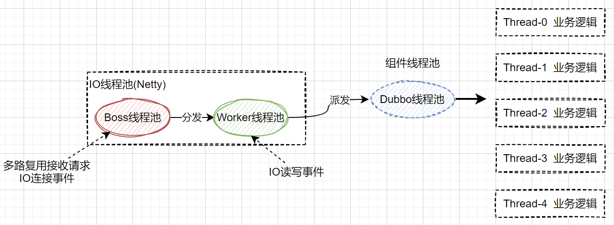

# Apache Dubbo

## Dubbo线程模型



Dubbo底层默认使用Netty进行网络通信，Provider使用Netty的两次线程池，即`EventLoopGroup(Boss)`基于IO多路复用处理客户端的连接请求，完成TCP三次握手后将连接分发给`EventLoopGroup(Worker)`来处理。

> boss和worker线程我们统称为IO线程，前者为IO连接事件处理线程、后者为IO读写事件处理线程

### Dubbo线程分发策略

Dubbo线程模型是Dubbo可以实现高性能的基础，通过将IO线程池和逻辑线程池的隔离，提高整个中间件框架的并发能力。

如果服务是计算密集型或者逻辑较为简单，没有发起新的IO请求，我们完全可以将请求在`woker(IO读写处理线程)`中进行处理，这样也避免了线程池调度与上下文切换的开销，毕竟一切线程的切换都是有成本的。

我们绝大多数服务都是逻辑较为复杂，且需要发起新的网络通信，则请求必须派发到工作线程池中进行处理，否则IO线程被阻塞，导致`IO连接事件`无法快速分派，进而影响整个框架的IO请求效率。

Dubbo基于不同的线程分发策略，来决定请求在不同的线程池进行处理，以最大化的提升服务性能。

所有的`write`事件全部由`IO读写事件`处理线程完成

#### Dubbo内置的线程分发策略

**all:** 默认分发策略，消息所有处理都派发到dubbo线程池中处理，包括`connected`;`disconnected`;`received`;`caught`

- 实现类：`org.apache.dubbo.remoting.transport.dispatcher.all.AllChannelHandler`
- 适用于绝大多数场景，也是dubbo的默认线程分发策略
- 如果服务业务逻辑较复杂，耗时较长不建议使用。一旦服务接收大量请求，导致业务线程池被打满，此时抛出的拒绝异常会进入到`caught`方法进行处理；而`caught`方法也使用Dubbo线程池，导致逻辑无法处理，`Consumer`只能死等到超时才行

**direct:** 所有消息都不派发到线程池，全部在 IO 线程上直接执行

- 实现类：`org.apache.dubbo.remoting.transport.dispatcher.direct.DirectChannelHandler`
- 适合简单逻辑场景，尤其是业务逻辑中没有IO操作，只有一些内存操作的场景

_代码实现：_
```java
public class DirectChannelHandler extends WrappedChannelHandler {

    public DirectChannelHandler(ChannelHandler handler, URL url) {
        super(handler, url);
    }

    // 没有被重写的方法（connected、disconnected、caught），默认都是使用IO线程进行操作
    // 在all策略中，所有方法都会被重写，并获取DUBBO线程池进行操作

    @Override
    public void received(Channel channel, Object message) throws RemotingException {
        ExecutorService executor = getPreferredExecutorService(message);
        // 这里是针对Consumer的处理逻辑
        if (executor instanceof ThreadlessExecutor) {
            try {
                executor.execute(new ChannelEventRunnable(channel, handler, ChannelState.RECEIVED, message));
            } catch (Throwable t) {
                throw new ExecutionException(message, channel, getClass() + " error when process received event .", t);
            }
        } else {
            // 直接使用IO线程进行操作
            handler.received(channel, message);
        }
    }
}
```

**message:** 只有请求响应类消息派发到业务线程池，其他消息如连接事件、断开事件、心跳事件等，直接在I/O线程上执行。

- 实现类：`org.apache.dubbo.remoting.transport.dispatcher.message.MessageOnlyChannelHandler`
- 服务提供的业务逻辑较为复杂且耗时较长时建议选择；当大量请求进入到业务线程池后，即使打满线程池，`caught`是在IO线程进行处理的，避免`Consumer`一直等待进而引起系统雪崩

**execution:** 只把请求类消息派发到业务线程池处理，但是响应、连接事件、断开事件、心跳事件等消息直接在I/O线程上执行

- 实现类：`org.apache.dubbo.remoting.transport.dispatcher.execution.ExecutionChannelHandler`

**connection:** 在I/O线程上将连接事件、断开事件放入队列，有序地逐个执行，其他消息派发到业务线程池处理

- 实现类: `org.apache.dubbo.remoting.transport.dispatcher.connection.ConnectionOrderedChannelHandler`

**参考:**

> Dubbo线程模型: https://zhuanlan.zhihu.com/p/157354148
>
> Dubbo线程模型和调度策略: https://juejin.cn/post/6844903848159477774

----

## Dubbo为何高性能

**通信模型**

- 基于Netty的NIO通信框架，IO多路复用
- 单机长连接，`Consumer`和`Provider`之间基于长连接模式，避免每次调用频繁的创建、销毁连接而带来的性能损耗
- 高效的序列化机制和二进制流传输

**线程模型**

- IO线程与工作线程分离、异步化
- 多种线程分发策略，可以应对不同的系统场景

**自定义实现**

- 大量使用本地缓存，避免反射、动态代理带来的性能消耗
- 自定义的高效SPI框架，避免Java SPI带来的不灵活：每一个实现都会被初始化

**高可用机制**

- 心跳机制: 双向心跳
- 容错策略: 快速失败、自动切换、重试
- 超时机制
- 优雅下线机制

----

## Dubbo服务上下线策略

### Consumer引入Provider流程，以Spring容器为例

- **启动服务容器，连接zk，获取`/dubbo`下的service和provider的url信息**

- **`Invoker`是核心，Client对于每个Service的每一个Provider都会包装成为一个Invoker**

- **一个Service的多个Invoker被包装成一个`Cluster`**

- **`ReferenceBean.getObject()`基于动态代理生成代理对象，包含一个`Cluster`**

- **当执行远程方法调用时，实际上是通过`Cluster`完成与目标Provider的通信**
  - Cluster负责基于一定的负载均衡策略，选择一个Invoker进行通信
  - Cluster包含负载均衡 + 重试策略

- **当Provider上线或下线后，客户端zk监听器`NotifyListener`刷新**
  - 采用类似CopyOnWriteArrayList的读写分离策略，先创建新的invoker列表
  - 将invokers指向新的列表
  - 销毁旧的invoker

### Provider下线流程，以Spring容器为例

- **`ShutdownHookListener`监听Spring容器的ClosedEvent事件**

- **`ZookeeperRegistry.destory()`将服务的注册信息在zk中移除并关闭与zk的连接**
  - dubbo注册的是临时节点，连接关闭，节点也被删除
  - 目的: 新的client端不再与当前的节点建立通信连接，以及Clinet端缓存新的Provider列表

- **`DubboProtocol.destroy()`首先将当前的provider关闭，之后再关闭对下游调用的client**
  - 发送`sentReadOnlyEvent`: 通知consumer该连接已不可用，不要再发送新的请求(该过程是轮询发送且是oneway方式)
  - 指定一个超时时间，将provider的还在进行的线程执行完毕
  - 关闭自身Server，再关闭对下游的依赖: 否则上游此时再有请求进来，会导致失败

**Dubbo默认实现的问题:**
  - `DubboProtocol.destroy()`只有一个上限: 超时时间**或**此时没有工作线程，就会强制关闭。
    - `sentReadOnlyEvent`是一个oneway的过程，不知道client有没有收到 && 收到到摘除invoker也有时间差 
    - provider从注册中心摘除和consumer移除该provider的Invoker过程有时间差，此时可能consumer仍然有请求发送到已经关闭的provider上，
    - 而provider在这个时间差内，因为当前没有工作线程直接就结束，导致调用失败
  - 根据dubbo官网描述，在容器中需要调用`DubboShutdownHook`的逻辑
  - 解决方案: 
    - 在`DubboProtocol.destroy()`过程前，设置一个停机等待的下限: 因为第一步已经断开了zk的连接，会通知consumer移除该provider的invoker，提供一个缓冲时间
    - 自定义监听Spring容器的ClosedEvent事件，手工新增ShutdownHook
    - Kill -9 无解，也需要发布平台一起配合。如果对Hook改造了停机下限，那么发布平台强制停止的时间不能小于这个值

----

## Dubbo与Spring Cloud体系

RPC功能都是Dubbo和Spring Cloud中的一个子集
  - RPC只关心进程间通信
  - Dubbo/Spring Cloud: 微服务治理的全套解决方案

Dubbo更注重语言级别的远程方法调用，并没有像Spring Cloud提供网关、限流、Eureka的解决方案；但提供了较为成熟的Dubbo Admin

在Spring cloud体系中，也可以融合Dubbo；Dubbo + zk/Nacos代替fegin + eureka + robbin

没有谁优谁劣，按需使用，考虑Team的技术演进、技术与运维能力

Spring Cloud的通讯基于Http协议、Dubbo自定义协议 + NIO长连接

**参考**

> Dubbo——服务调用、服务暴露、服务引用过程: https://www.jianshu.com/p/15e77db72b75
>
> 优雅停机: https://dubbo.apache.org/zh/docs/v2.7/user/examples/graceful-shutdown/