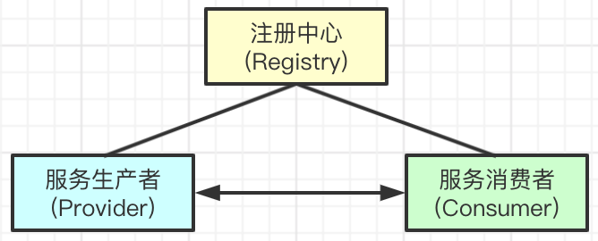
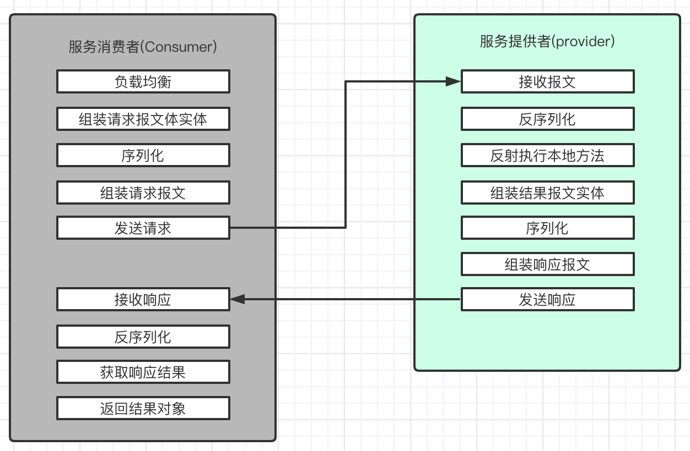

# RPC Basic(RPC基础)

## RPC工作流程

**服务注册与发现**
- `服务生产者(Provider)`启动后，将机器与服务元信息注册到`注册中心(Registry)`
- `服务消费者(Consumer)`引入服务后，根据服务坐标在`注册中心(Registry)`查询服务提供者列表

**服务调用流程**

- 负载均衡: 当服务有多个提供者时，`服务消费者(Consumer)`需要根据一定的负载均衡策略，选择一个`服务生产者(Provider)`地址供远程通信使用
- 组装报文体实体: 请求的方法路径、参数列表(类型 + 值)、请求SeqNo等信息
- 序列化: 将请求报文实体序列化为`格式化`数据（一般来说，采用JSON、Hessian、Kryo、Thrift等进行序列化）
- 发送请求: 通过Socket HTTP等方式将报文发送至负载均衡筛选出的服务提供者
- 反序列化请求报文: 将请求报文中的报文体，反序列化为请求报文对象
- 执行本地方法: 通过请求报文对象的方法路径、参数列表，反射执行目标Method
- 组装响应报文实体: 方法路径、返回值、是否异常、异常信息等
- 服务消费者接受响应后，反序列化为响应报文实体，返回反序列化后的方法返回值

----

## RPC通信协议的设计

**无论何种RPC框架，通信的协议格式大同小异，目的都在于获取调用信息，返回响应结果，均需要有以下几点：**

- 魔数(Magic): 约定这这是一个合法的协议类型，如果魔数不一致，直接拒绝连接
- 请求类型(Type): 标示报文的类型。请求、响应、心跳等
- 版本(Verison): 可选，报文格式版本；以做兼容和升级使用
- 报文体长度(Body_Length): 用来处理TCP粘包拆包的问题，需要让处理器知道，本次需要处理的报文体长度是多少
- 报文体(Body): 实际传输的报文内容，基于一定方式序列化(serial)的二进制数据

----

## RPC中关键技术点

- **Netty**
  - 基于Netty实现，服务端IO多路复用，实现单机高性能长连接
  - 内置TCP粘包拆包等解决方案
  - 替代方案: 基于HTTP、Socket BIO通信
- **序列化**
  - 将报文对象以统一的格式进行传输与解析
  - Java Seriallizable、Thrift、ProtoBuffer、JSON、Hessian等
- **动态代理**
  - 实现Consumer只依赖Provider的服务定义JAR包即可完成远程调用
  - 封装 序列化、负载、通信、失败处理 逻辑
  - 基于动态代理生成动态代理实现类
- **反射**
  - Provider根据请求报文中的方法坐标信息和参数类型信息，反射执行本地目标方法
- **负责均衡**
  - 当Provider集群部署的情况下，Consumer需要根据一定的负载均衡规则，筛选出一个目标服务提供者
  - 常见负载均衡策略:
    - 随机
    - 轮询
    - 加权轮询: 连接数、成功失败率、系统负载等条件
    - 一致性hash
- **心跳机制**
  - 维持服务端与客户端的可连通性方案，保证高可用
  - 不需要忙检测: 如果Consumer和Provider频繁进行通信，则无需进行心跳
  - 如何实现？
    - 为每一个连接设置两个标志位: 最后写时间 最后读时间
    - 基于TimerTask或Netty时间轮，定时执行任务，检查两个标志位的时间差，如果大于心跳间隔才发起检测
- **容错机制**
  - 保证服务调用的高可用的一种方案
  - 常见容错机制:
    - `failfast:` 快速失败，发起一次调用，失败即结束
    - `failover:` 失败自动切换，尝试其他服务器；retry的方式，一般适用于读服务
    - `failsafe:` 失败忽略，适用于日志写入；oneway的方式，只管发
    - `forking:` 多台机器并发调用，一台成功即成功
    - `broadcast:` 广播模式，逐个调用，一台失败全失败
  - `failfast` 和 `failover` 较为常见，`oneway`在不重要场景也可以使用

----

## 关于ServiceMesh的思考

- 在很多rpc框架中，通信、负载、容错、序列化等功能全部与应用耦合在一起，当rpc框架升级时，应用服务必然受到影响，会降低服务SLA
- 而对于SOA框架来说，RPC模块是稳定的，而类似于负载、容错、通信可能是变化较多的
- ServiceMesh的理念，个人认为，在Consumer和Provider建立起一个Proxy
  - Proxy直接完成进程间通讯、负载、容错 - 即 SideCar
  - 应用端只需要维护与Proxy的通讯、序列化流程，这种核心流程一旦稳定近乎不会改变  
  - 伴随着中间件的升级，只需要更新Proxy即可；建立公共Proxy，保证服务SLA不受影响