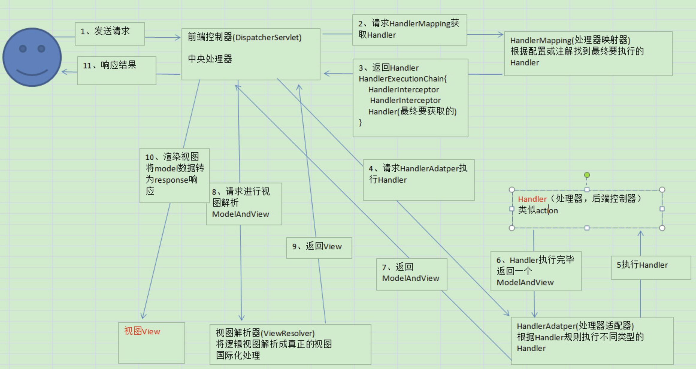

# Spring MVC

## 实现原理

Spring MVC基于Servlet实现，是非线程安全的，只有单例

## 工作流程

- DispatcherServlet接收请求，并查找HandlerMapping，获取Handler
- HandlerAdapter调用Controller中的具体方法（Handler），并返回ModelAndView
- ViewRelover解析处理ModelAndView，返回View对象（Json、Jsp、ftl等）
- DispatcherServlet根据View渲染结果（填充value属性）
- DispatcherServlet响应结果