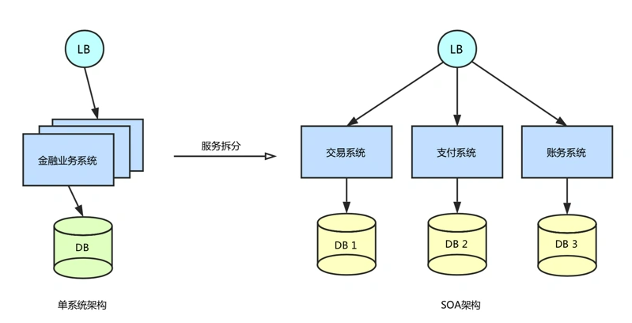
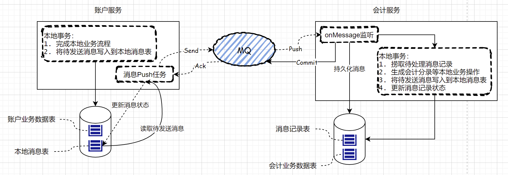
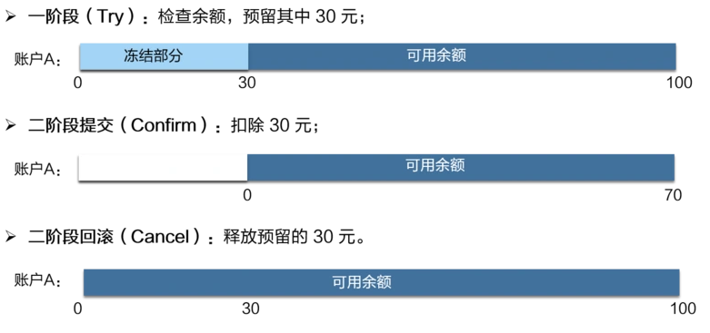
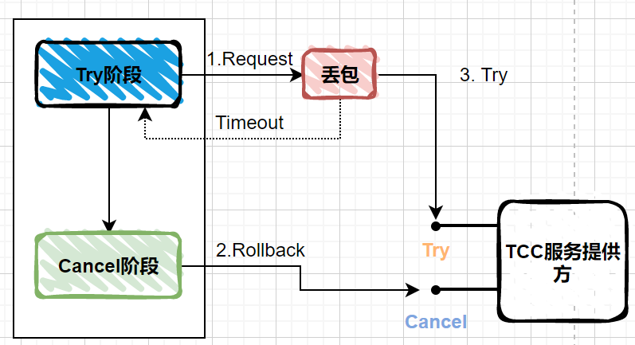
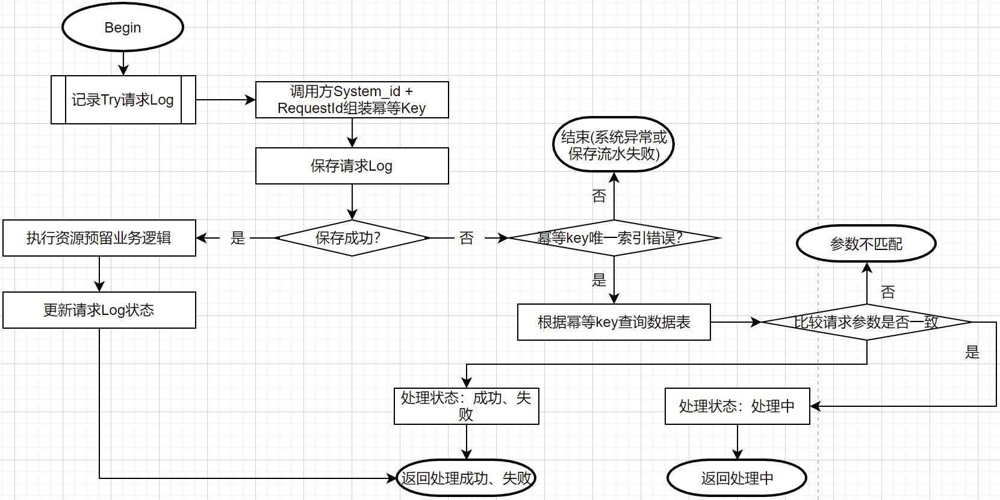

# 分布式事务

## 产生分布式事务的原因

**分布式事务归根还是数据的一个一致性问题，和Raft要解决的同一个数据的一致性不同；分布式事务要解决在一个事务中，数据的变更需要一致，要么全提交、要么全回滚，ACID**

**基于不同的架构视角，产生分布式事务的原因是不一样的**

- 在单应用架构下，系统为了提升性能和未来的高可扩展，会进行分库或者分表；而进行`分库`之后，由于事务操作可能不在一个数据库中完成，从而导致单连接的事务失效，导致数据不一致；而`分表`操作由于还是在同一个数据库内完成，基本不涉及`分布式事务`问题

- 在微服务架构下，由于一次完整的业务流程会调用多个微服务，数据会在多个上下游系统中流转，各个系统数据库资源独立；任何一步异常都会导致事务的数据结果不一致

----

## BASE理论

**- Basically Available(基本可用):** 在分布式集群当中，某一个服务节点宕机，或者数据在复制的过程中又部分不可用，不影响整个系统的可用性（因为可以基于后续的流程进行补偿）。

**- Soft State(软状态):** 软状态理解为一个中间状态，允许数据在节点集群间操作的过程中，存在一个延时；但是这个中间状态，最后一定会转为一个终态。

**- Eventual Consistency(最终一致性):** 数据在分布式集群节点间的同步操作存在延时，这与ACID原则相反，在中间的一段时间内，数据是不一致的；但是经过一段时间后，分布式集群节点间的数据拷贝可以达到最终一致性。

----

## 基于本地消息表实现分布式事务

本地消息表的核心是将需要分布式执行的事务流程，通过消息日志的方式进行异步执行。本地消息表的方案最早由Ebay提出，是BASE理论的实现，也是最终一致性的表现。因为在一个完整的事务流程中，记录都存在一个中间状态，待事务完成后，流转到最终状态。

以支付账户与会计系统为例，整体流程表述：账户系统完成账户资金划转后，调用会计系统生成会计记账分录。此时需要明确：如果在账户资金划转的过程中，调用会计系统，一定会产生分布式事务问题。

### 实现思路

**本地事务消息表设计：**

| 字段 | 描述 |
| ---- | ---- |
| t_id | 自增主键 |
| t_msg_id | 消息id，在业务系统内唯一，用来实现幂等和防重 |
| t_msg_payload | 消息内容 |
| t_state | 消息状态 |
| t_retrycount | 重试次数 |

上述的表设计抛砖引玉，实际应用时需要根据实际情况进行调整。但是，该表已经具备`事务消息表`的最基本要素。

**具体流程说明：**
- 账户系统接收上游系统请求，开启事务Txn_1
  - 完成本地事务流程，更新数据库
  - 组装事务消息记录表信息（状态：发送中、重试次数：0），生成消息的唯一Id(雪花算法、自增序列、UUID)
  - 提交事务Txn_1
- 账户系统`消息Push任务`定时捞取`事务消息表`中，状态为`发送中`的记录
  - 组装`msgId`和`msgPayload`消息，同步发送到消息中间件
  - 收到Broker的Ack成功的响应后，更新记录状态为`发送成功`
  - 如果Push消息失败，则将`重试次数 + 1` && 状态设置为`待重试`，等待重试Push任务发送
- 会计系统接收MQ的消息，开启事务Txn_2
  - 将消息插入到一张`消息记录表`中，其中`上游系统id` + `msgId`作为幂等键，如果是重复消息，忽略处理
  - 执行会计系统业务逻辑，生成会计分录
  - 更新消息记录状态为`处理成功`

### 问题与方案

经过前面的步骤，整个业务就已经完成了。但这是在理想的状态下，中间的步骤没有任何的异常，但实际情况里，生产者、MQ、消费者都会有失败的情况。下面我们就讨论一下，面对异常场景应该如何处理。

**问题1：上游系统事务执行失败**

- 根据事务的ACID特性，我们需要保证本地业务和插入事务消息记录表的逻辑在一个本地事务中完成。

- 在简单系统中，一个微服务一般只对应一个数据库，这基本可以保证两个步骤在同一个事务中完成。

- 如果涉及到分库的系统，我们需要在每一个分库中建立一张`本地事务消息表`；因为在系统完成分库后，我们的一个原则是：要将事务尽可能的在同一个库中完成。但是，生成的`msgId`必须在系统内全局唯一，这需要有一定的`分布式ID`机制保证

**问题2：上游系统消息Push任务执行失败**

- 增加一个`重试消息Push任务`，它与`消息Push任务`的区别：只捞取状态为`待重试` && 重试次数<`最大重试次数` 的记录，再次推送消息

- 消息Push失败，大部分网络问题、消息中间件故障、编码错误导致，在可预估的时间内都是可以恢复的；那么在重试的时间间隔频次上，我们可以参考`斐波那契数列`算法，越往后的推送，时间间隔越长；这样不会因为固定频率的重试，在很短时间内使消息重试次数达到上限，进而需要人工介入修复数据，才能再次发起重试

- 如果长时间、大面积的消息推送失败，需要依赖监控告警服务，及时响应，定位故障

**问题3：基于MQ服务，如何保证消息被送达**

- 生产者的消息重复投递机制，要尽最大可能将消息投递到消费者；但是消费者要对消息消费实现幂等处理（不能重复消费或重复处理）

- MQ要将消息成功刷盘、或者成功同步给大多数Fllower节点后（RAFT一致性算法），才能响应生产者消息发送成功（针对RocketMQ和Kafka有不同的配置）

- MQ服务是不是也可以支持消息重试投递，尽最大努力将消息投递到消费者

**问题4：消息一旦丢失，如何保证事务的最终一致性**

- 需要引入类似于`对账`的核对与差错处理流程

- 以`账户系统`和`会计系统`为例：账户系统属于分账，而会计系统属于总账（即多个账户的余额in or out，会体现在一个会计科目的借贷发生额上）

  - 会计日日切后，账户系统所有账户的日发生额；会计系统汇总科目的借贷日发生额

  - 在正常情况下，账户系统的余额信息、发生额信息应该与会计系统一致；若不一致，及产生分布式事务不一致的错误，人工介入排查（系统逐笔勾兑 or 人肉运维）

### 基于消息服务实现分布式事务的思考

- 可以对调用方屏蔽MQ的细节，对于生产者来说只要调用MQ服务成功即可确认发送成功；即使MQ不可用，只要消息服务成功接收，业务方可以不再过多关心

- 可以实现HALF-半消息模式
  - 大部分业务场景我们是业务逻辑完成之后发送事务消息（因为消息中包含本地事务处理的结果）；
  - 有些业务场景，无需本地事务的处理结果，可以先Push事务消息，成功后再开启事务，完成之后发送确认到MQ服务
  - 如果本地事务失败，可以发送取消到MQ服务

- HALF半消息也可以基于RocketMQ实现，但是我们设计技术架构的准则，是要做到低耦合，如果更换了其他MQ中间件，就需要重新实现HALF机制

- 类似于一种TCC的实现

- 还需要维护一个类似事务消息表的模型，因为confirm或者cancel的调用，不应该在事务中执行；远程调用，终归会有失败的时候，需要补偿机制保证可用性

----

## 基于TCC方案实现分布式事务

TCC事务的概念，最早见于Pat Helland于2007年发表的一篇名为《Life beyond Distributed Transactions:an Apostate’s Opinion》的论文提出。在该论文中，TCC还是以`Tentative-Confirmation-Cancellation`作为名称，正式是以`Try-Confirm-Cancel`作为名称。

TCC事务机制相对于传统的分布式事务处理机制（例如XA、2PC、3PC）方案，特征是在于不依赖资源管理器(RM)，而是通过业务系统的业务逻辑进行协调，来实现分布式事务。

### TCC方案实现思路

#### TCC的主要流程

以转账场景为例，MA001账户转账给MA002账户

- Try阶段：冻结MA001账户资金，对业务系统的资源做预留
- Confirm阶段：确认阶段，Try阶段的资源确认被锁定，继续执行主业务流程，之后调用解冻并转账服务
- Cancel阶段：业务执行过程错误，调用解冻服务，释放被占用的资源

> 可以被try住的资源，就一定可以被confirm或者cancel

**1. 初步操作(Try)**

Try操作站在技术的角度来看，与一般的服务间调用+业务流程处理没有任何差别；但是站在业务流程的角度来看，这是一个初步的操作，是后续所有流程的开始。只有资源明确被Try成功，才能执行后续的业务流程以及确认或取消操作，完成一个完整的业务逻辑。

**2. 确认操作(Confirm)/取消操作(Cancel)**

- Confirm操作是对Try操作补充，表示资源Try方的业务逻辑已经执行完成，此时可以完成全局事务的COMMIT；

- Cancel操作是对Try操作的回滚，类似于我们传统事务操作中的Rollback操作。

- Cancel操作是由业务逻辑来控制的，比如说MA001账户冻结100成功，发起转账时，目标账户不存在、已冻结不许发起支付操作（相当于Confirm失败），此时就要对冻结的金额进行回滚操作，方式就是通过解冻接口，进行Cancel操作。而在传统本地事务中，我们可能会抛出一个Exception，然后然事务回滚

- 如果Try阶段执行成功，则Confirm和Cancel阶段必须保证成功。为什么？因为资源在Try阶段已经被锁定成功，所以确认或取消操作一定是可以执行下去的。

> Confirm 和 Cancel 操作，只能对Try住的资源做操作

----

### 应用TCC方案的问题与方案

#### 1. TCC一定要有Try、Confirm、Cancel接口么？

以我个人实践经验为例：

  - 在账户系统的服务中，一些业务动作与场景属于一次性动作（例如：系统内部中间账户向用户或商户主账户转账），只需要提供一个transfer接口，根据交易指令规则完成账户间资金划转即可
  - 再例如提现类的业务操作，天然适合TCC场景：用户发起提现请求后，调用账户系统`forzen冻结`接口，完成`Try-预留`资源的过程；当支付引擎或出款系统完成渠道代发之后，再调用账户系统`releaseTransfer-解冻并转账`接口，完成用户冻结余额的扣减；反之，调用`release-解冻`接口，释放被`Try-预留`的资源

#### 2. 什么是空回滚和悬挂？

空回滚: _调用方在Try阶段由于网络、系统问题调用失败，服务方也暂时没有收到Try请求；进而会尝试执行Cancel动作，释放资源(1、2阶段)_

悬挂: _调用方在Try阶段由于网络抖动超时调用失败，服务方也暂时没有收到Try请求；进而会尝试执行Cancel动作，释放资源(1、2阶段)完成后，服务提供方又收到了Try请求(3阶段)，如果此时处理该Try请求，会导致资源被挂起，后续没有流程再操作它_

#### 3. 幂等处理

- system_requestId 拼接成唯一的 reference_id：针对同一个调用方的同一个请求做幂等处理，我们不能保证不同调用方之间生成的request_id是唯一的，需要增加一个系统标示

- 记录请求流水，如果触发了唯一索引，根据reference_id查询记录；如果请求记录是处理中的状态，则3次查询，每次间隔100ms

- 根据查询到的请求流水记录，进行返回结果的幂等处理

  - `成功、失败`状态：表示有一笔相同请求已经处理成功或失败，根据幂等原则，返回仍然提示成功或失败
  - `处理中`状态：表示有一笔相同请求仍在处理中，给调用方返回一个中间态

- 如果客户端调用`Try`服务失败，会发起重试或定时补偿；重试时的RequestId不变，服务端由于有幂等性保证，多次重试请求都会返回结果是一样的

#### 4. 基于Try操作流水号完成后续的Confirm或Cancel操作

思路描述：在Try阶段，服务提供方完成资源预留后，返回唯一的操作流水号；后续的Confirm和Cancel操作，均以此流水号作为依据

优缺点：

- 该方案不会出现`空悬挂`的问题，因为`Cancel`阶段需要`Try`的返回结果；会牺牲一定的灵活性，把Try和Cancel强制顺序化，对于业务方，还需要维护一个冻结流水号

- 如果针对同一笔交易做多次冻结，需要其他的机制来保证防重问题（例如：同一个账户 + 同一笔订单 + 同一笔交易 + 动账方向 只能有一条记录）

**流程描述**

- 在Try阶段，调用成功后服务方会返回一个全局唯一的冻结流水号；客户端需要根据该流水号进行`Confirm`或者`Cancel`操作

- 如果客户端调用`Try`服务失败，会发起重试或定时补偿；重试时的RequestId不变，服务端由于有幂等性保证，多次重试请求都会返回一样的冻结流水号

- 客户端重试或补偿成功后，根据乐观锁更新订单流转到下一状态，即使多次补偿，最终也只有一个线程执行到后续流程（或向下流转、或执行`Cancel`）

#### 5. 基于事务状态表实现TCC事务

思路描述：事务发起方生成`主TxnId（可以是随机生成的Id，也可以使用业务方单号）`，服务方将TCC的请求记录在一张`事务状态控制表`中；基于该表实现幂等、空回滚和防悬挂操作

_该方案会发生`空回滚`和`悬挂`问题，因为事务的顺序不像上一方案，被强制顺序；但是对于业务方，无需再感知类似冻结流水号的数据，更适合作用于TCC框架做统一实现_

**流程描述**

- 在Try阶段，事务发起发生成`全局事务Id(GlobalTxnId)，可以是随机生成的Id，也可以使用业务方单号`，调用服务提供方；后续的Confirm和Cancel请求，均携带该`GlobalTxnId`

- 服务提供方在接收到请求后，向`事务状态表`中插入记录（GlobalTxnId, Action），其中`GlobalTxnId`作为唯一键；如果保存成功，需要判断后续操作流程：

  - 如果当前是Try请求，表示是正常的资源预留操作，继续向下拉流转执行
  - 如果当前是Cancel请求，表示触发了空回滚操作：一般来说，使用TCC框架时，空回滚时需要被支持的，此时应该返回处理成功，记录状态为空回滚
  - 如果当前是Confirm请求，直接拒绝

- 如果触发唯一索引，需要判断后续操作流程：

  - 如果当前是Try请求，表中记录也是Try：触发业务级别幂等，需要等待或查询处理结果返回
  - 如果当前是Try请求，表中记录是Cancel：表示触发悬挂处理，一定是有一个二阶段的请求先到达或已经完成处理，该请求需要被拒绝，避免资源`空悬挂`
  - 如果当前是Try请求，表中记录是Confirm：表示事务已经完成，该请求直接被拒绝

- 完成后续操作流程后，更新`事务状态表`的处理结果

----

### TCC事务协调器开发的思考

- 业务活动事务管理器（日志的概念）
- 需要通过一个较为实际的例子来解决演示解决方案

----

## 思考

- 按照我的技术架构选型和设计的方法论来说，是尽量减少重量级的中间件引入到系统中（因为我们不能保证对一个中间件又足够多的掌控），所以在分布式事务的技术选型上，我是很倾向于使用事务消息表或者TCC的方案

- 两种方案在实现上，是比较依赖业务逻辑的，但是这可以做到大部分的通用可控性（比如幂等逻辑、重试机制）

- 本地消息表是基于数据库实现的，性能上有所损失（可以基于一定的Shard策略或者Cache来解决），但是适用于绝大多数业务场景，跨限界上下文的事务，通过MQ解耦通信并达到最终一致性即可

- TCC的方案适用于账户、库存类的业务，先完成锁定再进行后续业务操作；这也说明了，如果我们在设计系统的时候，如果要采用TCC的模式解决分布式事务，就需要判断当前的业务流程是否可以裂变成两个阶段（冻结-确认/取消）

- TCC和事务消息的方案，可能需要考虑失败的过程（使用分布式事务框架就不需要考虑了么？），但绝大部分问题是可以通过重试、对账等最终一致性手段保证事务完成，极端的情况我们需要依赖监控系统和人工处理

**参考：**
> ebay基于本地消息表实现分布式事务的完整方案：https://queue.acm.org/detail.cfm?id=1394128。
>
> TCC事务机制简介: https://www.bytesoft.org/tcc-intro/
>
> 如何理解TCC事务: https://www.zhihu.com/question/48627764
>
> 分布式事务中Tcc模式常见问题解决: https://blog.csdn.net/xiaozhu0301/article/details/111322711