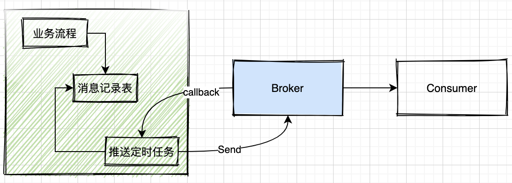

# 消息丢失与幂等

## 消息丢失

消息的的处理一般分为三个阶段：`生产、存储、消费`；每个阶段在处理消息防丢失的时候，都有不同的处理策略。

### 生产阶段

生产者保证消息不丢失是所有方案的基础，如果生产者消息都没有发出去，那后续的流程也就不存在。一般来说，生产阶段防止消息丢失的方案主要从两个思路出发：持久化和消息生产者客户端配置

核心理念：重试 + 同步 + 可回溯

#### 消息持久化方案

**流程**

- 开启数据库事务，执行业务流程
- 组装待发送的Message信息，在当前事务中保存到消息表中
- 提交事务；如果执行中有异常，依赖事务实现，保证消息也被回滚（类似于分布式事务中的消息事务）
- 定时任务捞取消息，乐观锁更新到中间状态，并发送到broker：同步发送成功后，更新记录状态，避免消息重复投递 或 发送后监听回调，更新记录状态

**方案总结**
- 延迟：消息发送的延迟时间要考虑定时任务的周期，从发送到投递成功，可能需要经过更长的时间
- 实现成本：高。需要建立独立的表和任务；客户端持久化方案也可以进一步延伸为Broker代理持久化方案，总是要引入新的逻辑和中间件
- 可靠性：高。消息只要被事务持久化成功，抛出不可抗力的故障，消息数据在Producer端不会丢失
- 替代方案：基于log的持久化。可以在代码中直接使用mq的client发送消息，在log中记录消息的发送状态，如果失败的话，基于日志处理并重新push

#### 生产客户端配置

不是所有的场景都需要基于持久化方案，在绝大部分场景或者可以容忍由于硬件故障导致消息丢失的情况下，我们还是优先考虑基于客户端配置来保证消息防丢失

**以Kafka为例**

- 除非是明确的oneway场景，否则不要只使用`send()`方法
- `acks`可以配置为`all`，必须得到broker所有副本的接收确认，消息才算是已提交，否则producer还会尝试重新投递消息
> Q1: 设置`acks=all`就一定保证消息不会丢失？
>
> A1: 不一定。Partition只有一个副本，也就不存在同步一说，Brokder没有刷盘，消息还是会丢失
>
> Q2: 设置`acks=1`为什么会丢消息？
>
> A2: 要先搞明白`acks=1`的流程，Producer只要将消息发送到Leader Partiton就算成功；但是，如果Leader 还没有开始同步到副本后就宕机，此时从副本中选出的Leader并没有当前消息，消息丢失
- `retries`的配置值不要太小，由于网络抖动问题导致消息投递失败、超时等原因，由Producer自动重发，如果重试次数太小，消息无法尽最大努力投递；既然重试，就一定会遇到重复消费的问题
- 合适的批次大小(`batch.size`)和生产者缓冲区大小（`buffer.memory`）让消息尽快的投递出去，缓冲区不要缓存过多消息，如果出现宕机会丢失
- 针对生产者缓冲区（`buffer.memory`）满的处理：业务类系统还是不建议阻塞(`block.on.buffer.full=false`),hang住线程带来的影响可能更大，不如快速失败然后再次重试；流处理类的业务，可以考虑阻塞

----

### 存储阶段

消息存储阶段，主要是针对Broker节点，基于Broker配置和高可用部署的方案，来保证消息的不丢失。

核心理念：多副本同步 + 同步刷盘

**以下均以kafka为例**

#### Broker配置

- 基于replication机制：Partition 是复制的基本单位，每个 Partition 有多个 Replica，其中的一个 Replica 是 Leader， Leader 负责着与 Consumer 之间的所有读写交互，而 Follower 从 Leader 中通过 Fetch RPC 去拉取同步。设置`replication.factor >= 3`达到冗余的目的；设置`min.insync.replicas = 2`以保证最小同步两个复制区才算消息已提交
- 不论是Kafka还是RocketMQ，只要是基于Linux操作系统，文件都是先写入到操作系统的pagecache中，然后由操作系统定时刷盘或者中间件异步刷盘，这样即使中间件宕机，只要操作系统没挂，消息是不会丢失的同时保证了性能；如果要保证每一条消息都成功落盘，需要配置`log.flush.interval.messages=1`,即每条消息都落盘，由于刷盘是一个非常小号性能的动作，会直接影响中间件的吞吐性能
- 即使是kafka官方也不建议通过修改刷盘机制来保证数据的高可靠，还是建议基于replication机制实现

#### 高可用部署

- 可靠的IDC网络环境，减少网络抖动、断电等不可抗力带来的可靠性影响
- 集群部署
- 有效的监控

----

### 消费阶段

----

## 消息幂等

或 重复消费、消息一致性问题

### 产生重复消息的一些原因

**参考**
> Kafka 与RocketMQ 落盘机制比较: https://www.jianshu.com/p/fd50befccfdd