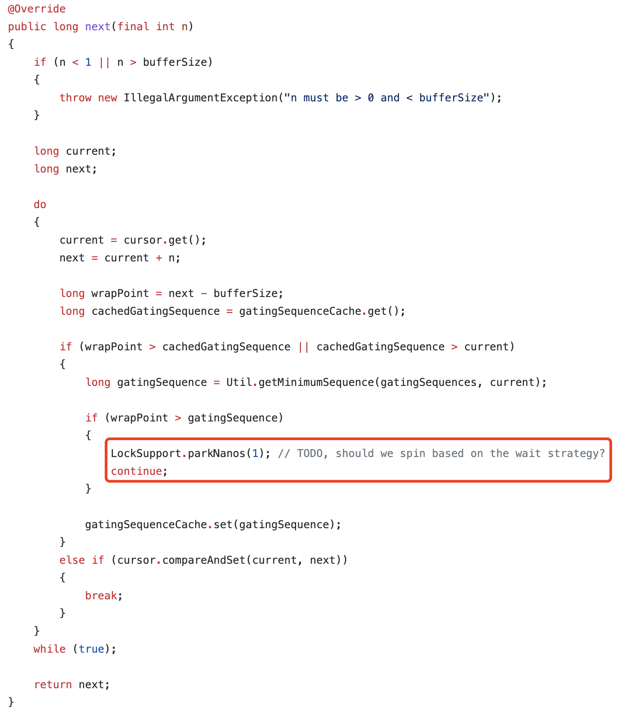

# Concurrent(并发编程)

## CAS

## 什么是CAS

CAS: `Compare And Swap`，比较并交换。一个CAS涉及如下操作：

> 假设内存中的的变量V，代码中期望的值为A，需要修改为B
>
> - 比较A和V是否相等（比较）
> - 如果比较成功，将B的值写入V
> - 返回是否操作成功

当多个线程同时对某个资源进行CAS操作时，只能有一个线程操作成功，并不会阻塞其他线程。更新失败的会收到失败信号，CAS是一种轻量级的乐观锁，或者认为是一种无锁编程的思想。

## CAS的应用

**Java中CAS的实现：** 底层基于`sun.misc.Unsafe`类实现

### AtomicReference

Atomic家族主要保证在多线程环境下的原子性操作，相比我们使用`synchronized`关键字、`ReentrantLock`更加轻量。比较常用的如：`AtomicInteger`、`AtomicLong`等，但是这些都是针对指定类型的CAS操作；而`AtomicReference`作用是针对普通对象的CAS操作封装

**自旋锁**

```java
public class SpinLock {

  private AtomicReference<Thread> sign =new AtomicReference<>();

  public void lock(){
    Thread current = Thread.currentThread();
    while(!sign .compareAndSet(null, current)){
    }
  }

  public void unlock (){
    Thread current = Thread.currentThread();
    sign .compareAndSet(current, null);
  }
}
```

### CAS的问题

**A-B-A问题**

当V从A变为B，再变成A，这个过程CAS操作是无法区分出来的。我们在绝大多数的场景下是无需关心的，但是针对版本有强需求的场景（尤其是类似于状态机的场景），可以使用`AtomicStampedReference`携带时间戳。

**自旋锁的性能消耗问题**

我们使用自旋锁的时候，大部分都是`while(true)`的方式，直到成功为止。优势是速度极快；缺点也很明显：一直在当前线程中循环，每个线程都要执行，占用CPU时间。

**参考**
> JAVA 中的 CAS: https://www.xilidou.com/2018/02/01/java-cas/

----

## 并发队列

### JUC中内置的队列

| 队列 | 边界性 | 是否有锁 | 数据结构 |
| ---- | ---- | ---- | ---- |
| ArrayBlockingQueue | 有界 | 加锁 | ArrayList |
| LinkedBlockingQueue | 可选有界 | 加锁 | LinkedList |
| ConcurrentLinkedQueue | 无界 | 无锁 | LinkedList |
| DelayQueue | 无界 | 无锁 | heap |

### 有锁队列

#### ArrayBlockingQueue

- 基于数组实现的有限队列
- 一把锁，读写冲突，并发度较低：因为数组是一组连续的内存，每次获取完元素后，需要对数组集合做resize，这需要原子性操作来保证并发时的线程安全
- 但仍然优先推荐使用：因为基于数组实现，在队列初始化时必须制定队列长度；一般我们基于内存和编码安全的角度考虑，还是不太允许内存中的队列元素无限增长的

#### LinkedBlockingQueue

- 基于链表实现的队列：由于链表的特性，在不指定初始化长度的情况下是无界队列
- 两把锁，读写不冲突：因为链表不是连续内存集合&通过指针关联。读的时候加`read`锁，只需要保证移除当前`head`和指定新`head`是原子性即可；写的时候加`write`锁，只需要保证当前`tail`元素指向下一个元素是原子性即可
- 并发度较高：如果可以确保队列中的消息可以足够快的被消费，可以使用；
- 在线程池中使用需要注意：如果使用无界的LinkedBlockingQueue作为等待队列，会导致线程池中只有核心线程数在工作

_均使用`ReentrantLock`加锁_

### 无锁队列

在处理并发线程安全时，一般有两种方式来完成同步，即：锁或者是原子变量。其中，有锁队列的操作均是基于`ReenternLock`实现的锁机制，对临界区进行锁定后，进行同步操作；而`原子变量`是基于CPU提供的CAS，对共享变量完成原子性的比较和替换，以达到无锁同步操作的目的。

#### 实现方式

**CAS原生方式**

- 使用`UnSafe`类的`compareAndSwap`方法完成对链表头尾或者数组尾的追加替换
- 如果操作失败，表示有并发冲突，通过自旋的方式进行重试，直到成功

**JUC中的AtomicReferenceArray**

_伪代码示例：_

```java
public class LockFreeQueue {
    private static AtomicReferenceArray<Integer> atomicReferenceArray;

    // 记录head位置指针
    private AtomicInteger head = new AtomicInteger(0);
    // 记录tail位置指针
    private AtomicInteger tail = new AtomicInteger(0);

    public LockFreeQueue() {
        atomicReferenceArray = new AtomicReferenceArray<>(10);
    }

    public boolean add(Integer o) {
        // 获取元素add的索引位置
        int index = tail.get() + 1;

        // 基于CAS自旋设置元素到tail，不成功递归调用
        while(!atomicReferenceArray.compareAndSet(index, null, o)) {
            return add(o);
        }

        // 设置成功，移动tail指针
        tail.incrementAndGet();
        return true;
    }

```

**问题与优势**

- 基于CPU提供的原子性操作，速度和效率高
- 冲突较高的时候，CAS自旋空循环会对CPU资源还是有很多的消耗，极端情况下甚至会打满CPU，其他线程无法获取到CPU时间
- Disruptor框架原理也是基于CAS，但是在索引位置冲突的时候会将线程挂起1纳秒后再去竞争，没有采用自旋空循环的方式



**参考**

> 高性能队列——Disruptor: https://tech.meituan.com/2016/11/18/disruptor.html
>
> java轻松实现无锁队列: https://www.cnblogs.com/linlinismine/p/9263426.html
>
> 你应该知道的高性能无锁队列Disruptor: https://juejin.cn/post/6844903648875528206

----

## 并发集合

----

## AQS